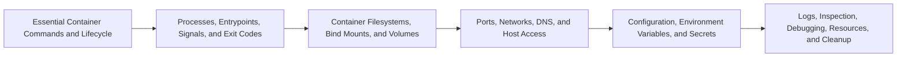

# Running Containers and Local Development Overview

> Run, inspect, debug, and clean up containers while reasoning about processes, files, networking, configuration, and host-to-container boundaries.

> [!abstract] Chapter outcome
> Run, inspect, debug, and clean up containers while reasoning about processes, files, networking, configuration, and host-to-container boundaries.

## Topics

- [[04 Docker/03 Running Containers and Local Development/12 Essential Container Commands and Lifecycle|12 - Essential Container Commands and Lifecycle]]
- [[04 Docker/03 Running Containers and Local Development/13 Processes Entrypoints Signals and Exit Codes|13 - Processes, Entrypoints, Signals, and Exit Codes]]
- [[04 Docker/03 Running Containers and Local Development/14 Container Filesystems Bind Mounts and Volumes|14 - Container Filesystems, Bind Mounts, and Volumes]]
- [[04 Docker/03 Running Containers and Local Development/15 Ports Networks DNS and Host Access|15 - Ports, Networks, DNS, and Host Access]]
- [[04 Docker/03 Running Containers and Local Development/16 Configuration Environment Variables and Secrets|16 - Configuration, Environment Variables, and Secrets]]
- [[04 Docker/03 Running Containers and Local Development/17 Logs Inspection Debugging Resources and Cleanup|17 - Logs, Inspection, Debugging, Resources, and Cleanup]]

## Chapter Map

## How To Use This Area

Practice these topics at the command line. Everyday confidence comes more from this chapter than from memorizing Dockerfile syntax.

## Related Areas

- [[04 Docker/Docker Learning Map|Docker Learning Map]]
- [[04 Docker/02 Building Reproducible Images/Building Reproducible Images Overview|Previous: Building Reproducible Images]]
- [[04 Docker/04 Docker Compose and Multi-Service Environments/Docker Compose and Multi-Service Environments Overview|Next: Docker Compose and Multi-Service Environments]]
