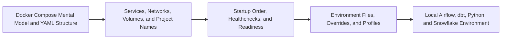

# Docker Compose and Multi-Service Environments Overview

> Read and operate a Compose project that gives a team a repeatable local data-engineering environment.

> [!abstract] Chapter outcome
> Read and operate a Compose project that gives a team a repeatable local data-engineering environment.

## Topics

- [[04 Docker/04 Docker Compose and Multi-Service Environments/18 Docker Compose Mental Model and YAML Structure|18 - Docker Compose Mental Model and YAML Structure]]
- [[04 Docker/04 Docker Compose and Multi-Service Environments/19 Services Networks Volumes and Project Names|19 - Services, Networks, Volumes, and Project Names]]
- [[04 Docker/04 Docker Compose and Multi-Service Environments/20 Startup Order Healthchecks and Readiness|20 - Startup Order, Healthchecks, and Readiness]]
- [[04 Docker/04 Docker Compose and Multi-Service Environments/21 Environment Files Overrides and Profiles|21 - Environment Files, Overrides, and Profiles]]
- [[04 Docker/04 Docker Compose and Multi-Service Environments/22 Local Airflow dbt Python and Snowflake Environment|22 - Local Airflow, dbt, Python, and Snowflake Environment]]

## Chapter Map

## How To Use This Area

This is the practical center of the curriculum for a local Airflow stack. Treat Compose as a declarative development environment, not automatic production readiness.

## Related Areas

- [[04 Docker/Docker Learning Map|Docker Learning Map]]
- [[04 Docker/03 Running Containers and Local Development/Running Containers and Local Development Overview|Previous: Running Containers and Local Development]]
- [[04 Docker/05 Data Stack Integration Patterns/Data Stack Integration Patterns Overview|Next: Data Stack Integration Patterns]]
