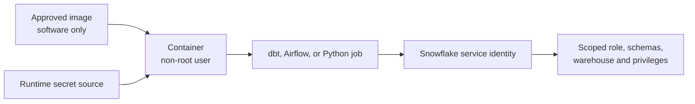

# Non-root Users, Secrets, and Least Privilege

> [!abstract] Mental model
> Give the container only the operating-system access, credentials, and Snowflake privileges required for its job—and supply sensitive values when it runs, not when its image is built.

> **Curriculum priority:** Essential

## Executive Summary

- **What it is:** Applying least privilege at three layers: the user inside the container, the secrets supplied to it, and the external permissions granted to its Snowflake or service identity.
- **Why it matters:** A container does not become safe merely because it is isolated. Excessive privileges or embedded credentials increase the damage from faulty code, a leaked image, or an attacker.
- **Mental model:** The image contains software; the runtime supplies identity and environment-specific secrets; Snowflake independently decides what that identity may do.
- **Best used when:** Always for shared development images, CI jobs, Airflow tasks, and production workloads.
- **Avoid or reconsider when:** A temporary local experiment may accept simpler setup, but it should never use production credentials or become the production pattern by accident.

## What It Can Do

- Prevent ordinary application code from running as the container's all-powerful `root` user.
- Keep passwords, private keys, tokens, and package-repository credentials out of image layers and source control.
- Limit a dbt, Airflow, or Python workload to the Snowflake roles, schemas, warehouses, and operations it requires.
- Reduce the likely impact of configuration mistakes and compromised dependencies.
- Make security responsibilities visible in the Dockerfile, runtime configuration, and Snowflake access model.

## What It Cannot Do

- Make an untrusted image safe or protect against every host and container-platform vulnerability.
- Stop a platform administrator from inspecting runtime configuration or mounted secrets.
- Replace secret rotation, audit logging, network controls, vulnerability management, or Snowflake RBAC.
- Fix application code that logs credentials or copies secrets into output files.
- Guarantee that a non-root process has the correct file permissions on every host-mounted directory.

## Core Concepts

| Concept | Plain-language meaning | Why it matters |
|---|---|---|
| Container user | The operating-system user that runs the process inside the container | Running as non-root removes unnecessary power inside the container |
| Runtime secret | A sensitive value supplied only when the container starts | The same image can move between environments without containing credentials |
| Build secret | A temporary credential used while building, such as access to a private Python package repository | Normal build arguments and environment variables can persist in image history or layers |
| Service identity | The non-human identity used by Airflow, dbt, or Python to access Snowflake | It should be separate from a developer's personal identity and scoped to the workload |
| Least privilege | Granting only the access needed for the task | Limits blast radius and makes ownership easier to review |
| UID/GID | Numeric identity used for Linux file ownership | Mismatches commonly cause permission problems on bind-mounted files and logs |

## How It Works (Simple Flow)

1. Start from an approved base image and create or use its intended non-root runtime user.
2. Install software and set file ownership during the image build.
3. End the Dockerfile with `USER` so the normal process does not run as root.
4. Keep ordinary configuration external to the image and obtain sensitive values from the approved runtime secret mechanism.
5. Start the container with the environment-specific service identity.
6. Snowflake authorizes that identity through a narrowly scoped role and warehouse.
7. Rotate, revoke, and audit credentials without rebuilding the application image.

## Visuals



## Readable Snippets

A small Python-style image can create application files as root during the build but run the actual job as a less privileged user:

```dockerfile
FROM python:3.12-slim

RUN useradd --create-home appuser
WORKDIR /app

COPY --chown=appuser:appuser requirements.txt .
RUN pip install --no-cache-dir -r requirements.txt

COPY --chown=appuser:appuser . .
USER appuser

CMD ["python", "job.py"]
```

Do not place secrets in the Dockerfile:

```dockerfile
# Bad: the value can become part of the image or build record
ENV SNOWFLAKE_PASSWORD="actual-password"
```

The important review question is not only *how* a secret is passed, but whether it is absent from the repository, Dockerfile, image, logs, and generated artifacts.

## Consultant Talking Points

- **Client question this answers:** “If containers are isolated, why do we also need non-root users and restricted Snowflake roles?”
- **Trade-offs to mention:** Stronger separation adds some work around file ownership, local development, secret injection, and role design.
- **Risk or governance angle:** Separate developer and workload identities, define credential rotation and ownership, and ensure secrets cannot be recovered from images or CI logs.
- **Cost or operational angle:** Scoped Snowflake warehouses and roles reduce accidental high-cost execution as well as security exposure.

## Common Pitfalls

- Running every image as root because it fixes local file-permission problems hides the underlying ownership issue and increases runtime privilege.
- Putting a private key or token in `ENV`, `ARG`, `COPY`, or a committed `.env` file can expose it through source history, build records, image layers, or logs.
- Reusing a developer's interactive Snowflake login for Airflow makes ownership, MFA, rotation, and incident response unclear.
- Giving a shared container one powerful Snowflake role for every environment expands the blast radius and weakens attribution.
- Switching to a non-root user without assigning ownership of `/app`, mounted logs, or generated artifacts causes avoidable “permission denied” failures.
- Treating a mounted secret as automatically safe ignores whether the application prints, copies, or retains it.

## When to Recommend What (Decision Table)

| Situation | Recommend | Why | Watch-outs |
|---|---|---|---|
| Local learning with disposable data | Non-root image and non-production credentials supplied at runtime | Builds the correct habit without complex infrastructure | Never copy real production secrets into the exercise |
| Airflow or CI workload accessing Snowflake | Dedicated non-human identity with a scoped Snowflake role | Clear ownership, rotation, audit, and least privilege | Authentication must be non-interactive and supported by the platform |
| Build needs a private package repository | BuildKit secret or approved CI secret mount | Makes the credential temporary during the build | Confirm the package manager does not persist credentials in its configuration |
| Production container on a cloud platform | Platform secret manager or workload identity | Central rotation, audit, and short-lived access are preferable | Exact mechanism is platform-specific |
| Bind-mounted development files fail as non-root | Align UID/GID or adjust explicit file ownership | Solves the actual boundary problem | Avoid broad permissions such as world-writable directories |

## Related Topics

- [[04 Docker/04 Security Operations and Team Standards/Security Operations and Team Standards Overview|Security Operations and Team Standards Overview]]
- [[04 Docker/01 Foundations and Everyday Docker/04 Files Mounts Networks Configuration and Secrets|Files, Mounts, Networks, Configuration, and Secrets]]
- [[04 Docker/03 Data Stack Integration Patterns/14 Snowflake Connectivity Authentication and Environment Parity|Snowflake Connectivity, Authentication, and Environment Parity]]
- [[04 Docker/04 Security Operations and Team Standards/16 Image Provenance Pinning Scanning and SBOMs|Image Provenance, Pinning, Scanning, and SBOMs]]

## Related Decision Notes

- No dedicated Docker identity decision note yet; add one when a real client discussion produces durable criteria.

## Questions

- **Explain:** Why are the container user, runtime secret, and Snowflake role three separate controls?
- **Apply:** Where should a Snowflake private key enter an Airflow task, and where should it never appear?
- **Challenge:** A container only works when run as root. What would you inspect before accepting that requirement?

## Sources To Revisit

- [Docker Docs: Dockerfile best practices—USER](https://docs.docker.com/build/building/best-practices/#user)
- [Docker Docs: Build secrets](https://docs.docker.com/build/building/secrets/)
- [Docker Docs: Compose secrets](https://docs.docker.com/compose/how-tos/use-secrets/)
- [Snowflake Docs: Workload identity federation](https://docs.snowflake.com/en/user-guide/workload-identity-federation)
- [Snowflake Docs: Key-pair authentication and rotation](https://docs.snowflake.com/en/user-guide/key-pair-auth)
