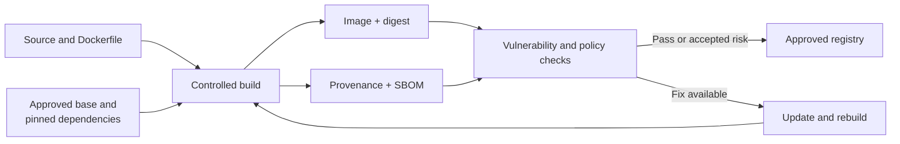

# Image Provenance, Pinning, Scanning, and SBOMs

> [!abstract] Mental model
> An image is a packaged software supply chain: know its source, identify its exact contents, scan it, approve it, and rebuild it when those contents become outdated.

> **Curriculum priority:** Working depth

## Executive Summary

- **What it is:** Controls that show where an image came from, which exact version was used, what software it contains, and which known vulnerabilities affect it.
- **Why it matters:** A convenient public image or mutable tag can change without your Dockerfile changing, and every included operating-system or Python package becomes something the team must trust and maintain.
- **Mental model:** **Provenance** says how it was built; a **digest** identifies the exact image; an **SBOM** lists its components; a **scan** compares those components with known vulnerabilities.
- **Best used when:** Images are shared, stored in a registry, used by CI or Airflow, or promoted toward production.
- **Avoid or reconsider when:** Never skip the concern entirely; scale the evidence and approval process to the workload's sensitivity and lifetime.

## What It Can Do

- Restrict projects to trusted or approved base-image publishers.
- Reproduce or audit the exact image that ran by recording its digest.
- List operating-system and application packages through an SBOM.
- Detect known vulnerabilities in base images and installed dependencies.
- Attach build provenance and SBOM attestations to images in a registry.
- Support policies such as approved bases, non-root defaults, and severity thresholds.

## What It Cannot Do

- Prove that software has no unknown vulnerability or malicious behavior.
- Decide automatically whether a reported vulnerability is actually exploitable in your workload.
- Patch a running image; the team must update dependencies, rebuild, test, and redeploy.
- Make an old image safe merely because its Dockerfile was safe when first written.
- Replace source review, dependency governance, access control, or runtime monitoring.

## Core Concepts

| Concept | Plain-language meaning | Why it matters |
|---|---|---|
| Trusted base image | An image from an approved publisher and repository | Reduces uncertainty about origin, maintenance, and documentation |
| Tag | A readable label such as `3.12-slim` or `release-42` | Useful for humans, but a tag may later point to different content |
| Digest | A content-derived identifier such as `sha256:...` | Identifies an exact image rather than a movable label |
| Provenance | Metadata describing source inputs and how the image was built | Supports traceability from a deployed image back to source and build process |
| SBOM | Software Bill of Materials: a package and version inventory | Makes included components visible for audit and vulnerability matching |
| Vulnerability scan | Comparison of image components with known security advisories | Identifies issues that require patching, mitigation, acceptance, or investigation |
| Rebuild | Creating a fresh image from current approved inputs | Images are immutable; updates arrive through replacement, not in-place patching |

## How It Works (Simple Flow)

1. Choose an approved, maintained base image and define a controlled version policy.
2. Resolve and record the exact base and dependency inputs used for the build.
3. Build the image in CI and attach or generate provenance and an SBOM.
4. Scan the finished image, not only the Dockerfile or dependency file.
5. Triage findings by severity, exploitability, workload exposure, and available fixes.
6. Push approved images to the organization's registry and record the immutable digest.
7. Rebuild and repeat when base images, Python dependencies, or vulnerability knowledge changes.

## Visuals



## Readable Snippets

A tag is convenient, while a digest identifies exact content:

```dockerfile
# Readable version policy; the publisher may update this tag over time
FROM python:3.12-slim

# Exact content; update deliberately when a new approved digest is available
FROM python:3.12-slim@sha256:<approved-digest>
```

Typical inspection commands:

```bash
docker image inspect my-data-job:1.4
docker scout sbom my-data-job:1.4
docker scout cves my-data-job:1.4
```

The tools may differ by organization. The durable process is: inventory, scan, triage, approve, record, and rebuild.

## Consultant Talking Points

- **Client question this answers:** “We built and tested this image six months ago—why must we keep reviewing it?”
- **Trade-offs to mention:** Pinning supports repeatability, while frequent rebuilding brings security updates; a good policy defines both deliberate versions and a regular update cadence.
- **Risk or governance angle:** Record publisher, source commit, build identity, base image, dependency inventory, scan decision, approver, and deployed digest where the workload requires evidence.
- **Cost or operational angle:** Smaller, focused images usually scan faster, transfer faster, and produce fewer packages to patch, but extreme minimization can make support and debugging harder.

## Common Pitfalls

- Treating `latest` or another tag as an immutable release can make two builds with the same Dockerfile produce different images.
- Pinning forever without a rebuild schedule preserves old vulnerabilities as effectively as it preserves reproducibility.
- Scanning only the base image misses Python packages and files added later in the Dockerfile.
- Blocking every reported issue without triage can stop delivery while failing to focus on reachable, high-impact risk.
- Assuming “no critical findings” proves the image is trusted ignores provenance, malicious packages, secrets, configuration, and unknown vulnerabilities.
- Deploying by tag without recording the digest weakens incident reconstruction and rollback confidence.

## When to Recommend What (Decision Table)

| Situation | Recommend | Why | Watch-outs |
|---|---|---|---|
| Short-lived local experiment | Trusted named base tag plus normal dependency version control | Keeps setup readable and lightweight | Do not promote the image without CI checks and a recorded version |
| Shared team development image | Approved base, regular rebuild, SBOM, and vulnerability scan | Many developers inherit the same dependency risk | Define who owns updates and false-positive triage |
| Production or regulated workload | Provenance, SBOM, immutable digest, policy checks, approval evidence | Supports traceability and controlled promotion | Evidence is only useful if it maps to the actual deployed digest |
| Critical fix exists in a base image | Rebuild, test, and redeploy the application image | Images are replaced rather than patched in place | Confirm compatibility and complete rollout across all environments |
| Scan reports a vulnerability with no available fix | Document exposure and mitigation; accept, isolate, replace, or stop based on risk | Severity alone does not determine actual impact | Give the acceptance an owner and expiry date |

## Related Topics

- [[04 Docker/04 Security Operations and Team Standards/Security Operations and Team Standards Overview|Security Operations and Team Standards Overview]]
- [[04 Docker/02 Reproducible Images and Docker Compose/07 Image Optimization Versioning and Registries|Image Optimization, Versioning, and Registries]]
- [[04 Docker/04 Security Operations and Team Standards/15 Non-root Users Secrets and Least Privilege|Non-root Users, Secrets, and Least Privilege]]
- [[04 Docker/04 Security Operations and Team Standards/17 CI Build Test Publish and Promotion|CI Build, Test, Publish, and Promotion]]

## Related Decision Notes

- No dedicated Docker supply-chain decision note yet; add one when a real client approval or update-policy discussion produces durable criteria.

## Questions

- **Explain:** What separate questions do a digest, provenance record, SBOM, and vulnerability scan answer?
- **Apply:** How would you prove which exact Airflow image ran a failed production task last month?
- **Challenge:** Why are “pin every input forever” and “always pull the newest tag” both incomplete policies?

## Sources To Revisit

- [Docker Docs: Choose the right base image](https://docs.docker.com/build/building/best-practices/#choose-the-right-base-image)
- [Docker Docs: Pin base image versions](https://docs.docker.com/build/building/best-practices/#pin-base-image-versions)
- [Docker Docs: Docker Scout SBOMs](https://docs.docker.com/scout/how-tos/view-create-sboms/)
- [Docker Docs: Docker Scout image analysis](https://docs.docker.com/scout/explore/analysis/)
- [Docker Docs: Build attestations](https://docs.docker.com/build/metadata/attestations/)
