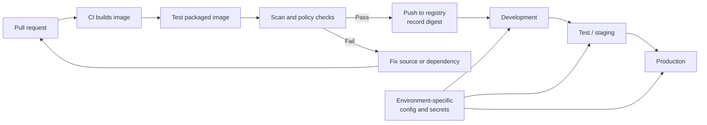

# CI Build, Test, Publish, and Promotion

> [!abstract] Mental model
> Build an image once from reviewed source, test that exact image, publish it under a traceable identity, and promote the same image through environments by changing external configuration—not its contents.

> **Curriculum priority:** Working depth

## Executive Summary

- **What it is:** The automated path from a source-code change to a tested container image in an approved registry and then into one or more runtime environments.
- **Why it matters:** Local builds are hard to audit and may differ between developers. CI provides a consistent builder, repeatable checks, controlled registry access, and traceability to the source commit.
- **Mental model:** The image is the release artifact. Build it once; give it an immutable identity; move that same artifact through test and production.
- **Best used when:** A Docker image is shared, scheduled, deployed by Airflow or another platform, or expected to be reproduced after an incident.
- **Avoid or reconsider when:** A disposable local experiment need not have a full promotion pipeline, but it should not be treated as a controlled release.

## What It Can Do

- Build images consistently from reviewed source rather than from a developer's laptop.
- Run Dockerfile checks, unit tests, smoke tests, dependency checks, and image scans before publication.
- Tag images with a release version or source commit and record the resulting digest.
- Authenticate to a registry through scoped CI credentials.
- Promote the same image between environments while supplying different Snowflake targets, roles, and secrets at runtime.
- Preserve logs and metadata showing who built what, from which source, and with which result.

## What It Cannot Do

- Prove that tests cover the correct business behavior or production data conditions.
- Make mutable tags such as `latest` reliable release identifiers.
- Guarantee parity when production uses different architecture, networking, identity, storage, or container-platform controls.
- Replace deployment approval, rollback design, monitoring, or ownership.
- Safely promote an image whose environment-specific credentials or configuration were baked into it.

## Core Concepts

| Concept | Plain-language meaning | Why it matters |
|---|---|---|
| CI build | An automated image build triggered by a code change | Removes dependence on one developer's machine |
| Image test | Running checks against the built image rather than only the source directory | Confirms the packaged artifact contains what the job needs |
| Registry | Controlled storage and distribution for versioned images | Creates a shared source of approved runtime artifacts |
| Tag | Readable reference such as a release number or commit | Helps people and automation find an image, but may be movable |
| Digest | Immutable identity of the image content | Proves which exact artifact was tested or deployed |
| Promotion | Approving the same artifact for another environment | Avoids rebuilding slightly different binaries for test and production |
| Runtime configuration | Environment-specific settings and secrets supplied when the container runs | Allows one image to serve development, test, and production safely |

## How It Works (Simple Flow)

1. A pull request changes the Dockerfile, dependencies, dbt project, Airflow code, or Python job.
2. CI checks the Dockerfile and builds an image using controlled inputs.
3. CI runs fast tests inside or against the finished image.
4. The image is scanned and evaluated against the team's release policy.
5. On approval or merge, CI tags and pushes it to the approved registry.
6. The registry returns an immutable digest that is recorded with the release.
7. Deployment selects that same digest and injects environment-specific configuration, secrets, and Snowflake identity.
8. If validation fails, deployment returns to a known prior digest or a corrected image is built.

## Visuals



## Readable Snippets

The exact CI system varies, but the release path should be recognizable:

```text
1. Build:  data-job:<source-commit>
2. Test:   run unit and smoke tests in that image
3. Check:  scan image and validate release policy
4. Push:   publish to the approved registry
5. Record: store image digest with the release
6. Deploy: select the same digest and supply runtime configuration
```

A small local approximation is:

```bash
docker build --pull -t registry.example/data-job:abc123 .
docker run --rm registry.example/data-job:abc123 python -m pytest
docker push registry.example/data-job:abc123
```

The pipeline should use CI-managed credentials and should not print registry tokens or Snowflake secrets.

## Consultant Talking Points

- **Client question this answers:** “Why not let each environment build its own image from the same Git branch?”
- **Trade-offs to mention:** Build-once promotion improves traceability, but requires external configuration, registry governance, compatible platforms, and a clear release process.
- **Risk or governance angle:** Protect release branches, scope CI credentials, retain evidence, approve base images, scan the final artifact, and record the deployed digest.
- **Cost or operational angle:** Build caching speeds CI, while image sprawl and indefinite registry retention increase storage and cleanup needs.

## Common Pitfalls

- Rebuilding from source separately in production can produce different base packages or dependencies from the image tested earlier.
- Using only `latest` makes rollback and incident reconstruction ambiguous.
- Testing source code outside the image can miss absent files, incompatible libraries, wrong users, or incorrect startup commands in the packaged artifact.
- Publishing images from developer laptops bypasses standard checks and weakens provenance.
- Baking environment names, Snowflake credentials, or production-only configuration into the image defeats build-once promotion.
- Granting CI broad permanent registry credentials increases the impact of pipeline compromise.

## When to Recommend What (Decision Table)

| Situation | Recommend | Why | Watch-outs |
|---|---|---|---|
| Developer-only experiment | Local build and disposable tag | Fast feedback with little ceremony | Do not use it as the production artifact |
| Shared dbt or Python image | CI build, package-level tests, scan, registry push, commit-based tag | Provides a consistent team artifact | Decide who maintains base and dependency updates |
| Production Airflow image | Build once, record digest, validate in lower environment, promote exact image | Preserves traceability across a multi-service platform | Airflow database migrations and deployment compatibility still need planning |
| Regulated workload | Protected pipeline, approvals, provenance, SBOM, scan evidence, digest-based deployment | Creates a defensible release trail | Keep evidence mapped to the actual deployed environment |
| Urgent dependency fix | Normal controlled rebuild with expedited review | Produces a clear new artifact and audit trail | Avoid silently moving an existing release tag |

## Related Topics

- [[04 Docker/04 Security Operations and Team Standards/Security Operations and Team Standards Overview|Security Operations and Team Standards Overview]]
- [[04 Docker/02 Reproducible Images and Docker Compose/07 Image Optimization Versioning and Registries|Image Optimization, Versioning, and Registries]]
- [[04 Docker/04 Security Operations and Team Standards/16 Image Provenance Pinning Scanning and SBOMs|Image Provenance, Pinning, Scanning, and SBOMs]]
- [[04 Docker/04 Security Operations and Team Standards/18 Operations Troubleshooting and Production Boundaries|Operations, Troubleshooting, and Production Boundaries]]

## Related Decision Notes

- No dedicated Docker release decision note yet; add one when a real delivery model produces durable approval and promotion criteria.

## Questions

- **Explain:** Why should the image tested in CI be the same image promoted to production?
- **Apply:** Which values should change when one dbt image moves from development to production, and which should not?
- **Challenge:** A team deploys `data-job:latest`. What evidence would you need to identify and restore last week's working version?

## Sources To Revisit

- [Docker Docs: Continuous integration with Docker](https://docs.docker.com/build/ci/)
- [Docker Docs: Docker Build GitHub Actions](https://docs.docker.com/build/ci/github-actions/)
- [Docker Docs: Build checks](https://docs.docker.com/build/checks/)
- [Docker Docs: Build attestations](https://docs.docker.com/build/metadata/attestations/)
- [Docker Docs: Tag an image](https://docs.docker.com/reference/cli/docker/image/tag/)
