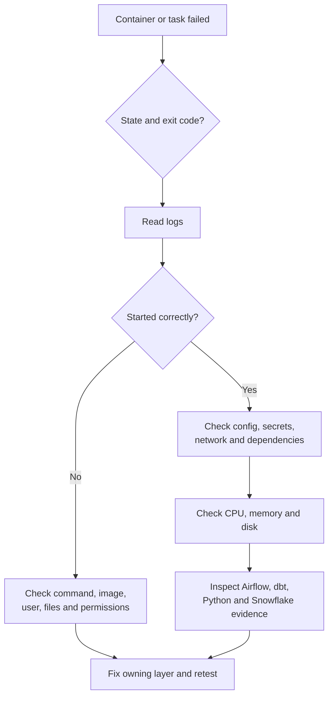

# Operations, Troubleshooting, and Production Boundaries

> [!abstract] Mental model
> Diagnose containers from the outside in—state, exit code, logs, configuration, resources, connections, and application behavior—and treat local Compose as a development model, not an automatic production operating model.

> **Curriculum priority:** Essential

## Executive Summary

- **What it is:** A repeatable way to investigate failed containers plus the judgment to separate Docker mechanics from production platform responsibilities.
- **Why it matters:** Most early Docker failures are ordinary problems at a new boundary: wrong command, missing file, incompatible dependency, unavailable service, bad credential, insufficient memory, or misunderstood `localhost`.
- **Mental model:** A container is a process with packaged software and explicit inputs. First determine what happened to that process; then follow its inputs and dependencies.
- **Best used when:** Debugging local Compose, CI jobs, Airflow services, dbt commands, and Python task containers—or evaluating whether a proposed deployment is operable.
- **Avoid or reconsider when:** Repeatedly restarting or recreating containers without collecting evidence can hide the symptom and destroy useful context.

## What It Can Do

- Reveal whether a container is running, exited, unhealthy, restarting, or unable to start.
- Use exit codes and logs to separate container startup failure from application or data failure.
- Inspect the effective command, image, mounts, environment, networks, health status, and resource settings.
- Identify CPU, memory, disk, networking, DNS, permissions, and dependency-readiness problems.
- Establish a practical first-response runbook for local and shared environments.
- Clarify when Compose is enough and when the workload needs a managed or clustered production platform.

## What It Cannot Do

- Prove that a successful dbt, Python, or Airflow task produced correct or complete data.
- Replace application metrics, Airflow task history, dbt artifacts, Snowflake query history, or data-quality monitoring.
- Turn a healthcheck into full business-level readiness or downstream freshness assurance.
- Make a single Docker host highly available or provide production ownership by itself.
- Choose a production orchestrator without workload, security, scale, recovery, and organizational context.

## Core Concepts

| Concept | Plain-language meaning | Why it matters |
|---|---|---|
| Container state | Current lifecycle status such as running, exited, unhealthy, or restarting | Tells you which diagnostic branch to follow first |
| Exit code | Numeric result returned by the main process | Zero normally means success; non-zero means the process reported failure |
| Standard output/error | Normal destinations for application log messages | `docker logs` can retrieve them when the logging setup supports it |
| Inspection | Effective configuration recorded by Docker | Shows what actually ran rather than what you expected from the source file |
| Healthcheck | A repeated command used to judge whether a running container is healthy | Helps detect process-level readiness but must test something meaningful |
| Resource limit | CPU or memory boundary applied to a container | Prevents one workload from consuming the whole host, but can cause throttling or termination |
| Restart policy | Rule controlling whether Docker restarts an exited container | Useful for transient failure, but it does not fix a permanent configuration error |
| Production platform | The wider system providing scheduling, scaling, identity, secrets, logging, recovery, and operational ownership | Docker images are only one part of production operation |

## How It Works (Simple Flow)

1. Check the container or Compose service state and record the exit code or health status.
2. Read the latest logs with timestamps before recreating anything.
3. Inspect the effective image, command, environment names, mounts, networks, user, and resource limits.
4. Confirm required files, file permissions, configuration, and secret references are present.
5. Test dependencies from the same network boundary: DNS, ports, proxy, certificates, Airflow metadata database, or Snowflake access.
6. Check CPU, memory, disk space, and repeated restart behavior.
7. Move into application evidence: Airflow task logs, dbt artifacts, Python exception, or Snowflake query history.
8. Fix the owning layer, reproduce the result, and capture a durable runbook improvement.

## Visuals



## Readable Snippets

A compact first-response sequence:

```bash
docker ps -a
docker logs --tail 100 --timestamps <container>
docker inspect <container>
docker stats --no-stream <container>
```

For Compose:

```bash
docker compose ps
docker compose logs --tail 100 <service>
docker compose config
```

Read the evidence in that order. Entering the container with `docker exec` can help, but it should not be the first or only diagnostic method—and it only works while the container is running.

## Consultant Talking Points

- **Client question this answers:** “We can start Airflow with Compose, so why do we need a separate production-platform decision?”
- **Trade-offs to mention:** Compose is transparent and effective for local or simple single-host use; larger production needs may require stronger scheduling, high availability, secret integration, centralized logs, scaling, patching, and recovery.
- **Risk or governance angle:** Define who owns the host or platform, image updates, credentials, logs, backups, access, incident response, and evidence retention.
- **Cost or operational angle:** A simpler platform can be cheaper and easier at small scale; a sophisticated orchestrator adds platform cost and skill requirements that only pay off when the workload needs them.

## Common Pitfalls

- Deleting and recreating a failed container before collecting state, logs, and inspection output destroys useful evidence.
- Treating `localhost` inside a container as the developer's computer or another Compose service causes common connection failures.
- Adding an aggressive restart policy can turn a permanent error into an endless restart loop that hides the root cause.
- Declaring a container healthy because its process exists can miss a broken dependency or unusable application endpoint.
- Assuming a green container means the data is correct ignores dbt tests, source freshness, reconciliation, and Snowflake evidence.
- Copying the Airflow documentation's learning-oriented Compose stack directly into production leaves security, availability, scaling, and operational decisions unresolved.
- Installing fixes manually inside a running container creates a one-off state that disappears when the container is replaced.

## When to Recommend What (Decision Table)

| Situation | Recommend | Why | Watch-outs |
|---|---|---|---|
| Individual development or learning | Docker Desktop or Engine with Compose | Fast, repeatable local setup and easy inspection | Limit resources and use non-production data and credentials |
| Team integration environment on one controlled host | Compose may be sufficient with explicit logging, backup, security, and ownership | Keeps operations understandable at modest scale | Single-host availability and manual scaling remain limitations |
| Business-critical Airflow with availability and scaling needs | Managed Airflow or an approved production container platform | Provides a stronger operational control plane | Higher cost, platform skills, and provider constraints |
| One-off scheduled data job | Existing Airflow/platform task container or managed batch service | Reuses scheduling, identity, logs, and alerting | Avoid creating a new platform for one job |
| Repeated unexplained container failure | Use the evidence-based runbook before rebuilding or restarting | Separates packaging, runtime, dependency, and application causes | Preserve enough logs and metadata for post-incident review |

## Related Topics

- [[04 Docker/04 Security Operations and Team Standards/Security Operations and Team Standards Overview|Security Operations and Team Standards Overview]]
- [[04 Docker/01 Foundations and Everyday Docker/03 Essential Commands Processes Logs and Debugging|Essential Commands, Processes, Logs, and Debugging]]
- [[04 Docker/02 Reproducible Images and Docker Compose/08 Docker Compose Services Storage Networking and Readiness|Docker Compose: Services, Storage, Networking, and Readiness]]
- [[04 Docker/03 Data Stack Integration Patterns/13 Running dbt and Python from Airflow|Running dbt and Python from Airflow]]

## Related Decision Notes

- No dedicated Docker production-platform decision note yet; add one when the actual deployment context produces durable criteria.

## Questions

- **Explain:** Why should state, exit code, logs, and inspection come before entering or rebuilding a failed container?
- **Apply:** A Python task can connect to Snowflake on your laptop but not in Compose. Which boundaries would you check first?
- **Challenge:** Which requirements would move an Airflow deployment from local Compose toward a managed or clustered production platform?

## Sources To Revisit

- [Docker Docs: Container logs](https://docs.docker.com/reference/cli/docker/container/logs/)
- [Docker Docs: Container inspect](https://docs.docker.com/reference/cli/docker/container/inspect/)
- [Docker Docs: Container resource statistics](https://docs.docker.com/reference/cli/docker/container/stats/)
- [Docker Docs: Restart policies](https://docs.docker.com/engine/containers/start-containers-automatically/)
- [Docker Docs: Use Compose in production](https://docs.docker.com/compose/how-tos/production/)
- [Apache Airflow Docs: Running Airflow in Docker](https://airflow.apache.org/docs/apache-airflow/stable/howto/docker-compose/)
