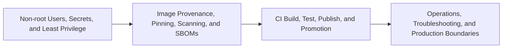

# Security Operations and Team Standards Overview

> [!abstract] Chapter outcome
> Recognize safe image and runtime practices, understand image promotion, diagnose common failures, and discuss where local Docker ends and production platform ownership begins.

## Topics

- [[04 Docker/04 Security Operations and Team Standards/15 Non-root Users Secrets and Least Privilege|15 - Non-root Users, Secrets, and Least Privilege]]
- [[04 Docker/04 Security Operations and Team Standards/16 Image Provenance Pinning Scanning and SBOMs|16 - Image Provenance, Pinning, Scanning, and SBOMs]]
- [[04 Docker/04 Security Operations and Team Standards/17 CI Build Test Publish and Promotion|17 - CI Build, Test, Publish, and Promotion]]
- [[04 Docker/04 Security Operations and Team Standards/18 Operations Troubleshooting and Production Boundaries|18 - Operations, Troubleshooting, and Production Boundaries]]

## Chapter Map

## How To Use This Area

Topic 15 and Topic 18 are must-read. Topics 16 and 17 provide the governance vocabulary commonly needed in larger organizations.

## Related Areas

- [[04 Docker/Docker Learning Map|Docker Learning Map]]
- [[04 Docker/03 Data Stack Integration Patterns/Data Stack Integration Patterns Overview|Previous: Data Stack Integration Patterns]]
