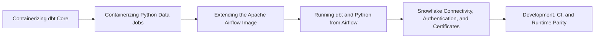

# Data Stack Integration Patterns Overview

> Apply Docker to dbt Core, Airflow, Python, and Snowflake connectivity while keeping execution ownership and environment boundaries clear.

> [!abstract] Chapter outcome
> Apply Docker to dbt Core, Airflow, Python, and Snowflake connectivity while keeping execution ownership and environment boundaries clear.

## Topics

- [[04 Docker/05 Data Stack Integration Patterns/23 Containerizing dbt Core|23 - Containerizing dbt Core]]
- [[04 Docker/05 Data Stack Integration Patterns/24 Containerizing Python Data Jobs|24 - Containerizing Python Data Jobs]]
- [[04 Docker/05 Data Stack Integration Patterns/25 Extending the Apache Airflow Image|25 - Extending the Apache Airflow Image]]
- [[04 Docker/05 Data Stack Integration Patterns/26 Running dbt and Python from Airflow|26 - Running dbt and Python from Airflow]]
- [[04 Docker/05 Data Stack Integration Patterns/27 Snowflake Connectivity Authentication and Certificates|27 - Snowflake Connectivity, Authentication, and Certificates]]
- [[04 Docker/05 Data Stack Integration Patterns/28 Development CI and Runtime Parity|28 - Development, CI, and Runtime Parity]]

## Chapter Map

## How To Use This Area

Study this after Compose. These topics should map directly to the repository and operating model you encounter at work.

## Related Areas

- [[04 Docker/Docker Learning Map|Docker Learning Map]]
- [[04 Docker/04 Docker Compose and Multi-Service Environments/Docker Compose and Multi-Service Environments Overview|Previous: Docker Compose and Multi-Service Environments]]
- [[04 Docker/06 Security Operations and Team Standards/Security Operations and Team Standards Overview|Next: Security, Operations, and Team Standards]]
- [[02 dbt/05 Deployment CI CD and Operations/44 Scheduling and Orchestration|dbt Scheduling and Orchestration]]
- [[01 Snowflake/04 Data Engineering/25 dbt on Snowflake|dbt on Snowflake]]
