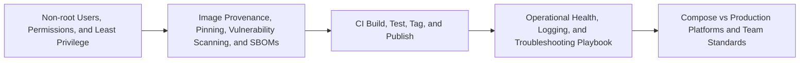

# Security Operations and Team Standards Overview

> Recognize safe container practices, diagnose common failures, and discuss how a team builds, approves, operates, and upgrades images.

> [!abstract] Chapter outcome
> Recognize safe container practices, diagnose common failures, and discuss how a team builds, approves, operates, and upgrades images.

## Topics

- [[04 Docker/06 Security Operations and Team Standards/29 Non-root Users Permissions and Least Privilege|29 - Non-root Users, Permissions, and Least Privilege]]
- [[04 Docker/06 Security Operations and Team Standards/30 Image Provenance Pinning Vulnerability Scanning and SBOMs|30 - Image Provenance, Pinning, Vulnerability Scanning, and SBOMs]]
- [[04 Docker/06 Security Operations and Team Standards/31 CI Build Test Tag and Publish|31 - CI Build, Test, Tag, and Publish]]
- [[04 Docker/06 Security Operations and Team Standards/32 Operational Health Logging and Troubleshooting Playbook|32 - Operational Health, Logging, and Troubleshooting Playbook]]
- [[04 Docker/06 Security Operations and Team Standards/33 Compose vs Production Platforms and Team Standards|33 - Compose vs Production Platforms and Team Standards]]

## Chapter Map

## How To Use This Area

Aim for informed participation and good escalation judgment. Owning a production container platform is outside the required depth.

## Related Areas

- [[04 Docker/Docker Learning Map|Docker Learning Map]]
- [[04 Docker/05 Data Stack Integration Patterns/Data Stack Integration Patterns Overview|Previous: Data Stack Integration Patterns]]
