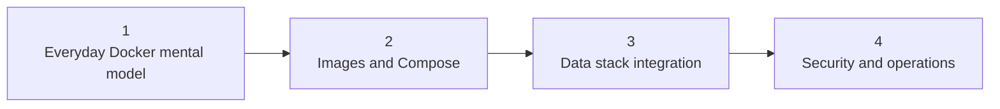

# Docker Learning Map

> [!abstract] Learning outcome
> Work confidently with the Docker concepts, files, and commands used by a Snowflake, dbt Core, Airflow, and Python team, without aiming to become a container-platform specialist.

Use this as the main entry point:

`Docker Learning Map -> chapter overview -> individual topic notes`

## Scope

Docker packages an application, runtime, and dependencies into an image and runs that image as an isolated container. It gives the team a standardized starting environment, while reproducibility still depends on pinned inputs, external configuration, data, credentials, host architecture, and operating discipline.

For this stack:

- **Snowflake** normally remains a remote managed service.
- **dbt Core** commonly runs as a short-lived command or task workload.
- **Python jobs** become explicit, versioned runtime units.
- **Airflow** coordinates work and may run across several containers or launch dedicated task containers.
- **Docker Compose** is especially useful for a repeatable local environment; it does not prove production readiness.

## Learning Path

## Chapter Hubs

- [[04 Docker/01 Foundations and Everyday Docker/Foundations and Everyday Docker Overview|01 - Foundations and Everyday Docker]]
- [[04 Docker/02 Reproducible Images and Docker Compose/Reproducible Images and Docker Compose Overview|02 - Reproducible Images and Docker Compose]]
- [[04 Docker/03 Data Stack Integration Patterns/Data Stack Integration Patterns Overview|03 - Data Stack Integration Patterns]]
- [[04 Docker/04 Security Operations and Team Standards/Security Operations and Team Standards Overview|04 - Security Operations and Team Standards]]

## Curriculum

| Topic | Priority | Why it matters |
|---|---|---|
| [[04 Docker/01 Foundations and Everyday Docker/01 What Docker Is and Where It Fits|01 - What Docker Is and Where It Fits]] | Essential | Position Docker in the stack and distinguish containers from virtual machines and Python virtual environments. |
| [[04 Docker/01 Foundations and Everyday Docker/02 Images Containers Registries Layers and Lifecycle|02 - Images, Containers, Registries, Layers, and Lifecycle]] | Essential | Connect the build artifact, running instance, distribution mechanism, layered filesystem, and container states in one mental model. |
| [[04 Docker/01 Foundations and Everyday Docker/03 Essential Commands Processes Logs and Debugging|03 - Essential Commands, Processes, Logs, and Debugging]] | Essential | Use the small command set needed to run, inspect, enter, stop, and diagnose containers while understanding exit codes and signals. |
| [[04 Docker/01 Foundations and Everyday Docker/04 Files Mounts Networks Configuration and Secrets|04 - Files, Mounts, Networks, Configuration, and Secrets]] | Essential | Understand the main boundaries through which containers persist data, reach services, receive settings, and obtain credentials. |
| [[04 Docker/02 Reproducible Images and Docker Compose/05 Dockerfile Anatomy Base Images and Dependencies|05 - Dockerfile Anatomy, Base Images, and Dependencies]] | Essential | Read the main Dockerfile instructions and evaluate the Python version, operating-system packages, and application dependencies baked into an image. |
| [[04 Docker/02 Reproducible Images and Docker Compose/06 Build Context Layers Cache and Reproducibility|06 - Build Context, Layers, Cache, and Reproducibility]] | Working depth | Understand what reaches the builder, how cache invalidation works, and why dependency locks and instruction order affect repeatability. |
| [[04 Docker/02 Reproducible Images and Docker Compose/07 Image Optimization Versioning and Registries|07 - Image Optimization, Versioning, and Registries]] | Working depth | Recognize multi-stage builds, image-size trade-offs, tags, immutable digests, and the path into a team registry. |
| [[04 Docker/02 Reproducible Images and Docker Compose/08 Docker Compose Services Storage Networking and Readiness|08 - Docker Compose: Services, Storage, Networking, and Readiness]] | Essential | Read a Compose file as the declarative definition of services, networks, volumes, configuration, startup dependencies, and health. |
| [[04 Docker/03 Data Stack Integration Patterns/09 Local Airflow dbt Python and Snowflake Environment|09 - Local Airflow, dbt, Python, and Snowflake Environment]] | Essential | Trace a realistic local environment in which Airflow and code run in containers while Snowflake remains a remote managed service. |
| [[04 Docker/03 Data Stack Integration Patterns/10 Containerizing dbt Core|10 - Containerizing dbt Core]] | Essential | Package dbt Core, its Snowflake adapter, project dependencies, profiles behavior, and artifacts into a predictable command-container workflow. |
| [[04 Docker/03 Data Stack Integration Patterns/11 Containerizing Python Data Jobs|11 - Containerizing Python Data Jobs]] | Essential | Build data jobs with explicit dependencies, configuration, inputs, outputs, logging, exit behavior, and idempotency expectations. |
| [[04 Docker/03 Data Stack Integration Patterns/12 Extending the Apache Airflow Image|12 - Extending the Apache Airflow Image]] | Essential | Add providers and project dependencies to the official image while preserving compatible Airflow constraints and repeatable builds. |
| [[04 Docker/03 Data Stack Integration Patterns/13 Running dbt and Python from Airflow|13 - Running dbt and Python from Airflow]] | Essential | Compare execution inside an Airflow image with dedicated task containers or remote execution, including artifacts, isolation, and failure handling. |
| [[04 Docker/03 Data Stack Integration Patterns/14 Snowflake Connectivity Authentication and Environment Parity|14 - Snowflake Connectivity, Authentication, and Environment Parity]] | Essential | Connect containers through approved networking, certificate trust, proxies, and non-interactive identity while separating shared runtime from environment-specific settings. |
| [[04 Docker/04 Security Operations and Team Standards/15 Non-root Users Secrets and Least Privilege|15 - Non-root Users, Secrets, and Least Privilege]] | Essential | Limit container and Snowflake blast radius while avoiding common credential, permissions, and bind-mount ownership mistakes. |
| [[04 Docker/04 Security Operations and Team Standards/16 Image Provenance Pinning Scanning and SBOMs|16 - Image Provenance, Pinning, Scanning, and SBOMs]] | Working depth | Evaluate where images and packages came from, what changed, which vulnerabilities are known, and what evidence supports supply-chain review. |
| [[04 Docker/04 Security Operations and Team Standards/17 CI Build Test Publish and Promotion|17 - CI Build, Test, Publish, and Promotion]] | Working depth | Understand how source changes become tested and versioned images that are promoted through an approved registry into runtime environments. |
| [[04 Docker/04 Security Operations and Team Standards/18 Operations Troubleshooting and Production Boundaries|18 - Operations, Troubleshooting, and Production Boundaries]] | Essential | Diagnose failures systematically and distinguish a useful local Compose environment from a production container platform and operating model. |

## Recommended First Pass

If time is limited, start with the topics marked **Essential**. This gives you 14 must-read topics. Return to the four **Working depth** topics when build performance, image governance, or CI promotion appears in your work.

## Hands-on Milestones

1. Run, inspect, troubleshoot, and remove a disposable Python container.
2. Read and make one safe change to a Dockerfile.
3. Explain a Compose environment's services, storage, networking, configuration, and health behavior.
4. Run a dbt command from a container against a safe Snowflake development target.
5. Trace how Airflow launches a dbt or Python workload and where logs, artifacts, credentials, and exit status go.
6. Review the environment for versioning, secret, permission, recovery, and production-readiness concerns.

## Deliberately Out of Scope

- Kubernetes administration, Helm authoring, service meshes, and cluster autoscaling.
- Deep Linux namespace, cgroup, storage-driver, or container-runtime internals.
- Advanced multi-architecture build infrastructure or registry administration.
- Memorizing the full Docker command or Compose reference.

## Cross-Tool Context

- [[00 Home/Snowflake Learning Map|Snowflake Learning Map]]
- [[02 dbt/dbt Learning Map|dbt Learning Map]]
- [[03 Fivetran/Fivetran Learning Map|Fivetran Learning Map]]
- [[05 APIs/API Learning Map|API Learning Map]]
- [[02 dbt/05 Deployment CI CD and Operations/44 Scheduling and Orchestration|dbt Scheduling and Orchestration]]
- [[02 dbt/05 Deployment CI CD and Operations/47 Secrets Service Accounts and RBAC|dbt Secrets, Service Accounts, and RBAC]]
- [[01 Snowflake/04 Data Engineering/25 dbt on Snowflake|dbt on Snowflake]]
- [[80 Comparisons and Decision Notes/Modern Data Stack Overview|Modern Data Stack Overview]]

## Sources To Revisit

- [Docker Docs: Get Started](https://docs.docker.com/get-started/)
- [Docker Docs: Dockerfile best practices](https://docs.docker.com/build/building/best-practices/)
- [Docker Docs: Compose](https://docs.docker.com/compose/)
- [Apache Airflow Docs: Running Airflow in Docker](https://airflow.apache.org/docs/apache-airflow/stable/howto/docker-compose/)
- [dbt Docs: Install dbt Core](https://docs.getdbt.com/docs/core/installation-overview)
- [Snowflake Docs: Connecting with the Python Connector](https://docs.snowflake.com/en/developer-guide/python-connector/python-connector-connect)
