# Docker Learning Map

> [!abstract] Learning outcome
> Explain how Docker standardizes development and runtime environments, work confidently with the Docker files and commands used by a data-engineering team, and reason about containerized dbt Core, Airflow, and Python workloads that connect to Snowflake.

Use this as the main entry point for Docker:

`Docker Learning Map -> chapter overview -> individual topic notes`

This curriculum is intentionally scoped to **Docker fluency for a data engineer and consultant**. It does not aim to make you a container-platform specialist.

## The Mental Model First

Your initial understanding is correct, with one useful refinement:

> Docker packages an application, its runtime, and its dependencies into an image, then runs that image as an isolated container. This gives teams a repeatable starting environment, but reproducibility still depends on pinned inputs, external configuration, data, credentials, host architecture, and operating discipline.

For this stack:

- **Snowflake** normally remains a remote managed service; Dockerized tools connect to it.
- **dbt Core** can run as a short-lived command container or inside an Airflow task environment.
- **Python jobs** can become purpose-built images with explicit inputs, outputs, dependencies, and exit codes.
- **Airflow** is a multi-service application and is commonly explored locally with Docker Compose; production deployment requires a separate platform decision.
- **Docker Compose** standardizes a local multi-service environment, but it is not by itself proof that the environment is secure or production-ready.

## Learning Path

```mermaid
flowchart LR
    A["1<br/>Build the container mental model"] --> B["2<br/>Build reproducible images"]
    B --> C["3<br/>Run and debug containers"]
    C --> D["4<br/>Operate a Compose environment"]
    D --> E["5<br/>Apply Docker to the data stack"]
    E --> F["6<br/>Discuss security and operations"]

    classDef foundation fill:#E8F0FE,stroke:#4C6EF5,color:#172B4D
    classDef build fill:#E6FCF5,stroke:#0CA678,color:#163A2D
    classDef operate fill:#FFF4E6,stroke:#F08C00,color:#4A2A00
    classDef judgment fill:#F3F0FF,stroke:#7950F2,color:#2B1B54

    class A foundation
    class B,C build
    class D,E operate
    class F judgment
```

## Recommended Depth

| Level | What success looks like | Curriculum emphasis |
|---|---|---|
| Minimum conversational fluency | Explain image vs container, Dockerfile vs Compose, mount vs image content, port mapping, and why Snowflake is not running locally | Chapters 1-2 and Topics 12, 14-16, 18-20 |
| Day-to-day working level | Build and run the team's images, use Compose, follow logs, diagnose common failures, and change dependencies safely | Chapters 1-5 |
| Consultant working knowledge | Discuss reproducibility limits, secrets, image provenance, CI promotion, execution boundaries, and production fit | All chapters |
| Optional specialist depth | Operate Kubernetes, design cluster networking, tune BuildKit fleets, or administer a registry platform | Explicitly outside this curriculum |

## Chapter Hubs

- [[04 Docker/01 Foundations and Container Mental Model/Foundations and Container Mental Model Overview|01 - Foundations and Container Mental Model]]
- [[04 Docker/02 Building Reproducible Images/Building Reproducible Images Overview|02 - Building Reproducible Images]]
- [[04 Docker/03 Running Containers and Local Development/Running Containers and Local Development Overview|03 - Running Containers and Local Development]]
- [[04 Docker/04 Docker Compose and Multi-Service Environments/Docker Compose and Multi-Service Environments Overview|04 - Docker Compose and Multi-Service Environments]]
- [[04 Docker/05 Data Stack Integration Patterns/Data Stack Integration Patterns Overview|05 - Data Stack Integration Patterns]]
- [[04 Docker/06 Security Operations and Team Standards/Security Operations and Team Standards Overview|06 - Security Operations and Team Standards]]

## Full Curriculum

| Topic | Why it matters |
|---|---|
| [[04 Docker/01 Foundations and Container Mental Model/01 What Docker Is and Is Not|01 - What Docker Is and Is Not]] | Position Docker as a way to package and run software consistently—not as a data warehouse, workflow orchestrator, or complete production platform. |
| [[04 Docker/01 Foundations and Container Mental Model/02 Containers vs Virtual Machines and Python Virtual Environments|02 - Containers vs Virtual Machines and Python Virtual Environments]] | Separate OS-level process isolation from machine virtualization and Python-only dependency isolation. |
| [[04 Docker/01 Foundations and Container Mental Model/03 Images Containers Registries and Layers|03 - Images, Containers, Registries, and Layers]] | Build the vocabulary for immutable image artifacts, running container instances, distribution, and layered reuse. |
| [[04 Docker/01 Foundations and Container Mental Model/04 Docker Engine Docker Desktop and the Container Lifecycle|04 - Docker Engine, Docker Desktop, and the Container Lifecycle]] | Understand the client, engine, Linux VM boundary on desktop systems, and the states a container moves through. |
| [[04 Docker/01 Foundations and Container Mental Model/05 Docker in the Snowflake dbt Airflow and Python Stack|05 - Docker in the Snowflake, dbt, Airflow, and Python Stack]] | See which parts run in containers, which remain external services, and where configuration and responsibility boundaries sit. |
| [[04 Docker/02 Building Reproducible Images/06 Dockerfile Anatomy|06 - Dockerfile Anatomy]] | Recognize FROM, WORKDIR, COPY, RUN, USER, ENTRYPOINT, and CMD, and explain which choices happen at build time. |
| [[04 Docker/02 Building Reproducible Images/07 Base Images Python Versions and OS Packages|07 - Base Images, Python Versions, and OS Packages]] | Choose a trusted base that supports the required Python and native dependencies without carrying unnecessary risk or weight. |
| [[04 Docker/02 Building Reproducible Images/08 Build Context dockerignore Layers and Cache|08 - Build Context, .dockerignore, Layers, and Cache]] | Understand what is sent to the builder, what invalidates cache, and why instruction order affects speed and accidental data exposure. |
| [[04 Docker/02 Building Reproducible Images/09 Reproducible Python Dependency Installation|09 - Reproducible Python Dependency Installation]] | Install dbt adapters, Snowflake libraries, Airflow providers, and application packages from controlled, reviewable dependency definitions. |
| [[04 Docker/02 Building Reproducible Images/10 Multi-stage Builds Image Size and BuildKit|10 - Multi-stage Builds, Image Size, and BuildKit]] | Recognize when separate build and runtime stages, cache mounts, or build secrets improve an image without over-engineering it. |
| [[04 Docker/02 Building Reproducible Images/11 Tags Digests and Container Registries|11 - Tags, Digests, and Container Registries]] | Distinguish human-friendly tags from immutable digests and understand how teams publish and promote approved images. |
| [[04 Docker/03 Running Containers and Local Development/12 Essential Container Commands and Lifecycle|12 - Essential Container Commands and Lifecycle]] | Use the small command set needed to pull, run, list, stop, remove, execute in, and inspect containers. |
| [[04 Docker/03 Running Containers and Local Development/13 Processes Entrypoints Signals and Exit Codes|13 - Processes, Entrypoints, Signals, and Exit Codes]] | Treat a container as an isolated process and understand how startup commands, shutdown signals, and exit status affect orchestration. |
| [[04 Docker/03 Running Containers and Local Development/14 Container Filesystems Bind Mounts and Volumes|14 - Container Filesystems, Bind Mounts, and Volumes]] | Know what disappears with a container, what should persist, and when source code or logs should be mounted from the host. |
| [[04 Docker/03 Running Containers and Local Development/15 Ports Networks DNS and Host Access|15 - Ports, Networks, DNS, and Host Access]] | Explain published ports, service-name DNS, localhost confusion, and how a container reaches Snowflake or a host-side service. |
| [[04 Docker/03 Running Containers and Local Development/16 Configuration Environment Variables and Secrets|16 - Configuration, Environment Variables, and Secrets]] | Separate image content from runtime configuration and keep credentials out of source code, image layers, and ordinary logs. |
| [[04 Docker/03 Running Containers and Local Development/17 Logs Inspection Debugging Resources and Cleanup|17 - Logs, Inspection, Debugging, Resources, and Cleanup]] | Use evidence to diagnose failures, recognize memory or disk pressure, and clean unused objects without deleting valued data. |
| [[04 Docker/04 Docker Compose and Multi-Service Environments/18 Docker Compose Mental Model and YAML Structure|18 - Docker Compose Mental Model and YAML Structure]] | Understand how a version-controlled Compose file declares services and their runtime configuration. |
| [[04 Docker/04 Docker Compose and Multi-Service Environments/19 Services Networks Volumes and Project Names|19 - Services, Networks, Volumes, and Project Names]] | Read the main Compose objects and predict names, connectivity, persistence, and isolation between projects. |
| [[04 Docker/04 Docker Compose and Multi-Service Environments/20 Startup Order Healthchecks and Readiness|20 - Startup Order, Healthchecks, and Readiness]] | Distinguish a process starting from a dependency being ready, and know where retries and health conditions belong. |
| [[04 Docker/04 Docker Compose and Multi-Service Environments/21 Environment Files Overrides and Profiles|21 - Environment Files, Overrides, and Profiles]] | Support local differences and optional services without copying or silently forking the main environment definition. |
| [[04 Docker/04 Docker Compose and Multi-Service Environments/22 Local Airflow dbt Python and Snowflake Environment|22 - Local Airflow, dbt, Python, and Snowflake Environment]] | Trace a realistic local stack in which Airflow and support services are containerized while Snowflake remains a remote managed service. |
| [[04 Docker/05 Data Stack Integration Patterns/23 Containerizing dbt Core|23 - Containerizing dbt Core]] | Package dbt Core, the Snowflake adapter, project dependencies, profiles behavior, and artifacts into a predictable execution pattern. |
| [[04 Docker/05 Data Stack Integration Patterns/24 Containerizing Python Data Jobs|24 - Containerizing Python Data Jobs]] | Build small batch or utility jobs with explicit dependencies, inputs, outputs, exit behavior, and idempotency expectations. |
| [[04 Docker/05 Data Stack Integration Patterns/25 Extending the Apache Airflow Image|25 - Extending the Apache Airflow Image]] | Add providers and project dependencies to the official Airflow image while respecting Airflow version constraints and repeatable builds. |
| [[04 Docker/05 Data Stack Integration Patterns/26 Running dbt and Python from Airflow|26 - Running dbt and Python from Airflow]] | Compare in-process commands, subprocesses, dedicated containers, and remote execution so task isolation and artifact handling are explicit. |
| [[04 Docker/05 Data Stack Integration Patterns/27 Snowflake Connectivity Authentication and Certificates|27 - Snowflake Connectivity, Authentication, and Certificates]] | Make containers reach Snowflake through approved networking, certificate trust, proxies, and non-interactive authentication without baking in secrets. |
| [[04 Docker/05 Data Stack Integration Patterns/28 Development CI and Runtime Parity|28 - Development, CI, and Runtime Parity]] | Define what should remain identical across environments and which settings, credentials, data, and platform controls must differ. |
| [[04 Docker/06 Security Operations and Team Standards/29 Non-root Users Permissions and Least Privilege|29 - Non-root Users, Permissions, and Least Privilege]] | Reduce container and Snowflake blast radius while avoiding common bind-mount and file-ownership failures. |
| [[04 Docker/06 Security Operations and Team Standards/30 Image Provenance Pinning Vulnerability Scanning and SBOMs|30 - Image Provenance, Pinning, Vulnerability Scanning, and SBOMs]] | Evaluate where images come from, how changes are controlled, and what evidence supports supply-chain review. |
| [[04 Docker/06 Security Operations and Team Standards/31 CI Build Test Tag and Publish|31 - CI Build, Test, Tag, and Publish]] | Understand the promotion path from source change to tested image in an approved registry. |
| [[04 Docker/06 Security Operations and Team Standards/32 Operational Health Logging and Troubleshooting Playbook|32 - Operational Health, Logging, and Troubleshooting Playbook]] | Work from container state, exit code, logs, health, resources, networking, mounts, and configuration toward a likely cause. |
| [[04 Docker/06 Security Operations and Team Standards/33 Compose vs Production Platforms and Team Standards|33 - Compose vs Production Platforms and Team Standards]] | Know when Compose is sufficient, when a production orchestrator is needed, and which standards a data team should document. |

## Hands-on Milestones

1. Run a disposable Python container and explain what was isolated and what was not.
2. Build a small Python image from a Dockerfile and prove that a dependency version is reproducible.
3. Mount local code, pass non-secret configuration, capture logs, and diagnose a deliberate failure.
4. Start a small Compose project and explain its services, network, volumes, healthchecks, and cleanup behavior.
5. Run a dbt command in a container against a safe Snowflake development target.
6. Extend an Airflow image with controlled Python dependencies and trace how a task launches dbt or Python.
7. Review an example as if it were a client repository: identify credential, versioning, permissions, persistence, and production-readiness concerns.

## What Not To Prioritize Yet

- Kubernetes administration, Helm authoring, service meshes, and cluster autoscaling.
- Deep Linux namespace, cgroup, union-filesystem, or container-runtime internals.
- Building a custom container runtime or advanced multi-architecture build infrastructure.
- Memorizing every Docker command or every Compose attribute.
- Treating a local Airflow quick-start as a production architecture.

## Cross-Tool Context

- [[00 Home/Snowflake Learning Map|Snowflake Learning Map]]
- [[02 dbt/dbt Learning Map|dbt Learning Map]]
- [[03 Fivetran/Fivetran Learning Map|Fivetran Learning Map]]
- [[02 dbt/05 Deployment CI CD and Operations/44 Scheduling and Orchestration|dbt Scheduling and Orchestration]]
- [[02 dbt/05 Deployment CI CD and Operations/47 Secrets Service Accounts and RBAC|dbt Secrets, Service Accounts, and RBAC]]
- [[01 Snowflake/04 Data Engineering/25 dbt on Snowflake|dbt on Snowflake]]
- [[80 Comparisons and Decision Notes/Modern Data Stack Overview|Modern Data Stack Overview]]

## Sources To Revisit

- [Docker Docs: Get Started](https://docs.docker.com/get-started/)
- [Docker Docs: Docker concepts](https://docs.docker.com/get-started/docker-concepts/)
- [Docker Docs: Dockerfile best practices](https://docs.docker.com/build/building/best-practices/)
- [Docker Docs: Compose](https://docs.docker.com/compose/)
- [Apache Airflow Docs: Running Airflow in Docker](https://airflow.apache.org/docs/apache-airflow/stable/howto/docker-compose/)
- [dbt Docs: Install dbt Core](https://docs.getdbt.com/docs/core/installation-overview)
- [Snowflake Docs: Connecting with the Python Connector](https://docs.snowflake.com/en/developer-guide/python-connector/python-connector-connect)
