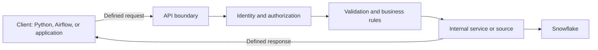

# What APIs Are and Where They Fit

> [!abstract] Learning target
> Explain an API as a controlled system boundary and place it correctly in a Snowflake-centered data architecture.

> **Curriculum priority:** Essential

## Executive Summary

- **What it is:** An application programming interface (API) is a defined way for one piece of software to request data or an action from another.
- **Why it matters:** APIs are common source interfaces, automation surfaces, and delivery channels for data products.
- **Mental model:** An API is a service counter with a menu and rules. The client asks in an allowed form; the service decides whether and how to respond.
- **Best used when:** Consumers need controlled, on-demand access to a capability or a bounded amount of data.
- **Avoid or reconsider when:** The requirement is high-volume bulk movement, continuous change capture, or unrestricted analytical querying.

An API is both a **contract** and a **boundary**. The contract describes valid requests and responses. The boundary hides internal implementation and gives the provider a place to enforce identity, authorization, validation, rate limits, and observability.

For a data engineer, there are two common directions:

- **Consume an API:** extract data from a SaaS or operational system and land it in Snowflake.
- **Provide an API:** expose a deliberately shaped data product or action to an application without giving it broad database access.

## What It Can Do

- Provide a stable interface while the provider changes internal code or storage.
- Expose narrowly defined data or business actions to applications and pipelines.
- Enforce authentication, authorization, validation, quotas, and audit logging at a boundary.
- Support automation of platform operations, such as configuring Fivetran connectors or executing Snowflake SQL through supported APIs.
- Return current data on demand when a scheduled file is not timely enough.

## What It Cannot Do

- Guarantee data quality, uptime, or backwards compatibility unless the provider operates those concerns well.
- Make row-by-row HTTP calls efficient for bulk analytical transfer.
- Remove the need for source-to-target reconciliation, lineage, retention, and ownership.
- Turn Snowflake into a low-latency operational database simply by placing an API in front of it.
- Replace a managed connector, CDC stream, or file exchange when those patterns better match volume and latency.

## Core Concepts

| Concept | Plain-language meaning | Why it matters |
|---|---|---|
| Client | Software that sends a request | A Python ingestion job, UI, Airflow task, or another service can be a client |
| Provider or server | Software that receives the request and produces a response | It owns validation, authorization, behavior, and service reliability |
| Endpoint | An address plus an operation exposed by the API | It is the callable surface, such as `GET /customers/42` |
| Contract | The documented rules for requests and responses | Consumers build against it and depend on compatible change |
| Payload | Data carried in a request or response | Frequently JSON, but files, XML, binary formats, and empty bodies also occur |
| Control plane | Interface for configuring or operating a system | Creating a connector or warehouse is different from moving business data |
| Data plane | Interface through which workload data is read, written, or processed | Volume, latency, privacy, and cost dominate the design |

## How It Works (Simple Flow)

1. A provider defines operations, accepted inputs, response shapes, and access rules.
2. A client obtains documentation and, when required, credentials.
3. The client sends a request to an endpoint using the agreed protocol.
4. The provider authenticates the caller, authorizes the operation, and validates the input.
5. The provider reads data or performs an action in its internal systems.
6. It returns a response containing a result or a structured error.
7. Both sides use logs, identifiers, metrics, and version rules to operate the interaction over time.

## Visuals



The API exposes a controlled capability, not the provider's whole internal implementation.

## Readable Snippets

```http
GET /v1/customers/42 HTTP/1.1
Host: api.example.com
Authorization: Bearer <token>
Accept: application/json
```

Read this as: “The client asks `api.example.com` for customer `42`, requests JSON, and presents a credential.” The example says nothing yet about whether that caller is allowed to see the customer.

## Consultant Talking Points

- **Client question this answers:** “Should we integrate through an API, connect directly to the database, or receive files?”
- **Trade-offs to mention:** APIs provide control and decoupling, but add service ownership, network failures, quotas, and contract management.
- **Risk or governance angle:** The boundary can enforce least privilege and record access, but weak object-level authorization can still expose another customer's data.
- **Cost or performance angle:** APIs are effective for bounded interactions; chatty row-by-row calls and warehouse-backed low-latency requests can be slow and expensive.

## Common Pitfalls

- Calling every integration an API and missing the important distinction between request-response, files, webhooks, events, and database connections.
- Assuming an authenticated caller is authorized for every referenced object or field.
- Building a custom extractor before evaluating a managed Fivetran connector or a bulk export.
- Returning Snowflake tables almost unchanged and accidentally exposing unstable schemas or sensitive columns.
- Treating an API as “just a thin layer” without assigning an owner for uptime, changes, support, and cost.

## When to Recommend What (Decision Table)

| Situation | Recommend | Why | Watch-outs |
|---|---|---|---|
| Application needs a small, current result on demand | API | Controlled request-response access fits the interaction | Latency, availability, authorization, and quotas |
| Snowflake needs data from a common SaaS source | Evaluate a managed connector first | Connector may already handle pagination, schema drift, and recovery | Coverage, sync behavior, cost, and ownership boundary |
| Large periodic dataset must move between organizations | File or bulk-export interface | More efficient and replayable than millions of small calls | Encryption, manifests, completeness, and retention |
| Every database change is needed quickly | CDC or event stream | Represents continuous change more naturally | Ordering, duplicates, replay, and schema evolution |
| External app needs curated Snowflake data | Narrow data-product API or supported sharing pattern | Avoids broad warehouse credentials and hides physical tables | Do not promise operational latency without testing architecture |
| Administrator needs to automate platform configuration | Control-plane API or Terraform provider | Repeatable, auditable operations | Permissions, idempotency, drift, and version support |

## Related Topics

- [[05 APIs/01 Foundations and API Literacy/Foundations and API Literacy Overview|Foundations and API Literacy Overview]]
- [[05 APIs/01 Foundations and API Literacy/02 HTTP Request and Response Anatomy|HTTP Request and Response Anatomy]]
- [[03 Fivetran/02 Connectors and Sync Behavior/09 File Event and Custom Connector Patterns|File, Event, and Custom Connector Patterns]]
- [[03 Fivetran/04 Fivetran with Snowflake and dbt/19 Fivetran to Snowflake to dbt Ownership Boundaries|Fivetran to Snowflake to dbt Ownership Boundaries]]

## Related Decision Notes

- [[80 Comparisons and Decision Notes/Comparisons/Cross-Tool/Comparison - API vs File vs CDC|API vs File vs CDC]]
- [[80 Comparisons and Decision Notes/Decision Notes/Cross-Tool/Decisions - Build vs Buy API Ingestion|Build vs Buy API Ingestion]]

## Questions

- **Explain:** What does an API hide, and what does its contract expose?
- **Apply:** In a source-to-Snowflake pipeline, which component is the API client and which organization owns the provider?
- **Challenge:** When would an API be a worse choice than a file export or CDC stream even if an API is available?

## Sources To Revisit

- [MDN: An overview of HTTP](https://developer.mozilla.org/en-US/docs/Web/HTTP/Guides/Overview)
- [IETF RFC 9110: HTTP Semantics](https://www.rfc-editor.org/rfc/rfc9110)
- [Snowflake Documentation: SQL API](https://docs.snowflake.com/en/developer-guide/sql-api/index)
- [Fivetran Documentation: REST API](https://fivetran.com/docs/rest-api)
