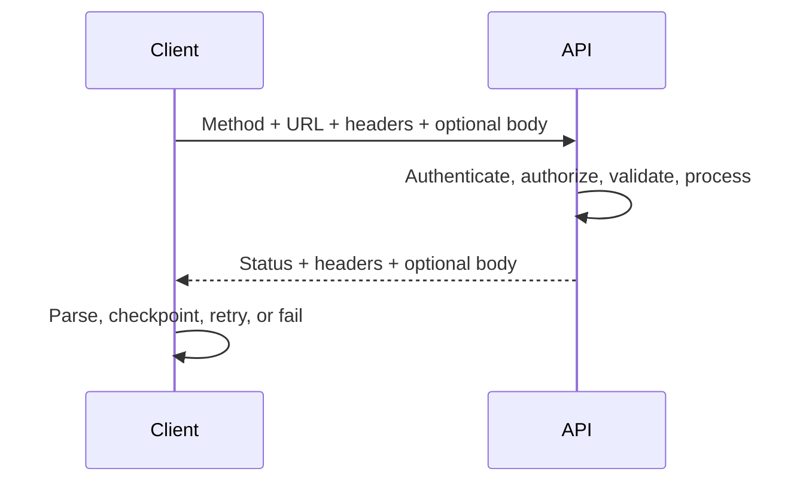

# HTTP Request and Response Anatomy

> [!abstract] Learning target
> Read an HTTP exchange and explain where the operation, identity, options, payload, outcome, and diagnostics are carried.

> **Curriculum priority:** Essential

## Executive Summary

- **What it is:** HTTP is the request-response protocol used by most web APIs.
- **Why it matters:** API documentation, logs, errors, and client code all assume this vocabulary.
- **Mental model:** A request is an addressed envelope with instructions and optional contents; the response is a receipt plus optional result.
- **Best used when:** A client needs a standard network interface supported across languages and platforms.
- **Avoid or reconsider when:** The workload needs continuous streaming, very low protocol overhead, or bulk transfer better served by another interface.

A URL identifies where to send the request. The method states the intended operation. Headers carry metadata. The optional body carries data. The response status describes the outcome, response headers provide metadata, and the optional response body provides a result or error detail.

## What It Can Do

- Address resources with URLs and express operations through methods.
- Negotiate representations such as JSON using headers.
- Carry credentials, tracing identifiers, conditional-request metadata, and caching instructions.
- Communicate broad outcomes with standardized status codes.
- Protect traffic in transit when HTTP is used over TLS as HTTPS.

## What It Cannot Do

- Guarantee that an API uses methods or status codes consistently.
- Explain business-specific errors through a status code alone.
- Make sensitive data safe if it is logged, placed in URLs, or exposed after decryption.
- Ensure retries are safe; that depends on method semantics and server implementation.
- Guarantee delivery exactly once across network failures.

## Core Concepts

| Part | Plain-language meaning | Example |
|---|---|---|
| Scheme and host | Protocol and destination service | `https://api.example.com` |
| Path | Address within the service | `/v1/orders/123` |
| Query parameters | Optional selection or control values | `?updated_after=2026-08-01&limit=100` |
| Method | Intended operation | `GET`, `POST`, `PATCH`, `DELETE` |
| Request headers | Metadata about caller, content, or request | `Authorization`, `Accept`, `Content-Type` |
| Request body | Optional input representation | JSON describing a new resource |
| Status code | Standardized outcome class | `200`, `201`, `400`, `401`, `404`, `429`, `500` |
| Response headers | Metadata about result and service behavior | `Content-Type`, `Retry-After`, request ID |
| Response body | Returned representation or error details | JSON data or problem details |

Status-code families are useful first clues:

| Family | Meaning | Typical interpretation |
|---|---|---|
| `2xx` | Request succeeded | Process the result; exact meaning depends on the code |
| `3xx` | Redirection or cache-related outcome | Client may need to follow another location or use cached data |
| `4xx` | Request cannot be fulfilled as sent | Fix credentials, authorization, address, input, quota, or state |
| `5xx` | Provider failed to fulfill an apparently valid request | Often transient, but retry only under a defined policy |

## How It Works (Simple Flow)

1. The client resolves the host and establishes an HTTPS connection.
2. It sends a method, target, headers, and—when required—a request body.
3. The provider parses the message and correlates it with a request ID.
4. Authentication, authorization, and input validation run before the operation.
5. The provider performs the work or determines why it cannot.
6. It returns a status code, response headers, and an optional body.
7. The client interprets the whole response, records useful diagnostics, and decides whether to continue, correct, retry, or fail.

## Visuals



## Readable Snippets

```http
GET /v1/orders?updated_after=2026-08-01T00:00:00Z&limit=100 HTTP/1.1
Host: api.example.com
Authorization: Bearer <token>
Accept: application/json
X-Request-ID: ingest-20260816-001

HTTP/1.1 200 OK
Content-Type: application/json
X-Request-ID: ingest-20260816-001

{"orders":[{"id":"o-17","updated_at":"2026-08-14T10:30:00Z"}]}
```

The query parameters select a window and page size. `Accept` asks for JSON. The request ID helps correlate client and provider logs. The `200` signals success, while the body carries the actual data.

## Consultant Talking Points

- **Client question this answers:** “What information do we need from the provider to diagnose failed API calls?”
- **Trade-offs to mention:** Rich headers and error bodies help operation, but sensitive values must be redacted and client behavior must remain predictable.
- **Risk or governance angle:** URLs commonly enter logs and monitoring systems; avoid putting tokens, personal data, or secrets in query strings.
- **Cost or performance angle:** Response size, compression, connection reuse, page size, and call count can matter more than the JSON parsing itself.

## Common Pitfalls

- Looking only at the status code and ignoring a useful error body, request ID, or `Retry-After` header.
- Sending JSON without the correct `Content-Type`, or assuming `Accept` and `Content-Type` mean the same thing.
- Putting API keys or personal data in URLs, where proxies, browser history, and access logs may retain them.
- Retrying every `4xx` or `5xx` response blindly and amplifying an outage or duplicating a write.
- Treating `401 Unauthorized` as lack of business permission; it usually means valid authentication credentials are missing or invalid, while `403 Forbidden` means the server understood the identity but refuses access.
- Logging full authorization headers or response payloads and creating a second sensitive-data store.

## When to Recommend What (Decision Table)

| Situation | Recommend | Why | Watch-outs |
|---|---|---|---|
| Filter, cursor, or page-size option | Query parameter | Visible, conventional input for retrieval | Keep secrets and sensitive filters out of URLs |
| Structured data creates or changes a resource | Request body with declared `Content-Type` | Handles nested, validated input cleanly | Body size, schema validation, and replay safety |
| Caller identity or token | Authorization header | Standard location supported by clients and gateways | Redact logs and use HTTPS |
| Diagnostic correlation | Request or trace ID header | Connects client, gateway, service, and warehouse logs | Define whether client or provider creates the canonical ID |
| Machine-readable error | Appropriate status plus structured error body | Supports both generic and domain-specific handling | Keep error format consistent and avoid leaking internals |
| Potentially transient throttling | `429` plus retry guidance | Clearly signals quota pressure | Respect `Retry-After`; add bounded backoff and jitter |

## Related Topics

- [[05 APIs/01 Foundations and API Literacy/Foundations and API Literacy Overview|Foundations and API Literacy Overview]]
- [[05 APIs/01 Foundations and API Literacy/01 What APIs Are and Where They Fit|What APIs Are and Where They Fit]]
- [[05 APIs/01 Foundations and API Literacy/03 REST Resources Methods and Semantics|REST Resources, Methods, and Semantics]]
- [[05 APIs/01 Foundations and API Literacy/04 JSON Serialization and Data Types|JSON, Serialization, and Data Types]]

## Related Decision Notes

- [[80 Comparisons and Decision Notes/Decision Notes/Cross-Tool/Decisions - Build vs Buy API Ingestion|Build vs Buy API Ingestion]]

## Questions

- **Explain:** What distinct jobs do the method, headers, status code, and body perform?
- **Apply:** Which parts of the example request would you record for an ingestion run, and which would you redact?
- **Challenge:** A `POST` times out after the server receives it. Why is “retry immediately” not automatically safe?

## Sources To Revisit

- [IETF RFC 9110: HTTP Semantics](https://www.rfc-editor.org/rfc/rfc9110)
- [MDN: HTTP messages](https://developer.mozilla.org/en-US/docs/Web/HTTP/Guides/Messages)
- [MDN: HTTP response status codes](https://developer.mozilla.org/en-US/docs/Web/HTTP/Reference/Status)
- [IETF RFC 9457: Problem Details for HTTP APIs](https://www.rfc-editor.org/rfc/rfc9457)
