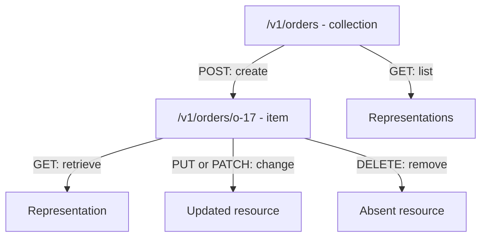

# REST Resources, Methods, and Semantics

> [!abstract] Learning target
> Read a resource-oriented API, choose sensible HTTP methods, and reason about safe retries without treating REST as a rigid URL-naming recipe.

> **Curriculum priority:** Essential

## Executive Summary

- **What it is:** REST is an architectural style in which clients interact with resource representations through a uniform interface, commonly HTTP.
- **Why it matters:** Most public APIs are described as REST APIs, even though real implementations follow the style to different degrees.
- **Mental model:** URLs identify nouns; HTTP methods express common operations; representations show resource state.
- **Best used when:** A service exposes understandable resources and benefits from standard web semantics, broad tooling, and loose client-server coupling.
- **Avoid or reconsider when:** The interaction is naturally an event stream, a complex graph query, a tightly coupled low-latency service call, or a bulk data transfer.

REST is not “JSON over HTTP,” and it does not require every operation to map neatly to create, read, update, and delete. The practical goal is a predictable interface whose methods, status codes, links, caching, and representations mean what clients expect.

## What It Can Do

- Organize an interface around stable business resources such as customers, orders, jobs, and connectors.
- Reuse standard HTTP semantics for reading, creating, replacing, modifying, and deleting state.
- Keep clients independent from a provider's database tables and internal functions.
- Support caching, intermediaries, conditional requests, and standardized tooling when HTTP semantics are honored.
- Make many operations discoverable and understandable without a custom protocol.

## What It Cannot Do

- Make a poorly modeled domain clear merely by using plural nouns in URLs.
- Guarantee idempotency when the implementation ignores the method's semantics.
- Remove concurrency conflicts or the need for validation and authorization.
- Represent every business operation elegantly as CRUD.
- Guarantee compatibility; resource representations still evolve and require contract discipline.

## Core Concepts

| Concept | Meaning | Why it matters |
|---|---|---|
| Resource | A conceptual entity with an identity | Examples include an order, connector, export job, or customer collection |
| Representation | Data describing resource state at a point in time | Often JSON; it is not necessarily the provider's storage row |
| Collection | A resource representing a set of items | Common place for filtering, pagination, and creation |
| Uniform interface | Shared semantics rather than a new verb for every action | Lets generic clients, gateways, and operators understand behavior |
| Safe method | Intended to be read-only from the client's perspective | `GET`, `HEAD`, and `OPTIONS` should not request a state change |
| Idempotent method | Repeating the same intended request has the same intended effect | Important when a client cannot tell whether a timed-out call completed |
| Stateless request | Each request carries what the provider needs to understand it | The service can still store resource and authentication state; it should not rely on hidden conversational context |

Common method expectations:

| Method | Typical use | Safe? | Idempotent? |
|---|---|---:|---:|
| `GET` | Retrieve a resource or collection | Yes | Yes |
| `POST` | Create under a collection or invoke a non-idempotent operation | No | Not by definition |
| `PUT` | Create or fully replace state at a known target | No | Yes |
| `PATCH` | Apply a partial modification | No | Depends on patch semantics and request |
| `DELETE` | Request removal of a resource | No | Yes for the intended effect |

“Idempotent” does not mean every response is identical. A repeated `DELETE` may first return success and later return not found; the intended end state remains “resource absent.” Logging, billing, and timestamps can still be side effects.

## How It Works (Simple Flow)

1. The provider identifies meaningful resources and stable identifiers.
2. It defines collection and item URLs such as `/v1/orders` and `/v1/orders/o-17`.
3. Standard methods communicate common intent: retrieve, create, replace, modify, or delete.
4. Request and response representations carry state without exposing physical database design.
5. Status codes communicate the broad outcome and headers add metadata.
6. Clients follow links, filters, pagination, concurrency controls, and version rules defined by the contract.
7. The provider preserves documented semantics as implementation and storage evolve.

## Visuals



## Readable Snippets

```http
POST /v1/exports HTTP/1.1
Content-Type: application/json
Idempotency-Key: source-a-2026-08-16

{"source":"orders","updated_before":"2026-08-16T00:00:00Z"}
```

```http
HTTP/1.1 201 Created
Location: /v1/exports/ex-204
Content-Type: application/json

{"id":"ex-204","status":"queued"}
```

The export is modeled as a resource because it has identity and state. The idempotency key is an API-specific mechanism that can prevent a retried creation request from creating a second job; HTTP does not make `POST` idempotent automatically.

## Consultant Talking Points

- **Client question this answers:** “Can we safely retry this write after a timeout?”
- **Trade-offs to mention:** Familiar resource semantics improve usability, but forcing action-heavy domains into artificial CRUD can make the API less honest.
- **Risk or governance angle:** Authorization must be checked against the requested resource, not merely at the endpoint or role level.
- **Cost or performance angle:** Collection endpoints need bounded page sizes and filters; an unbounded `GET /transactions` can become a denial-of-service path or an expensive Snowflake query.

## Common Pitfalls

- Assuming `POST` means create and `PUT` means update in every API without reading that API's contract.
- Calling an endpoint RESTful solely because it uses HTTP and returns JSON.
- Retrying non-idempotent writes after timeouts without an idempotency key or reconciliation step.
- Using `GET` for a state-changing action, allowing caches, crawlers, or retries to trigger it unexpectedly.
- Exposing physical table names and rows as resources, tightly coupling consumers to warehouse design.
- Allowing unbounded collection reads or arbitrary filters to generate costly Snowflake workloads.
- Returning `200 OK` for every outcome and forcing clients to reverse-engineer errors from text.

## When to Recommend What (Decision Table)

| Situation | Recommend | Why | Watch-outs |
|---|---|---|---|
| Read a resource without changing requested state | `GET` | Safe, idempotent, cache-aware semantics | Do not hide a state-changing command in the request |
| Create a server-identified child resource | `POST` to a collection | Server can assign identity and return `Location` | Use an idempotency strategy when retry matters |
| Replace complete state at a known URL | `PUT` | Replacement semantics and idempotency are clear | Define omitted-field behavior; do not silently treat it as patch |
| Change selected fields | `PATCH` | Avoids sending a full representation | Define patch format, validation, concurrency, and idempotency |
| Start a long-running export | Create a job resource and return `202` or `201` | Gives status, ownership, and lifecycle a durable identity | Polling interval, expiry, cancellation, and duplicate jobs |
| Business command does not fit CRUD honestly | Explicit command resource or RPC-style operation | Clearer than pretending every behavior is an entity update | Keep naming and retry behavior consistent |

## Related Topics

- [[05 APIs/01 Foundations and API Literacy/Foundations and API Literacy Overview|Foundations and API Literacy Overview]]
- [[05 APIs/01 Foundations and API Literacy/02 HTTP Request and Response Anatomy|HTTP Request and Response Anatomy]]
- [[05 APIs/01 Foundations and API Literacy/04 JSON Serialization and Data Types|JSON, Serialization, and Data Types]]
- [[05 APIs/01 Foundations and API Literacy/05 API Contracts OpenAPI and Documentation|API Contracts, OpenAPI, and Documentation]]

## Related Decision Notes

- No dedicated API comparison note yet; [[05 APIs/01 Foundations and API Literacy/06 API Styles at Recognition Depth|API Styles at Recognition Depth]] provides the first style-selection framework.

## Questions

- **Explain:** What is the difference between a resource and its JSON representation?
- **Apply:** How would you model an asynchronous Snowflake export so a client can check its status later?
- **Challenge:** Why can an idempotent request produce different status codes or logs when repeated?

## Sources To Revisit

- [Roy Fielding: Architectural Styles and the Design of Network-based Software Architectures, Chapter 5](https://ics.uci.edu/~fielding/pubs/dissertation/rest_arch_style.htm)
- [IETF RFC 9110: HTTP Semantics — Methods](https://www.rfc-editor.org/rfc/rfc9110#section-9)
- [IETF RFC 5789: PATCH Method for HTTP](https://www.rfc-editor.org/rfc/rfc5789)
- [MDN: HTTP request methods](https://developer.mozilla.org/en-US/docs/Web/HTTP/Reference/Methods)
