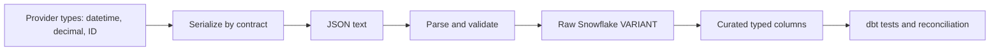

# JSON, Serialization, and Data Types

> [!abstract] Learning target
> Translate safely between in-memory values, JSON payloads, and Snowflake data without assuming that similar-looking types mean the same thing.

> **Curriculum priority:** Essential

## Executive Summary

- **What it is:** JSON is a text format for values built from objects, arrays, strings, numbers, booleans, and `null`; serialization converts program values into a transport representation and parsing reconstructs usable values.
- **Why it matters:** JSON is the most common REST API payload format, and type mismatches are a frequent source of silent data corruption.
- **Mental model:** JSON is a shipping format, not a database schema. Labels on the package do not guarantee how the receiving system stores the contents.
- **Best used when:** Payloads are structured, reasonably sized, human-readable, and exchanged across diverse clients.
- **Avoid or reconsider when:** Very large tabular or binary datasets require compact size, strong typing, columnar processing, or streaming efficiency.

JSON has no native timestamp, date, decimal, or binary type. APIs usually encode these as strings and define their meaning in the contract. A valid JSON payload can therefore still be semantically wrong.

## What It Can Do

- Represent nested objects, repeated arrays, scalar values, booleans, and explicit nulls.
- Move data between languages without sharing in-memory object implementations.
- Preserve a raw semi-structured payload in Snowflake `VARIANT` for later inspection and transformation.
- Support additive fields that older tolerant consumers may ignore.
- Remain readable in API documentation, logs, and small examples.

## What It Cannot Do

- Express date, timestamp, decimal, or binary semantics without a documented convention.
- Guarantee exact high-precision numeric handling in every parser.
- Distinguish “field absent,” “field present as null,” and “field present as empty” unless the contract and consumer preserve the distinction.
- Enforce required fields, formats, or business rules by itself.
- Efficiently replace Parquet or another bulk format for large analytical datasets.

## Core Concepts

| Concept | Meaning | Data-engineering concern |
|---|---|---|
| Object | Unordered collection of name-value members | Often becomes a record, `VARIANT` object, or related tables |
| Array | Ordered sequence of values | May remain nested or be flattened into child rows |
| Number | JSON numeric literal without a declared precision/scale type | Large integers and decimals may lose precision in some clients |
| String | Unicode text | Common carrier for IDs, timestamps, decimals, and encoded binary data |
| Boolean | `true` or `false` | Do not silently reinterpret strings such as `"false"` as booleans |
| `null` | Explicit absence of a value | Different from a missing field and often different from an empty string |
| Serialization | Convert usable program data to transport bytes/text | Formatting rules become part of compatibility |
| Deserialization or parsing | Convert payload bytes/text into usable program values | Validation should happen before trusting the result |

High-risk mappings:

| API value | Safer convention | Snowflake consideration |
|---|---|---|
| Business identifier | JSON string | Keeps leading zeros and avoids numeric precision loss |
| Timestamp | ISO 8601 / RFC 3339 string with offset or `Z` | Parse deliberately into the intended timestamp type |
| Money or exact decimal | Documented decimal string or constrained number | Validate precision and scale before casting to `NUMBER(p,s)` |
| Binary | Base64-encoded string with declared meaning | Decode explicitly; JSON itself has no binary type |
| Nested changing payload | Raw `VARIANT` plus curated typed columns | Retain evidence while stabilizing downstream models |

## How It Works (Simple Flow)

1. The producer starts with typed application values.
2. A serializer maps those values to JSON-compatible objects, arrays, and scalar literals.
3. The JSON text is encoded as bytes, normally UTF-8, and sent with an appropriate media type.
4. The client receives the bytes and parses valid JSON syntax.
5. Contract validation checks required fields, formats, ranges, and allowed nullability.
6. The pipeline preserves the raw payload and extracts durable fields into typed columns where useful.
7. Reconciliation detects missing, rejected, duplicated, or type-coerced records.

## Visuals



## Readable Snippets

```json
{
  "transaction_id": "0009007199254740993",
  "booked_at": "2026-08-16T09:30:00+02:00",
  "amount": "1234567890.1234",
  "currency": "EUR",
  "counterparty": null,
  "tags": ["priority", "review"]
}
```

Why the strings matter:

- The identifier remains an opaque identifier and keeps leading zeros.
- The timestamp includes an offset rather than relying on an assumed local timezone.
- The amount does not depend on a client's floating-point behavior; the contract must still define scale and rounding.
- `counterparty: null` explicitly differs from an omitted `counterparty` field if the contract says so.

## Consultant Talking Points

- **Client question this answers:** “If the API returns valid JSON, can we load it directly into the reporting model?”
- **Trade-offs to mention:** Raw `VARIANT` speeds landing and preserves evidence, while curated typed tables make quality rules and consumption clearer.
- **Risk or governance angle:** Raw payloads may contain unanticipated personal or confidential fields; retention and access controls still apply.
- **Cost or performance angle:** Repeatedly parsing large nested JSON in consumer queries can cost more than extracting frequently used fields once.

## Common Pitfalls

- Treating a business ID as a number and losing leading zeros or precision in a client runtime.
- Parsing timestamps without an offset and silently applying the machine or session timezone.
- Treating missing, explicit `null`, empty string, and empty array as interchangeable.
- Assuming JSON object member order is meaningful or stable.
- Loading everything into `VARIANT` indefinitely without curated types, tests, or a schema-evolution policy.
- Flattening nested arrays without retaining parent keys and array positions, producing duplicates or lost relationships.
- Logging full JSON payloads that contain credentials, personal data, or regulated fields.

## When to Recommend What (Decision Table)

| Situation | Recommend | Why | Watch-outs |
|---|---|---|---|
| Small or medium API request-response payload | JSON | Broad support and easy inspection | Contract validation and type conventions |
| Unfamiliar or changing source payload landing in Snowflake | Preserve raw `VARIANT` and ingestion metadata | Supports replay, investigation, and gradual modeling | Protect sensitive fields; avoid making raw shape the consumer contract |
| Stable analytical fields used frequently | Typed curated columns | Better tests, discoverability, and predictable query behavior | Define casts, invalid-record handling, and schema changes |
| Exact identifier or large integer | String in JSON | Avoids client numeric precision and formatting loss | Validate pattern and length |
| Large bulk analytical extract | Parquet or another bulk-oriented format | Better size, typing, and columnar performance | Schema exchange, file lifecycle, and delivery controls |
| Binary content | Dedicated binary transfer or encoded string for small content | Avoids pretending JSON has a binary type | Encoding overhead, content type, size limits, malware controls |

## Related Topics

- [[05 APIs/01 Foundations and API Literacy/Foundations and API Literacy Overview|Foundations and API Literacy Overview]]
- [[05 APIs/01 Foundations and API Literacy/02 HTTP Request and Response Anatomy|HTTP Request and Response Anatomy]]
- [[05 APIs/01 Foundations and API Literacy/05 API Contracts OpenAPI and Documentation|API Contracts, OpenAPI, and Documentation]]
- [[03 Fivetran/03 Destination Data History and Schema Change/14 Destination Schemas Naming and Data Type Mapping|Destination Schemas, Naming, and Data Type Mapping]]
- [[02 dbt/06 Governance Semantic Layer and Mesh/52 Model Contracts|dbt Model Contracts]]

## Related Decision Notes

- No dedicated API data-format comparison note yet; the decision table records the initial JSON-versus-bulk guidance.

## Questions

- **Explain:** Why can syntactically valid JSON still contain the wrong data types for a business contract?
- **Apply:** How would you land and curate an API field containing a high-precision finance amount?
- **Challenge:** What distinct meanings might missing, `null`, and empty string have during an incremental update?

## Sources To Revisit

- [IETF RFC 8259: The JavaScript Object Notation Data Interchange Format](https://www.rfc-editor.org/rfc/rfc8259)
- [IETF RFC 3339: Date and Time on the Internet](https://www.rfc-editor.org/rfc/rfc3339)
- [Snowflake Documentation: Semi-structured data types](https://docs.snowflake.com/en/sql-reference/data-types-semistructured)
- [Snowflake Documentation: Querying semi-structured data](https://docs.snowflake.com/en/user-guide/querying-semistructured)
