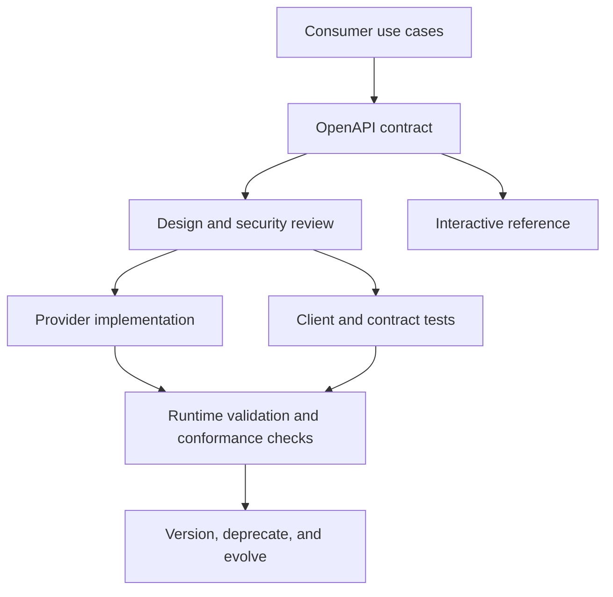

# API Contracts, OpenAPI, and Documentation

> [!abstract] Learning target
> Use an OpenAPI description as a reviewable interface contract while recognizing the operational and business rules that generated documentation cannot capture by itself.

> **Curriculum priority:** Essential

## Executive Summary

- **What it is:** An API contract defines what clients may send, what the provider may return, and the behavior both sides can rely on. OpenAPI is a machine-readable description format for HTTP APIs.
- **Why it matters:** A shared contract supports design review, documentation, validation, testing, client generation, gateway configuration, and controlled change.
- **Mental model:** OpenAPI is the structural blueprint; human guidance is the operating manual. A useful API needs both.
- **Best used when:** An HTTP API has multiple consumers, needs governance, or will evolve across teams and environments.
- **Avoid or reconsider when:** The team treats generated documentation as proof that behavior, security, examples, and operational policies are correct.

“Swagger” is used imprecisely in conversation. OpenAPI is the specification; Swagger is a family of tools and an older specification lineage. Swagger UI is one tool that renders an OpenAPI document as interactive documentation.

## What It Can Do

- Describe paths, operations, parameters, request bodies, responses, and reusable schemas.
- State which security schemes apply to an operation.
- Provide examples and descriptions next to machine-readable constraints.
- Generate interactive reference pages, client/server scaffolding, validators, mocks, and contract tests.
- Make proposed interface changes reviewable before or alongside implementation.

## What It Cannot Do

- Guarantee that the running provider actually follows the document.
- Fully express business semantics such as reconciliation, authorization ownership, or what “complete” means.
- Replace tutorials, lifecycle explanations, failure guidance, changelogs, and support information.
- Make generated client code safe or maintainable without review.
- Prevent breaking changes unless compatibility checks and governance use the contract.

## Core Concepts

| Concept | Meaning | Why it matters |
|---|---|---|
| OpenAPI Description | JSON or YAML document conforming to the OpenAPI Specification | Machine-readable source for tooling and review |
| Path and operation | Address template and HTTP operation | Defines callable surface such as `GET /orders/{order_id}` |
| Parameter | Input in a path, query, header, or cookie | Carries identifiers and request options |
| Request body | Structured input with a declared media type and schema | Defines write payloads separately from parameters |
| Response | Documented status, headers, media types, and schemas | Successful and error outcomes both belong in the contract |
| Schema | Structural constraints for values and objects | Supports validation and compatible evolution |
| Security scheme | Description of how credentials are presented | Does not itself grant or correctly enforce access |
| Example | Concrete request or response | Often explains intent faster than schema keywords alone |

Useful contract layers:

| Layer | Answers | Example |
|---|---|---|
| Syntax | Is the message structurally valid? | `amount` is a required string matching a decimal pattern |
| Semantics | What does the value mean? | Amount is the booked amount in the supplied ISO currency |
| Behavior | What happens and when? | Export creation is asynchronous and may take 20 minutes |
| Operations | How should clients run it safely? | Quota, retry policy, request IDs, retention, and support route |
| Governance | Who may access which data? | Caller can read only accounts in its permitted legal entity |

## How It Works (Simple Flow)

1. Provider and consumers agree on use cases, resource boundaries, and behavior.
2. The team writes or generates an OpenAPI description for the structural HTTP contract.
3. Review checks naming, schemas, errors, authentication, authorization implications, pagination, and compatibility.
4. Implementation and client tests use the agreed description.
5. Documentation tooling renders reference material and examples for consumers.
6. Automated checks compare implementations or changes against the contract where practical.
7. Versioning, deprecation, changelogs, and consumer communication govern evolution.

Contract-first and code-first are workflows, not competing religions:

- **Contract-first:** design and review the OpenAPI description before implementation.
- **Code-first:** generate the description from typed routes and models, then review the generated contract as a real deliverable.

## Visuals



## Readable Snippets

```yaml
paths:
  /v1/orders/{order_id}:
    get:
      summary: Get one order
      parameters:
        - name: order_id
          in: path
          required: true
          schema: { type: string }
      responses:
        "200":
          description: Order found
          content:
            application/json:
              schema:
                $ref: "#/components/schemas/Order"
        "404":
          description: Order not found or not visible to this caller
```

This fragment makes the route, input location, and two outcomes visible. It still needs the `Order` schema, security requirements, examples, and human explanation of authorization and lifecycle behavior.

## Consultant Talking Points

- **Client question this answers:** “If we have Swagger UI, do we have a governed API contract?”
- **Trade-offs to mention:** Contract-first supports early cross-team review; code-first reduces duplication. Either works when the artifact is reviewed, tested, versioned, and kept current.
- **Risk or governance angle:** Publishing hidden fields in schemas or examples can reveal sensitive structure even if runtime authorization blocks the call.
- **Cost or performance angle:** Document limits, filtering, pagination, expected latency, and asynchronous patterns so clients do not discover expensive boundaries in production.

## Common Pitfalls

- Using “OpenAPI,” “Swagger,” and “Swagger UI” as exact synonyms and confusing specification with rendering tool.
- Generating an OpenAPI file once and allowing it to drift away from runtime behavior.
- Documenting only the successful `200` response while omitting validation, authorization, throttling, and provider errors.
- Describing authentication but not the object- and field-level authorization rules consumers need to understand.
- Treating a schema as complete documentation while leaving timestamps, decimals, nullability, lifecycle, and side effects ambiguous.
- Introducing a breaking change under the same contract because the JSON remains syntactically valid.
- Trusting generated clients without reviewing retries, timeouts, logging, dependency risk, and error handling.

## When to Recommend What (Decision Table)

| Situation | Recommend | Why | Watch-outs |
|---|---|---|---|
| Several teams must agree before implementation | Contract-first OpenAPI workflow | Enables design and compatibility review early | Keep examples and implementation synchronized |
| Small typed service owned by one team | Code-first generation plus contract review | Fast feedback with less duplicate declaration | Generated output can expose framework details or omit intent |
| External or long-lived consumer base | Versioned OpenAPI plus guides, examples, changelog, and deprecation policy | Structural reference alone is insufficient for safe adoption | Consumer communication and support ownership |
| Pipeline integrates a third-party API | Pin or archive the consumed contract when licensing permits; add consumer contract tests | Makes assumptions visible and change detectable | Provider may publish incomplete or drifting specifications |
| Sensitive internal API | Restrict documentation appropriately and sanitize schemas/examples | Documentation can disclose data and attack surface | Do not rely on obscurity as the security control |
| One-off experimental endpoint | Lightweight contract is still useful, proportional to lifespan | Captures assumptions without heavy process | Label stability clearly; avoid accidental production dependency |

## Related Topics

- [[05 APIs/01 Foundations and API Literacy/Foundations and API Literacy Overview|Foundations and API Literacy Overview]]
- [[05 APIs/01 Foundations and API Literacy/03 REST Resources Methods and Semantics|REST Resources, Methods, and Semantics]]
- [[05 APIs/01 Foundations and API Literacy/04 JSON Serialization and Data Types|JSON, Serialization, and Data Types]]
- [[05 APIs/01 Foundations and API Literacy/06 API Styles at Recognition Depth|API Styles at Recognition Depth]]
- [[02 dbt/06 Governance Semantic Layer and Mesh/52 Model Contracts|dbt Model Contracts]]

## Related Decision Notes

- No dedicated API contract-governance decision note exists yet; add one when the curriculum reaches compatibility, versioning, and production ownership.

## Questions

- **Explain:** What can an OpenAPI schema describe well, and which behavioral rules still need human documentation?
- **Apply:** Which responses and operational limits would you require before approving an incremental ingestion endpoint?
- **Challenge:** When can code-first contract generation be as well governed as contract-first design?

## Sources To Revisit

- [OpenAPI Initiative: OpenAPI Specification](https://spec.openapis.org/oas/latest.html)
- [OpenAPI Initiative: Getting Started](https://learn.openapis.org/)
- [Swagger Documentation: OpenAPI Specification](https://swagger.io/specification/)
- [IETF RFC 9457: Problem Details for HTTP APIs](https://www.rfc-editor.org/rfc/rfc9457)
