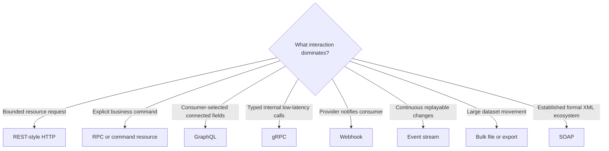

# API Styles at Recognition Depth

> [!abstract] Learning target
> Recognize REST, RPC, GraphQL, gRPC, SOAP, webhooks, and event-driven interfaces, then ask the right fit questions without pretending one style is universally best.

> **Curriculum priority:** Essential for recognition; situational for implementation

## Executive Summary

- **What it is:** API styles organize interactions differently: around resources, procedures, consumer-selected graphs, strongly typed remote calls, formal XML messages, callbacks, or event streams.
- **Why it matters:** The style shapes tooling, coupling, latency, schema evolution, failure recovery, and how data pipelines consume the interface.
- **Mental model:** Choose the conversation pattern before choosing its vocabulary: request a resource, call an action, select a graph, receive a callback, or subscribe to change.
- **Best used when:** Teams need a shared way to recognize an interface and judge its fit for a workload.
- **Avoid or reconsider when:** A style label is being used as a substitute for explicit requirements around volume, latency, replay, security, and ownership.

REST, GraphQL, gRPC, and SOAP are not successive maturity levels. Webhooks and event streams are not simply “faster APIs.” Each solves a different interaction problem and creates different operational obligations.

## What It Can Do

- Give teams a concise vocabulary for common interaction patterns.
- Reveal likely concerns: for example, query cost in GraphQL, code generation in gRPC, or replay in event streams.
- Help select interfaces based on consumers, network conditions, schema needs, and operational model.
- Support mixed architectures: REST control plane, events for changes, and bulk files for history can coexist.
- Prevent reflexively designing every integration as synchronous JSON request-response.

## What It Cannot Do

- Determine architectural quality from a label alone.
- Guarantee security, compatibility, observability, or good documentation.
- Remove the need to inspect the actual contract and provider behavior.
- Make an interface suitable for bulk data movement merely because it is modern.
- Eliminate delivery realities such as duplicates, ordering, timeouts, and partial failure.

## Core Concepts

| Style | Recognition clue | Natural fit | Data-engineering concern |
|---|---|---|---|
| REST-style HTTP | Resource URLs, HTTP methods, status codes, often JSON | Broad public and internal request-response APIs | Pagination, rate limits, idempotency, schema drift |
| RPC over HTTP | Action-oriented operations such as `/runReconciliation` | Commands that do not fit resource CRUD naturally | Retry semantics and tighter coupling to procedure names |
| GraphQL | Usually one endpoint; client sends a typed query selecting fields | UI or consumers needing flexible connected data shapes | Query complexity, authorization, caching, and extraction stability |
| gRPC | `.proto` contract, generated clients, Protocol Buffers, HTTP/2 | Internal low-latency service-to-service calls and streaming | Tooling, schema evolution rules, and less direct human inspection |
| SOAP | XML envelope, WSDL, formal service contracts | Established enterprise or regulated vendor integrations | Verbosity, legacy tooling, WS-* policy complexity |
| Webhook | Provider calls a consumer URL when something happens | Low-latency notification without frequent polling | Verification, duplicates, ordering, downtime, and replay |
| Event or message stream | Consumer subscribes to a broker/topic and tracks position | Continuous, decoupled change distribution | Delivery guarantees, partitions, replay, retention, and schema governance |
| Bulk file/export | Asynchronous file creation and transfer | Large historical or periodic datasets | Manifests, completeness, encryption, retention, and late files |

## How It Works (Simple Flow)

1. Clarify whether the interaction is a query, command, notification, continuous change feed, or bulk transfer.
2. Identify consumers, languages, network boundaries, payload volume, latency, and availability needs.
3. Decide who initiates communication and whether either side can be temporarily unavailable.
4. Define contract strength, compatibility, and tooling needs.
5. Select a primary interface style and complementary patterns where one style does not cover the whole lifecycle.
6. Design security, quotas, retries, replay, observability, and ownership for that pattern.
7. Validate with realistic traffic and failure scenarios before standardizing it.

## Visuals



## Readable Snippets

The same intent—retrieve a customer name—looks different by style:

```http
GET /v1/customers/c-42
```

```graphql
query {
  customer(id: "c-42") { id name }
}
```

```protobuf
rpc GetCustomer(GetCustomerRequest) returns (Customer);
```

These snippets show interface shape, not relative quality. The right choice depends on consumers, traffic, tooling, governance, and operational constraints.

## Consultant Talking Points

- **Client question this answers:** “Should this new integration be REST, GraphQL, a webhook, or an event stream?”
- **Trade-offs to mention:** Consumer flexibility can move complexity and cost into the provider; strong typing and generation can improve compatibility while adding specialized tooling.
- **Risk or governance angle:** Flexible field selection and event distribution expand the authorization and data-minimization surface.
- **Cost or performance angle:** Chatty REST calls, unconstrained GraphQL queries, retained streams, and row-wise warehouse lookups create different cost profiles; benchmark the actual access pattern.

## Common Pitfalls

- Selecting GraphQL because consumers dislike multiple REST calls without planning query complexity, caching, or field-level authorization.
- Choosing gRPC for an external ecosystem whose users expect simple browser- and `curl`-friendly HTTP tooling.
- Calling a webhook reliable ingestion without signature verification, durable receipt, deduplication, and replay or recovery.
- Treating event delivery as exactly once and failing to design idempotent consumers.
- Building millions of REST calls when a provider offers a bulk export or managed connector.
- Dismissing SOAP solely as old when an established vendor contract, security profile, and support model already work.
- Using one style for control operations and bulk data movement even when their needs differ sharply.

## When to Recommend What (Decision Table)

| Situation | Recommend | Why | Watch-outs |
|---|---|---|---|
| Public or partner API with conventional resources | REST-style HTTP with OpenAPI | Broad interoperability and familiar tooling | Consistent pagination, errors, compatibility, and quotas |
| Internal service needs typed, efficient calls or streaming | Evaluate gRPC | Strong contract and generated clients | Browser support, gateways, debugging, and team skills |
| UI consumers need different views over connected domain data | Evaluate GraphQL | Consumer selects one shaped result | Query limits, N+1 access, caching, and fine-grained authorization |
| Provider should notify about occasional changes | Webhook backed by durable processing | Avoids wasteful frequent polling | Verify signatures; acknowledge quickly; deduplicate and recover |
| Many consumers need continuous replayable changes | Event or message stream | Decouples producers and consumers with retained history | Broker operations, schemas, ordering, duplicates, and retention cost |
| Large historical or periodic extract | Bulk file/export | Efficient, compressible, and replayable | Completeness manifests, lifecycle, access, and encryption |
| Clear action does not map naturally to a resource update | RPC or explicit command resource | Honest expression of intent | Define idempotency and operation lifecycle |
| Existing enterprise vendor exposes supported SOAP contract | Use the supported SOAP interface unless migration value is clear | Supportability may outweigh fashion | Skills, XML security, tooling lifecycle, and vendor roadmap |

## Related Topics

- [[05 APIs/01 Foundations and API Literacy/Foundations and API Literacy Overview|Foundations and API Literacy Overview]]
- [[05 APIs/01 Foundations and API Literacy/01 What APIs Are and Where They Fit|What APIs Are and Where They Fit]]
- [[05 APIs/01 Foundations and API Literacy/03 REST Resources Methods and Semantics|REST Resources, Methods, and Semantics]]
- [[05 APIs/01 Foundations and API Literacy/05 API Contracts OpenAPI and Documentation|API Contracts, OpenAPI, and Documentation]]
- [[03 Fivetran/02 Connectors and Sync Behavior/09 File Event and Custom Connector Patterns|File, Event, and Custom Connector Patterns]]
- [[03 Fivetran/02 Connectors and Sync Behavior/08 Database Connectors CDC and High-Volume Agent|Database Connectors, CDC, and High-Volume Agent]]

## Related Decision Notes

- No dedicated cross-tool interface-style comparison exists yet; this note provides the chapter-level decision framework.

## Questions

- **Explain:** What workload difference separates a webhook from a replayable event stream?
- **Apply:** Which interfaces would you consider for a connector control plane and for its multi-terabyte historical data export?
- **Challenge:** Why might GraphQL improve consumer productivity while increasing provider governance and cost risk?

## Sources To Revisit

- [GraphQL Foundation: Learn GraphQL](https://graphql.org/learn/)
- [gRPC Documentation: Introduction to gRPC](https://grpc.io/docs/what-is-grpc/introduction/)
- [W3C: SOAP Version 1.2 Part 1](https://www.w3.org/TR/soap12-part1/)
- [CloudEvents Specification](https://cloudevents.io/)
- [OpenAPI Initiative: OpenAPI Specification](https://spec.openapis.org/oas/latest.html)
