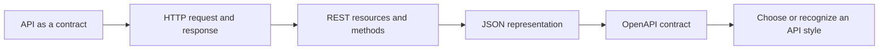
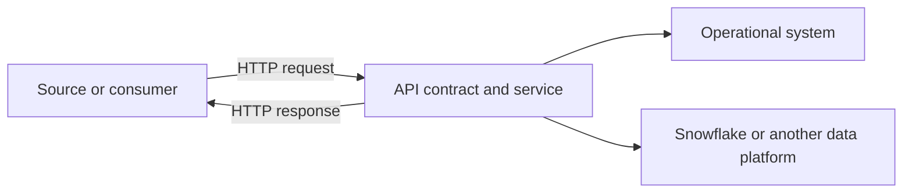

# Foundations and API Literacy Overview

> [!abstract] Chapter outcome
> Explain an API interaction from request to response, read a REST API contract, and recognize the major API styles without needing to be an API specialist.

## Topics

- [[05 APIs/01 Foundations and API Literacy/01 What APIs Are and Where They Fit|01 - What APIs Are and Where They Fit]]
- [[05 APIs/01 Foundations and API Literacy/02 HTTP Request and Response Anatomy|02 - HTTP Request and Response Anatomy]]
- [[05 APIs/01 Foundations and API Literacy/03 REST Resources Methods and Semantics|03 - REST Resources, Methods, and Semantics]]
- [[05 APIs/01 Foundations and API Literacy/04 JSON Serialization and Data Types|04 - JSON, Serialization, and Data Types]]
- [[05 APIs/01 Foundations and API Literacy/05 API Contracts OpenAPI and Documentation|05 - API Contracts, OpenAPI, and Documentation]]
- [[05 APIs/01 Foundations and API Literacy/06 API Styles at Recognition Depth|06 - API Styles at Recognition Depth]]

## Chapter Map

## The Data Engineer's Mental Model

An API is another system boundary. Instead of opening a database connection or reading a file, a client sends a defined request and receives a defined response. The difficult parts are familiar: schema, identity, incremental state, failure recovery, data quality, ownership, and cost. HTTP adds vocabulary for expressing those concerns.

## How To Use This Area

Study the topics in order. After this chapter, you should be able to inspect an API call and answer:

- What operation is being requested, and against which resource?
- Where are identity, options, and data carried?
- What does the response say happened?
- Is the payload valid and compatible with the expected contract?
- Is this API style suitable for the workload, or would a file, event stream, or managed connector fit better?

## Related Areas

- [[03 Fivetran/02 Connectors and Sync Behavior/09 File Event and Custom Connector Patterns|File, Event, and Custom Connector Patterns]]
- [[03 Fivetran/05 Security Governance and Production Operations/28 REST API Terraform and Configuration Automation|Fivetran REST API, Terraform, and Configuration Automation]]
- [[04 Docker/03 Data Stack Integration Patterns/11 Containerizing Python Data Jobs|Containerizing Python Data Jobs]]
