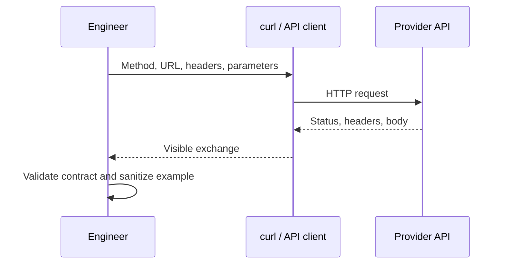

# Exploring APIs with curl and an API Client

> Make the HTTP exchange visible and reproducible before hiding it inside pipeline code.

## Executive Summary

- **What it is:** Using `curl` or a graphical API client to construct a request and inspect the full response.
- **Why it matters:** It separates contract, credential, network, and payload problems before orchestration adds noise.
- **Mental model:** This is the API equivalent of running source SQL manually before putting it in a scheduled job.
- **Best used when:** Learning an endpoint, reproducing an incident, or agreeing a request with a provider.
- **Avoid or reconsider when:** A saved GUI collection becomes the only production specification or contains live secrets.

## What It Can Do

- Show the exact URL, method, headers, query parameters, body, status, and response headers.
- Verify authentication, content negotiation, pagination links, and rate-limit headers.
- Produce a small reproducible example for a ticket or runbook.
- Reveal redirects, TLS issues, unexpected HTML, and non-JSON error bodies.

## What It Cannot Do

- Prove that a multi-page extraction is complete or replayable.
- Replace automated tests, monitoring, checkpoint storage, or reconciliation.
- Make copied credentials safe or turn an undocumented endpoint into a supported contract.

## Core Concepts

| Concept | Meaning | Why it matters |
|---|---|---|
| Request line | Method plus URL | Identifies the operation and target resource. |
| Header | Request or response metadata | Carries credentials, formats, tracing, quotas, and cache signals. |
| Query parameter | Key-value input encoded in the URL | Common home for filters, page size, and cursors. |
| Body | Optional request payload | Usually JSON for create, update, search, or job submission. |
| Status code | Coarse outcome category | Guides parsing, retry, authentication, and failure handling. |
| Response envelope | Body plus headers and status | The body alone is not enough evidence for production ingestion. |

## How It Works (Simple Flow)

1. Start from the provider's official documentation and select one read-only endpoint.
2. Build the smallest request with a placeholder credential supplied from an environment variable.
3. Run it with response headers visible and confirm the actual content type and status.
4. Inspect pagination, request ID, rate-limit, and error details—not just the JSON records.
5. Save a sanitized command and representative response shape in the runbook.
6. Translate the verified request into Python and production controls.

## Visuals



## Readable Snippets

```bash
# API_TOKEN is supplied by the shell or secret manager; never paste it here.
curl --fail-with-body --show-error \
  --header "Authorization: Bearer ${API_TOKEN}" \
  --header "Accept: application/json" \
  --get "https://api.example.com/v1/orders" \
  --data-urlencode "updated_since=2026-08-01T00:00:00Z" \
  --data-urlencode "limit=100"
```

Use verbose output only while diagnosing and redact `Authorization`, cookies, and sensitive payload fields before sharing logs.

## Consultant Talking Points

- **Client question this answers:** Can we reach the endpoint, authenticate, and understand the response contract?
- **Trade-offs to mention:** GUI clients are approachable and collaborative; `curl` is easier to review, automate, and reproduce anywhere.
- **Risk or governance angle:** Collections, shell history, screenshots, and verbose traces can leak credentials or personal data.
- **Cost/performance angle:** Manual exploration should use narrow filters and small page sizes to avoid consuming source quota or exporting excessive data.

## Common Pitfalls

- Treating `200 OK` as proof that all expected records were returned; the response may be paginated or filtered by default.
- Copying a token into a command, repository, screenshot, ticket, or shell history.
- Parsing an error body as data because the client did not check the status and content type.
- Testing only the happy path and never observing `401`, `403`, `404`, `429`, or `5xx` behavior.
- Sharing verbose output without removing headers, cookies, customer identifiers, and request bodies.

## When to Recommend What (Decision Table)

| Situation | Recommend | Why | Watch-outs |
|---|---|---|---|
| Quick endpoint verification | `curl` | Portable, explicit, and easy to paste into a runbook | Quoting differs between shells; protect history |
| Collaborative contract exploration | API client collection | Examples, environments, and responses are easy to organize | Never store live secrets in exported collections |
| Repeatable production extraction | Python client with tests | Supports state, observability, and structured handling | Do not promote exploratory snippets unchanged |
| Supported common SaaS source | Evaluate Fivetran first | Reduces connector operating burden | Confirm coverage, history, cost, and ownership |

## Related Topics

- [[05 APIs/02 Consuming APIs for Data Pipelines/Consuming APIs for Data Pipelines Overview]]
- [[05 APIs/02 Consuming APIs for Data Pipelines/08 Calling APIs from Python]]
- [[05 APIs/02 Consuming APIs for Data Pipelines/09 Authentication and Service Identity]]
- [[03 Fivetran/05 Security Governance and Production Operations/28 REST API Terraform and Configuration Automation]]

## Related Decision Notes

- [[80 Comparisons and Decision Notes/Comparisons/Fivetran/Comparison - Fivetran vs Custom Ingestion]]

## Questions

- Which parts of a request belong in the URL, headers, and body?
- Which response headers would you preserve as extraction evidence?
- How would you share a failing request without exposing credentials or regulated data?

## Sources To Revisit

- [curl command-line options](https://curl.se/docs/manpage.html)
- [curl HTTP scripting guide](https://curl.se/docs/httpscripting.html)
- [MDN: HTTP messages](https://developer.mozilla.org/en-US/docs/Web/HTTP/Guides/Messages)
- [Postman: Send API requests](https://learning.postman.com/docs/sending-requests/requests/)
