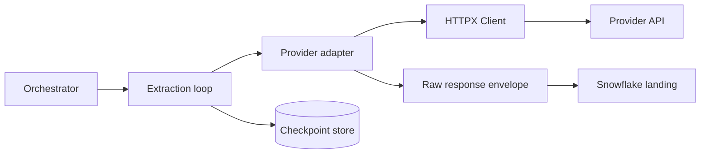

# Calling APIs from Python

> Build a small HTTP adapter whose transport behavior is separate from extraction state and Snowflake loading.

## Executive Summary

- **What it is:** Using a Python HTTP client such as HTTPX to send requests, validate responses, and decode payloads.
- **Why it matters:** A production extractor needs reusable configuration, explicit timeouts, structured errors, and testable boundaries.
- **Mental model:** The HTTP client is a source adapter; it should not also own scheduling, checkpoint tables, and business transformations.
- **Best used when:** A managed connector does not fit and custom behavior justifies custom ownership.
- **Avoid or reconsider when:** The integration is common, supported, and cheaper to operate through a managed connector.

## What It Can Do

- Reuse connections, default headers, authentication, and base URLs across requests.
- Apply explicit parameters and JSON decoding without hand-building URLs.
- Surface status, headers, request IDs, and transport exceptions as structured signals.
- Support synchronous code for ordinary jobs and asynchronous code when measured concurrency requires it.
- Run consistently in a pinned Docker image and under an orchestrator.

## What It Cannot Do

- Infer pagination, retry safety, or incremental semantics from an endpoint automatically.
- Guarantee source completeness, stable schemas, or exactly-once delivery.
- Secure secrets merely because they came from an environment variable.
- Make asynchronous Python faster when the actual bottleneck is source quota or Snowflake loading.

## Core Concepts

| Concept | Meaning | Why it matters |
|---|---|---|
| Client/session | Long-lived object that reuses connections and defaults | More efficient and consistent than one-off calls in a loop. |
| Transport error | DNS, TLS, connection, timeout, or protocol failure | No trustworthy application response may exist. |
| HTTP error | Valid response with an error status | Often contains provider-specific diagnostics and request IDs. |
| Adapter boundary | Small module translating provider behavior into internal records | Keeps source quirks away from Snowflake and orchestration code. |
| Dependency pinning | Fixed, reviewed library versions | Makes Dockerized jobs reproducible and patching intentional. |

## How It Works (Simple Flow)

1. Load endpoint configuration and a secret reference at runtime.
2. Create one client with a base URL, headers, connection reuse, and explicit timeouts.
3. Send parameters with the client's structured API rather than string concatenation.
4. Check status and content type before decoding the body.
5. Convert the provider response into a neutral extraction envelope.
6. Let separate code persist raw data, checkpoints, and run metrics.
7. Close the client and emit a sanitized run outcome.

## Visuals



## Readable Snippets

```python
import os
import httpx

def fetch_orders(updated_since: str) -> tuple[list[dict], str | None]:
    headers = {"Authorization": f"Bearer {os.environ['API_TOKEN']}"}
    timeout = httpx.Timeout(30.0, connect=10.0)

    with httpx.Client(
        base_url="https://api.example.com/v1",
        headers=headers,
        timeout=timeout,
    ) as client:
        response = client.get(
            "/orders",
            params={"updated_since": updated_since, "limit": 100},
        )
        response.raise_for_status()
        payload = response.json()
        return payload["items"], payload.get("next_cursor")
```

The function intentionally does not update a checkpoint. The caller should do that only after the corresponding data is durably landed.

## Consultant Talking Points

- **Client question this answers:** What does owning a custom API connector actually involve?
- **Trade-offs to mention:** HTTPX offers sync and async APIs with strict timeout behavior; `requests` remains a mature, readable choice for synchronous code. Standardize one unless a requirement says otherwise.
- **Risk or governance angle:** Pin and scan dependencies, redact logs, use a secret manager, and restrict outbound network destinations.
- **Cost/performance angle:** Connection reuse and sensible page sizes matter; uncontrolled concurrency can hit quotas without improving throughput.

## Common Pitfalls

- Calling a top-level `get()` for every page and repeatedly creating connections instead of reusing a client.
- Omitting explicit timeout policy or disabling timeouts, allowing a scheduled job to hang indefinitely.
- Catching a broad exception and continuing, which turns missing pages into a successful-looking run.
- Mixing API calls, normalization, Snowflake writes, and checkpoint updates in one untestable function.
- Logging full headers or response bodies that contain tokens, personal data, or provider error details.
- Adding async concurrency before measuring the source's quota and ordering constraints.

## When to Recommend What (Decision Table)

| Situation | Recommend | Why | Watch-outs |
|---|---|---|---|
| Small synchronous extractor | HTTPX `Client` | Clear API, connection pooling, explicit timeout model | Team needs to own retry and pagination policy |
| Existing estate standardized on Requests | `requests.Session` | Familiar and stable; reduces unnecessary variation | Configure timeouts on every request |
| Many independent calls and proven latency need | HTTPX `AsyncClient` | Concurrent I/O can reduce elapsed time | Bound concurrency; quotas remain the ceiling |
| Standard SaaS source with suitable connector | Fivetran | Transfers much connector maintenance to a service | Validate source objects, deletes, history, and MAR cost |

## Related Topics

- [[05 APIs/02 Consuming APIs for Data Pipelines/07 Exploring APIs with curl and an API Client]]
- [[05 APIs/02 Consuming APIs for Data Pipelines/10 Pagination Filtering and Incremental Extraction]]
- [[04 Docker/03 Data Stack Integration Patterns/11 Containerizing Python Data Jobs]]
- [[03 Fivetran/02 Connectors and Sync Behavior/07 Application and API Connectors]]

## Related Decision Notes

- [[80 Comparisons and Decision Notes/Comparisons/Fivetran/Comparison - Fivetran vs Custom Ingestion]]

## Questions

- Which responsibilities belong inside a provider adapter, and which belong to the extraction runner?
- Why should the checkpoint advance after durable landing rather than after a successful HTTP response?
- When would an asynchronous client improve the pipeline, and when would it only increase risk?

## Sources To Revisit

- [HTTPX QuickStart](https://www.python-httpx.org/quickstart/)
- [HTTPX clients and connection pooling](https://www.python-httpx.org/advanced/clients/)
- [HTTPX timeout configuration](https://www.python-httpx.org/advanced/timeouts/)
- [Requests advanced usage: Session objects](https://requests.readthedocs.io/en/latest/user/advanced/#session-objects)
