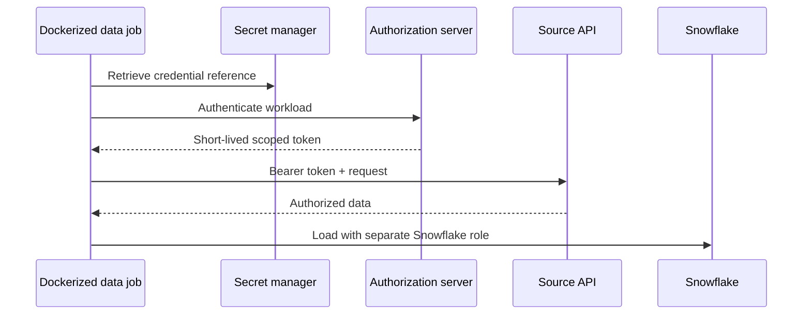

# Authentication and Service Identity

> Give a non-human pipeline a traceable, least-privileged identity without embedding long-lived secrets in code or images.

## Executive Summary

- **What it is:** The mechanisms by which an API recognizes a client and decides what that client may do.
- **Why it matters:** Credentials define the source-side blast radius and often determine whether an extraction is auditable and operable.
- **Mental model:** API identity is source-system RBAC for a workload; it is separate from the Snowflake role used at the destination.
- **Best used when:** Designing production service accounts, token acquisition, secret storage, rotation, and incident response.
- **Avoid or reconsider when:** A personal user's token is proposed for a scheduled production job.

## What It Can Do

- Identify the calling application or service account.
- Limit access with roles, scopes, audiences, network policy, expiry, or certificate binding.
- Produce separate audit trails for development, test, and production workloads.
- Reduce long-lived secret exposure through short-lived access tokens and automated rotation.

## What It Cannot Do

- Replace authorization checks; a valid identity should not automatically see every object.
- Make a bearer token safe after it has leaked—possession is normally sufficient to use it.
- Solve downstream Snowflake access, masking, retention, or purpose limitation.
- Make OAuth identical to login: OAuth delegates authorization, while OpenID Connect adds identity semantics for user login.

## Core Concepts

| Concept | Meaning | Why it matters |
|---|---|---|
| API key | Static secret identifying a client or account | Simple, but often coarse-grained and long-lived. |
| Bearer token | Credential usable by whoever possesses it | Must be protected in transit, storage, and logs. |
| OAuth 2.0 | Framework for obtaining delegated access tokens | Supports scopes and short-lived credentials without sharing user passwords. |
| Client credentials grant | Machine obtains a token using its own identity | Common fit for server-to-server data jobs when supported. |
| JWT | Signed token format carrying claims | A format, not an authentication flow; validate issuer, audience, signature, and time claims. |
| Scope/audience | Limits actions and intended resource server | Reduces privilege and token reuse across services. |
| mTLS/private key | Client proves possession of key material | Stronger assurance but more certificate and key lifecycle work. |

## How It Works (Simple Flow)

1. Register a dedicated non-human client for one environment and purpose.
2. Grant only the source scopes and objects needed for extraction.
3. Store the client secret or private key in an approved secret manager.
4. At runtime, the job authenticates to an authorization server or presents the configured credential.
5. The API validates the credential, scope, audience, and expiry before serving data.
6. The job records safe identity metadata—not the credential—and rotates or refreshes as required.
7. Snowflake uses a separate least-privileged loading identity for the destination boundary.

## Visuals



## Readable Snippets

```python
import os
import httpx

# In production, the environment value should be injected from a secret manager.
token_response = httpx.post(
    "https://identity.example.com/oauth2/token",
    data={"grant_type": "client_credentials", "scope": "orders.read"},
    auth=(os.environ["API_CLIENT_ID"], os.environ["API_CLIENT_SECRET"]),
    timeout=15.0,
)
token_response.raise_for_status()
access_token = token_response.json()["access_token"]
```

Never log `access_token`, the authorization header, client secret, refresh token, or private key.

## Consultant Talking Points

- **Client question this answers:** Which identity should an automated extractor use, and how is access revoked or rotated?
- **Trade-offs to mention:** Static keys are operationally simple; short-lived scoped tokens reduce exposure but require token lifecycle logic.
- **Risk or governance angle:** Separate identities by environment and purpose, record ownership, test revocation, and monitor use outside expected schedules or networks.
- **Cost/performance angle:** Token caching avoids needless authorization calls, but cached tokens must respect expiry and secure storage boundaries.

## Common Pitfalls

- Running production with a developer's personal token, so offboarding or MFA changes break the pipeline.
- Baking secrets into a Docker image, Git history, configuration file, notebook, or API-client collection.
- Treating a decoded JWT as trustworthy without validating its signature, issuer, audience, and expiry.
- Requesting broad administrative scopes because they are easier during development.
- Reusing one credential across environments, integrations, or teams, destroying attribution and increasing blast radius.
- Rotating a secret without testing overlap, refresh behavior, and rollback.

## When to Recommend What (Decision Table)

| Situation | Recommend | Why | Watch-outs |
|---|---|---|---|
| Simple low-risk integration with limited provider support | Dedicated API key | Lowest implementation complexity | Demand rotation, scope limits, and usage monitoring |
| Server-to-server API supports OAuth | Client credentials with short-lived token | Non-human identity, expiry, and scopes | Secure client credential and cache tokens safely |
| User acts through an application | Authorization code with PKCE | Preserves delegated user consent | Do not use a personal-user flow for headless batch jobs |
| High-assurance regulated integration | mTLS or signed client authentication when supported | Stronger proof of client possession | Certificate issuance and rotation add operational work |
| Suitable managed connector | Connector-managed service identity | Reduces custom credential code | Review vendor access, storage, rotation, and audit evidence |

## Related Topics

- [[05 APIs/02 Consuming APIs for Data Pipelines/08 Calling APIs from Python]]
- [[04 Docker/04 Security Operations and Team Standards/15 Non-root Users Secrets and Least Privilege]]
- [[01 Snowflake/03 Security and Governance/12 RBAC Roles and Privileges]]
- [[03 Fivetran/05 Security Governance and Production Operations/24 Credentials RBAC SSO SCIM and Service Access]]

## Related Decision Notes

- [[80 Comparisons and Decision Notes/Decision Notes/Fivetran/Decisions - Designing a Fivetran Production Operating Model]]

## Questions

- Why is a dedicated service identity better than a personal access token for scheduled ingestion?
- What must a client validate before trusting a JWT access token?
- Which source-side privileges and Snowflake privileges should be deliberately kept separate?

## Sources To Revisit

- [RFC 6749: OAuth 2.0 Authorization Framework](https://www.rfc-editor.org/rfc/rfc6749)
- [RFC 6750: OAuth 2.0 Bearer Token Usage](https://www.rfc-editor.org/rfc/rfc6750)
- [RFC 9700: OAuth 2.0 Security Best Current Practice](https://www.rfc-editor.org/rfc/rfc9700)
- [OpenID Connect Core 1.0](https://openid.net/specs/openid-connect-core-1_0.html)
- [OWASP Secrets Management Cheat Sheet](https://cheatsheetseries.owasp.org/cheatsheets/Secrets_Management_Cheat_Sheet.html)
