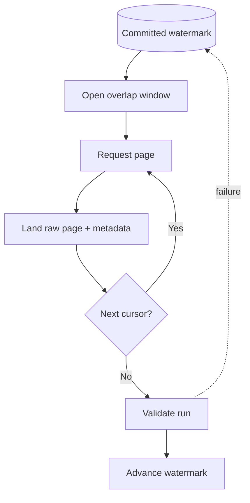

# Pagination, Filtering, and Incremental Extraction

> Traverse a changing remote dataset without silently stopping early, skipping records, or advancing state too soon.

## Executive Summary

- **What it is:** Following the API's paging mechanism while using supported filters and durable checkpoints to limit each run.
- **Why it matters:** Most APIs cap each response, and source data may change while pages are being read.
- **Mental model:** Pagination controls movement **within a run**; the high-water mark controls movement **between runs**.
- **Best used when:** Extracting list endpoints larger than one response or maintaining recurring incremental loads.
- **Avoid or reconsider when:** The provider offers a reliable bulk export, CDC feed, or managed connector better suited to the volume.

## What It Can Do

- Retrieve a large result set through bounded responses.
- Reduce source load with server-side time filters and field selection.
- Resume recurring extraction from a stored high-water mark or provider cursor.
- Support replay by reopening a deliberate overlap window.
- Preserve source ordering and checkpoint evidence for audit and recovery.

## What It Cannot Do

- Guarantee a stable snapshot if records are inserted or updated during offset pagination.
- Recover deletes unless the API exposes tombstones, events, history, or a comparison mechanism.
- Make an undocumented cursor permanent; providers may expire or invalidate it.
- Prove completeness without reconciliation against source counts, exports, or business controls.

## Core Concepts

| Concept | Meaning | Why it matters |
|---|---|---|
| Offset/page number | Client requests page positions | Easy, but changing rows can shift and create gaps or duplicates. |
| Cursor/token | Opaque continuation value from the server | Usually more stable; clients must not interpret it. |
| Keyset pagination | Continue after a stable ordered key | Efficient and explainable when the API supports it. |
| High-water mark | Greatest safely committed source position | Drives the next run, often using time plus a tie-breaker ID. |
| Overlap window | Re-read a recent interval | Captures late updates at the cost of deliberate duplicates. |
| Run boundary | Fixed upper limit selected at run start | Prevents a moving target from extending or destabilizing the run. |

## How It Works (Simple Flow)

1. Read the last **committed** high-water mark from control state.
2. Choose a fixed upper boundary for this run and subtract a small overlap from the lower boundary.
3. Request the first page with supported server-side filters and deterministic ordering.
4. Persist the raw page with request, response, page, and run metadata.
5. Follow the returned next link or cursor until the provider signals completion.
6. Validate counts and required fields, then atomically mark the run successful.
7. Advance the high-water mark only to the safely landed boundary; deduplicate the overlap downstream.

## Visuals



## Readable Snippets

```python
params = {
    "updated_from": "2026-08-15T00:00:00Z",  # includes replay overlap
    "updated_to": "2026-08-16T00:00:00Z",    # fixed run boundary
    "limit": 500,
}

while True:
    response = client.get("/orders", params=params).raise_for_status()
    page = response.json()
    land_raw(page["items"], cursor=params.get("cursor"))
    if not page.get("next_cursor"):
        break
    params["cursor"] = page["next_cursor"]  # treat as opaque
```

Checkpoint advancement is deliberately outside the loop and occurs only after all pages are durable and validated.

## Consultant Talking Points

- **Client question this answers:** How will the pipeline know where it stopped and whether it captured every change?
- **Trade-offs to mention:** Cursor pagination is often safer than offsets; timestamp filters are understandable but require tie-breakers, overlap, and precision rules.
- **Risk or governance angle:** Checkpoints and extraction metadata are audit records; restrict manual changes and record replay approvals for sensitive sources.
- **Cost/performance angle:** Larger pages reduce request overhead but increase payload size and retry cost; server-side filtering saves source quota and Snowflake ingestion work.

## Common Pitfalls

- Reading only the first response and mistaking a page-size default for the complete dataset.
- Updating the watermark after each HTTP response before the corresponding page is durable.
- Using `updated_at > last_timestamp` without a tie-breaker, losing rows that share timestamp precision.
- Assuming offset pages remain stable while records are inserted or deleted.
- Replacing the provider's next-link parameters with locally reconstructed values.
- Deduplicating solely by payload hash when the source provides a durable object ID and update version.

## When to Recommend What (Decision Table)

| Situation | Recommend | Why | Watch-outs |
|---|---|---|---|
| Small, nearly static list | Page number or offset | Simple and adequate | Confirm stable order and mutation risk |
| Frequently changing large list | Opaque cursor or keyset | Better continuity under change | Cursor expiry and replay behavior vary |
| Reliable `updated_at` and stable ID | Time watermark plus ID tie-breaker and overlap | Explainable incremental pattern | Time zones, precision, and late updates |
| Very high volume or snapshot need | Bulk export or CDC | Fewer requests and clearer run boundary | Delivery latency and file/event controls |
| Mature supported SaaS connector | Evaluate Fivetran | Managed checkpoint and schema handling | Verify actual connector behavior, not assumptions |

## Related Topics

- [[05 APIs/02 Consuming APIs for Data Pipelines/11 Rate Limits Timeouts Retries and Backoff]]
- [[05 APIs/02 Consuming APIs for Data Pipelines/13 API Ingestion Correctness]]
- [[03 Fivetran/02 Connectors and Sync Behavior/11 Scheduling Latency Checkpoints and Recovery]]
- [[02 dbt/02 Modeling Patterns and Layering/19 Late-arriving Data Corrections and Restatements]]

## Related Decision Notes

- [[80 Comparisons and Decision Notes/Comparisons/Fivetran/Comparison - Fivetran vs Custom Ingestion]]
- [[80 Comparisons and Decision Notes/Comparisons/dbt/Comparison - Full Refresh vs Backfill vs Replay]]

## Questions

- Why are the page cursor and incremental high-water mark different kinds of state?
- How could new records create gaps during offset pagination?
- What must happen before a checkpoint is safe to advance?

## Sources To Revisit

- [GitHub REST API: Using pagination](https://docs.github.com/en/rest/using-the-rest-api/using-pagination-in-the-rest-api)
- [Microsoft REST API Guidelines: Collections](https://github.com/microsoft/api-guidelines/blob/vNext/Guidelines.md#collections)
- [Stripe API: Pagination](https://docs.stripe.com/api/pagination)
- [Fivetran: Sync overview](https://fivetran.com/docs/core-concepts/syncoverview)
