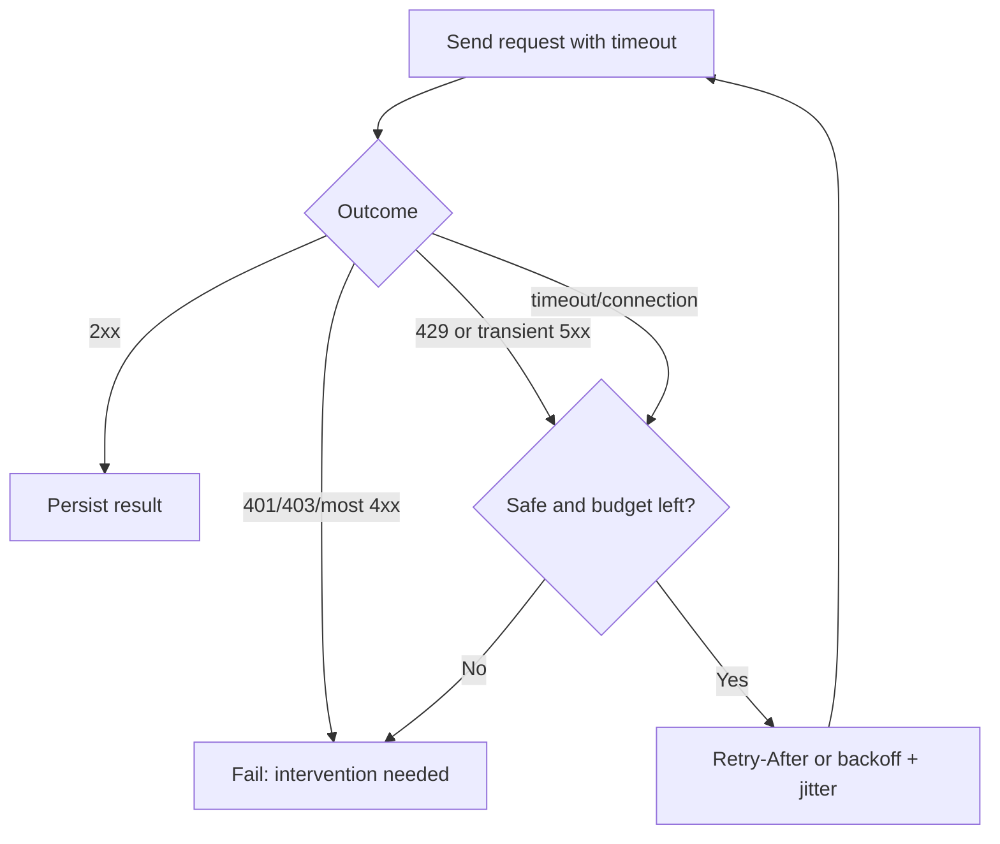

# Rate Limits, Timeouts, Retries, and Backoff

> Expect temporary failure, slow down politely, and stop retrying before resilience turns into duplication or runaway cost.

## Executive Summary

- **What it is:** A bounded policy for waiting, retrying safe operations, and respecting provider capacity signals.
- **Why it matters:** Networks and services fail transiently; a production job must recover without hanging, stampeding the source, or duplicating side effects.
- **Mental model:** Timeout limits one attempt, backoff spaces attempts, and a retry budget limits the entire recovery episode.
- **Best used when:** Every networked pipeline, with rules tailored to method, endpoint, provider guidance, and job SLA.
- **Avoid or reconsider when:** Retrying validation, authorization, or other permanent failures that require a code, credential, or data fix.

## What It Can Do

- Bound connection, read, write, and connection-pool waits.
- Recover from selected timeouts, connection failures, `429`, and temporary `5xx` responses.
- Spread clients using exponential backoff plus random jitter.
- Honor `Retry-After` and documented quota reset signals.
- Produce operational metrics for attempts, delay, throttling, and exhausted retries.

## What It Cannot Do

- Make a non-idempotent operation safe to repeat after an ambiguous response.
- Fix invalid credentials, forbidden scopes, malformed requests, or broken contracts.
- Guarantee completion inside an SLA when the provider remains unavailable.
- Replace source-level reconciliation after partial success.

## Core Concepts

| Concept | Meaning | Why it matters |
|---|---|---|
| Timeout | Maximum wait for a network phase or request | Prevents stuck workers and makes failure observable. |
| Rate limit | Provider cap on request rate or quota | Shared constraint that concurrency cannot bypass safely. |
| Retryable failure | Failure likely to succeed unchanged later | Usually selected transport errors, `429`, and temporary `5xx`. |
| Exponential backoff | Delay grows with each attempt | Reduces pressure during an outage. |
| Jitter | Random variation added to delay | Prevents synchronized retry storms. |
| Retry budget | Cap on attempts or elapsed time | Protects SLA, source, and compute cost. |
| Idempotency | Repeating an operation has no additional effect | Determines whether an ambiguous request can be retried safely. |

## How It Works (Simple Flow)

1. Apply explicit connect, read, write, and pool timeouts.
2. Classify the outcome: success, permanent failure, throttling, or possible transient failure.
3. Retry only operations known to be safe, using the same idempotency key when the provider supports it.
4. Prefer provider instructions such as `Retry-After`; otherwise use exponential backoff with jitter.
5. Stop at the retry budget and fail the unit of work visibly.
6. Persist the last durable checkpoint and enough metadata for a later replay.
7. Alert on sustained throttling or exhausted retries rather than hiding them inside a successful run.

## Visuals



## Readable Snippets

```python
import random
import time

for attempt in range(5):
    response = client.get("/orders", params=params)  # GET is read-only here
    if response.status_code != 429:
        response.raise_for_status()
        break
    if attempt == 4:
        response.raise_for_status()
    provider_delay = response.headers.get("Retry-After")
    delay = float(provider_delay) if provider_delay else min(30, 2**attempt)
    time.sleep(delay + random.uniform(0, 0.5))
```

Real policy should also classify transport exceptions and selected `5xx` responses. Keep retry logic centralized and observable.

## Consultant Talking Points

- **Client question this answers:** What happens when the provider is slow, unavailable, or asks us to reduce traffic?
- **Trade-offs to mention:** Aggressive retries may reduce isolated failures but amplify outages and consume quotas; conservative retries increase recovery delay.
- **Risk or governance angle:** Repeated non-idempotent requests can create duplicate transactions; define approved retry behavior per endpoint.
- **Cost/performance angle:** Retry volume consumes provider quota, container runtime, orchestrator capacity, and potentially duplicated Snowflake loads.

## Common Pitfalls

- No timeout or `timeout=None`, leaving a worker blocked without a clear failure.
- Retrying every `4xx`, including invalid credentials and invalid requests that cannot recover unchanged.
- Retrying `POST` after an ambiguous timeout without an idempotency guarantee or reconciliation step.
- Letting every parallel worker retry on the same schedule, creating a thundering herd.
- Ignoring `Retry-After` or provider-specific secondary limits.
- Logging only the final failure and losing attempt count, total wait, status, and request ID.

## When to Recommend What (Decision Table)

| Situation | Recommend | Why | Watch-outs |
|---|---|---|---|
| Read-only `GET` with transient failure | Bounded retry with backoff and jitter | Usually safe to repeat | Confirm provider semantics and total SLA |
| `429 Too Many Requests` | Honor `Retry-After`, reduce concurrency | Provider is explicitly signaling capacity | Shared quotas may affect other integrations |
| Invalid request or forbidden access | Fail fast and alert | Waiting will not correct data or privilege | Preserve sanitized provider details |
| Mutating request with ambiguity | Idempotency key or reconcile before retry | Avoid duplicate side effects | Provider retention and scope of keys vary |
| Prolonged provider outage | Stop, preserve checkpoint, replay later | Prevents unbounded resource use | Define backlog and freshness communication |

## Related Topics

- [[05 APIs/02 Consuming APIs for Data Pipelines/10 Pagination Filtering and Incremental Extraction]]
- [[05 APIs/02 Consuming APIs for Data Pipelines/13 API Ingestion Correctness]]
- [[03 Fivetran/02 Connectors and Sync Behavior/11 Scheduling Latency Checkpoints and Recovery]]
- [[04 Docker/04 Security Operations and Team Standards/18 Operations Troubleshooting and Production Boundaries]]

## Related Decision Notes

- [[80 Comparisons and Decision Notes/Decision Notes/Fivetran/Decisions - Designing a Fivetran Production Operating Model]]

## Questions

- Why are a request timeout and a retry budget separate controls?
- Which failures should normally fail fast instead of being retried?
- When is repeating a `POST` safe after the client received no response?

## Sources To Revisit

- [HTTP Semantics: Idempotent methods](https://www.rfc-editor.org/rfc/rfc9110#section-9.2.2)
- [MDN: 429 Too Many Requests](https://developer.mozilla.org/en-US/docs/Web/HTTP/Reference/Status/429)
- [MDN: Retry-After header](https://developer.mozilla.org/en-US/docs/Web/HTTP/Reference/Headers/Retry-After)
- [HTTPX timeout configuration](https://www.python-httpx.org/advanced/timeouts/)
- [GitHub REST API rate limits](https://docs.github.com/en/rest/using-the-rest-api/rate-limits-for-the-rest-api)
