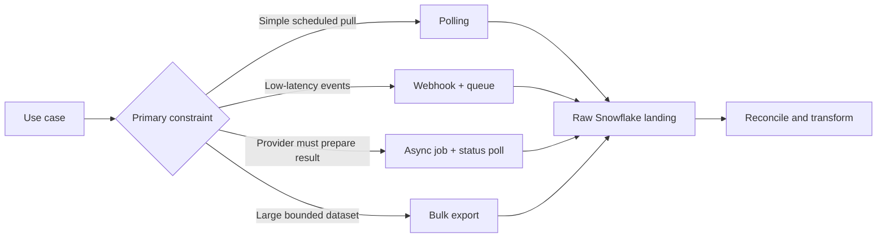

# Polling, Webhooks, Async Jobs, and Bulk Exports

> Choose how data arrives based on latency, volume, recoverability, and the operating model—not on which pattern sounds most modern.

## Executive Summary

- **What it is:** Four common acquisition patterns: repeatedly query for changes, receive event callbacks, submit and monitor a server-side job, or download prepared files.
- **Why it matters:** The pattern determines infrastructure, failure modes, source load, checkpoint design, and achievable freshness.
- **Mental model:** Polling asks “anything new?”; webhooks say “something happened”; async jobs say “come back later”; bulk exports say “take this bounded dataset.”
- **Best used when:** Selecting or reviewing the source-to-landing interface before coding a connector.
- **Avoid or reconsider when:** A pattern is chosen on latency alone without considering replay and completeness.

## What It Can Do

- Poll predictably from private scheduled infrastructure.
- Use webhooks for low-latency event notification or event payload delivery.
- Offload heavy report creation to provider-managed asynchronous jobs.
- Move large snapshots efficiently through compressed bulk files.
- Combine patterns—for example, a webhook triggers retrieval while periodic polling reconciles missed events.

## What It Cannot Do

- Make webhooks exactly once or guaranteed unless the provider explicitly supplies durable delivery semantics.
- Make fast polling equivalent to CDC; it may still miss deletes or consume heavy quota.
- Guarantee a `202 Accepted` job will ultimately succeed.
- Make a bulk export current after the provider's snapshot boundary.

## Core Concepts

| Concept | Meaning | Why it matters |
|---|---|---|
| Polling | Client requests state on a schedule | Operationally simple but trades quota for latency. |
| Webhook | Provider sends an HTTP request when an event occurs | Low latency, but requires a secure reachable receiver and replay controls. |
| Async job | Client submits work and polls a job resource | Fits reports too expensive for one synchronous request. |
| Bulk export | Provider prepares one or more files | Efficient for volume and clear snapshot boundaries. |
| Delivery ID | Provider identifier for one webhook event | Primary input to deduplication and replay audit. |
| Reconciliation poll | Periodic pull that checks webhook-derived state | Covers missed, delayed, duplicated, or out-of-order events. |

## How It Works (Simple Flow)

1. Define required freshness, daily volume, backfill size, network constraints, and completeness evidence.
2. Identify which patterns the provider actually supports and their retention or redelivery guarantees.
3. For polling, store a high-water mark; for webhooks, verify signatures and persist the delivery before processing.
4. For async jobs, store the job ID and poll its status with backoff; do not assume `202` means success.
5. For bulk exports, verify file completeness, checksums, manifest, snapshot time, and expiry.
6. Land raw events or files with source metadata before flattening in Snowflake.
7. Add reconciliation and replay paths appropriate to the pattern.

## Visuals



## Readable Snippets

```http
POST /v1/exports HTTP/1.1
Content-Type: application/json

{"from":"2026-08-01","to":"2026-08-15","format":"jsonl"}

HTTP/1.1 202 Accepted
Location: /v1/exports/job_123

{"job_id":"job_123","status":"queued"}
```

Persist `job_123`, poll the `Location` with backoff, and treat the export as complete only after the terminal status and files are validated.

## Consultant Talking Points

- **Client question this answers:** Should we poll, receive pushes, or ask the provider for export files?
- **Trade-offs to mention:** Webhooks reduce latency but add an internet-facing receiver and at-least-once handling; bulk export lowers request overhead but raises latency.
- **Risk or governance angle:** Verify webhook signatures before parsing, encrypt queues and landing zones, and control retention of sensitive raw payloads and exports.
- **Cost/performance angle:** Poll frequency consumes quota even when nothing changes; bulk files usually compress and load into Snowflake more efficiently than millions of small responses.

## Common Pitfalls

- Treating webhook arrival as exactly-once, ordered, or complete without provider guarantees.
- Performing heavy processing before acknowledging a webhook, causing provider timeouts and redelivery.
- Trusting source IP alone instead of validating a signature over the original request bytes.
- Treating `202 Accepted` as proof that the report or export succeeded.
- Downloading an expired signed URL after long processing delays without a refresh path.
- Choosing minute-level polling for a low-value daily dataset and exhausting shared quotas.

## When to Recommend What (Decision Table)

| Situation | Recommend | Why | Watch-outs |
|---|---|---|---|
| Moderate volume and hourly/daily freshness | Incremental polling | Simple private runtime and clear scheduling | Quota, watermark semantics, and deletes |
| Seconds-level event notification | Webhook receiver plus durable queue | Low latency and decoupled processing | Signature, duplicates, ordering, public ingress |
| Expensive provider-side report | Async job and status polling | Avoids long synchronous requests | Persist job ID; terminal failure and expiry |
| Large initial load or periodic snapshot | Bulk export to staged files | Efficient transfer and Snowflake loading | Snapshot boundary, manifest, checksums, retention |
| High-assurance event feed | Webhooks plus reconciliation polling | Fast path plus completeness control | More components and operating cost |

## Related Topics

- [[05 APIs/02 Consuming APIs for Data Pipelines/10 Pagination Filtering and Incremental Extraction]]
- [[05 APIs/02 Consuming APIs for Data Pipelines/13 API Ingestion Correctness]]
- [[03 Fivetran/02 Connectors and Sync Behavior/09 File Event and Custom Connector Patterns]]
- [[01 Snowflake/04 Data Engineering/19 Stages and Data Loading]]

## Related Decision Notes

- [[80 Comparisons and Decision Notes/Comparisons/Fivetran/Comparison - Fivetran vs Custom Ingestion]]

## Questions

- Why might webhooks still need a periodic reconciliation poll?
- What does `202 Accepted` prove, and what does it not prove?
- Which controls make a bulk export auditable before it is loaded to Snowflake?

## Sources To Revisit

- [MDN: 202 Accepted](https://developer.mozilla.org/en-US/docs/Web/HTTP/Reference/Status/202)
- [GitHub: Best practices for using webhooks](https://docs.github.com/en/webhooks/using-webhooks/best-practices-for-using-webhooks)
- [GitHub: Validating webhook deliveries](https://docs.github.com/en/webhooks/using-webhooks/validating-webhook-deliveries)
- [GitHub: Handling failed webhook deliveries](https://docs.github.com/en/webhooks/using-webhooks/handling-failed-webhook-deliveries)
- [Snowflake: Data loading considerations](https://docs.snowflake.com/en/user-guide/data-load-considerations)
