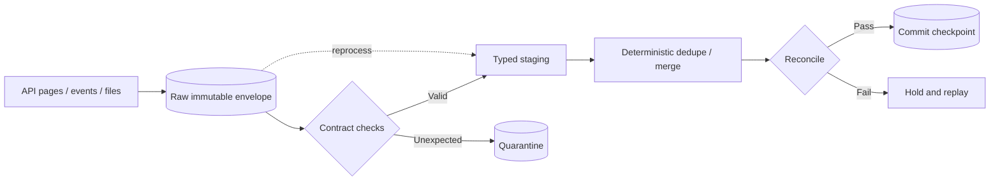

# API Ingestion Correctness

> Prove what the pipeline captured, make failures replayable, and keep transport artifacts separate from trusted business data.

## Executive Summary

- **What it is:** The controls that make API ingestion complete, repeatable, deduplicated, explainable, and safe under source change.
- **Why it matters:** A successful request does not prove a successful dataset; failures can occur between source read, raw landing, merge, and checkpoint commit.
- **Mental model:** Aim for **at-least-once capture plus deterministic deduplication**, with evidence strong enough to reconcile.
- **Best used when:** Designing any durable API feed, especially finance, regulated, or client-facing data products.
- **Avoid or reconsider when:** “Exactly once” is claimed without defining the source event identity and every commit boundary.

## What It Can Do

- Retain raw payloads and request metadata for replay and audit.
- Resume after partial failure without silently skipping a page.
- Deduplicate overlaps and redeliveries using source keys and versions.
- Detect schema drift, missing required fields, freshness failures, and count anomalies.
- Track hard deletes when the provider exposes tombstones, event logs, or periodic snapshots.
- Reconcile source extraction, Snowflake landing, and downstream dbt models.

## What It Cannot Do

- Recover changes the source never exposes or retains.
- Infer hard deletes reliably from an incremental upsert endpoint alone.
- Guarantee source truth when the provider's counts, timestamps, or event delivery are inconsistent.
- Remove the need for business-level controls; technical row counts may balance while values are wrong.

## Core Concepts

| Concept | Meaning | Why it matters |
|---|---|---|
| Raw envelope | Payload plus source, endpoint, run, request, cursor, and ingestion metadata | Preserves evidence independently of current parsing logic. |
| Idempotent landing | Reprocessing the same unit creates no unintended additional state | Makes retries and replay operationally safe. |
| Dedupe key | Source identity plus version/update position | Distinguishes redelivery from a genuine later change. |
| Checkpoint commit | Atomic declaration of safely captured progress | Prevents a successful response from getting ahead of durable data. |
| Quarantine | Isolated storage for invalid or unexpected records | Keeps the run visible without silently corrupting trusted tables. |
| Reconciliation | Compare expected and observed counts, totals, keys, or control values | Provides evidence beyond “the job did not error.” |
| Data contract | Agreed shape, semantics, ownership, and change expectations | Turns drift into a managed event rather than a surprise. |

## How It Works (Simple Flow)

1. Assign a run ID and define a fixed extraction window or provider position.
2. Capture every page, event, or file in a raw immutable layer with request and delivery metadata.
3. Validate parseability, required fields, data types, and source identity; quarantine exceptions.
4. Normalize into typed staging tables while retaining the raw record reference.
5. Merge with a documented business/source key and version rule; model deletes explicitly.
6. Reconcile counts, duplicates, freshness, and relevant financial totals.
7. Commit the checkpoint only after durable landing and required controls pass.
8. Preserve replay parameters, code version, and control results for incident recovery.

## Visuals



## Readable Snippets

```sql
merge into raw_api.orders as target
using staged_api_orders as source
  on target.source_id = source.source_id
 and target.source_version = source.source_version
when not matched then insert (
  source_id, source_version, payload, extracted_at, run_id, request_id
) values (
  source.source_id, source.source_version, source.payload,
  source.extracted_at, source.run_id, source.request_id
);
```

This protects immutable version capture. A separate current-state model can select the latest valid version and apply delete semantics.

## Consultant Talking Points

- **Client question this answers:** How can we demonstrate that API data is complete and recover safely when a run fails halfway?
- **Trade-offs to mention:** Raw retention improves replay and auditability but increases storage, classification, and retention obligations.
- **Risk or governance angle:** Apply masking, access policy, retention, and lineage to raw data; raw does not mean uncontrolled.
- **Cost/performance angle:** Replay from Snowflake raw storage is usually cheaper and gentler on provider quotas than re-extracting, but uncontrolled payload retention and repeated flattening add cost.

## Common Pitfalls

- Advancing the checkpoint before raw data and control results are durable.
- Overwriting raw payloads during parsing, losing evidence needed when transformation logic changes.
- Using ingestion time as the only dedupe rule when events can be delayed or delivered out of order.
- Treating missing rows as deletes without a complete snapshot or source tombstone.
- Allowing schema drift to silently turn populated fields into `NULL`.
- Reconciling only row counts when duplicate rows can keep the count stable and distort totals.
- Keeping sensitive raw payloads indefinitely because storage is cheap.

## When to Recommend What (Decision Table)

| Situation | Recommend | Why | Watch-outs |
|---|---|---|---|
| Audited or regulated feed | Immutable raw envelope plus control tables | Strong replay and lineage evidence | Classification, retention, and restricted access |
| At-least-once events or overlap polling | Source ID + version deduplication | Makes deliberate redelivery safe | Document update ordering and late-arrival rule |
| Source exposes delete events | Land tombstones and apply downstream | Preserves deletion intent | Distinguish hard delete from temporary absence |
| Source exposes only current snapshots | Periodic snapshot comparison where justified | Can infer removals from complete sets | Expensive; absence is safe only after completeness proof |
| Standard connector meets controls | Managed connector plus independent reconciliation | Lower custom operations burden | Do not outsource accountability for data correctness |

## Related Topics

- [[05 APIs/02 Consuming APIs for Data Pipelines/10 Pagination Filtering and Incremental Extraction]]
- [[05 APIs/02 Consuming APIs for Data Pipelines/12 Polling Webhooks Async Jobs and Bulk Exports]]
- [[01 Snowflake/04 Data Engineering/29 Semi-structured Data, Schema Drift, and Data Contracts]]
- [[03 Fivetran/03 Destination Data History and Schema Change/16 Data Contracts Completeness and Reconciliation]]
- [[02 dbt/02 Modeling Patterns and Layering/20 Reconciliation Models]]

## Related Decision Notes

- [[80 Comparisons and Decision Notes/Comparisons/Fivetran/Comparison - Fivetran vs Custom Ingestion]]
- [[80 Comparisons and Decision Notes/Comparisons/dbt/Comparison - Freshness vs Completeness vs Validity vs Reconciliation]]
- [[80 Comparisons and Decision Notes/Comparisons/dbt/Comparison - Full Refresh vs Backfill vs Replay]]

## Questions

- Why is at-least-once capture plus deterministic deduplication usually a more useful promise than “exactly once”?
- Which metadata belongs in a raw response envelope even if it is not business data?
- How would you prove a hard delete when the API exposes only incremental upserts?

## Sources To Revisit

- [HTTP Semantics: Idempotent methods](https://www.rfc-editor.org/rfc/rfc9110#section-9.2.2)
- [Stripe API: Idempotent requests](https://docs.stripe.com/api/idempotent_requests)
- [Snowflake: Semi-structured data considerations](https://docs.snowflake.com/en/user-guide/semistructured-considerations)
- [Snowflake: JSON basics tutorial](https://docs.snowflake.com/en/user-guide/tutorials/json-basics-tutorial)
- [Fivetran: Sync overview](https://fivetran.com/docs/core-concepts/syncoverview)
