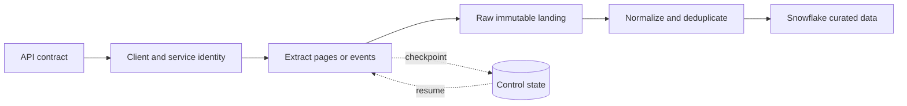

# Consuming APIs for Data Pipelines Overview

> Turn HTTP requests into recoverable, observable data ingestion rather than fragile download scripts.

## Chapter Goal

This chapter teaches the **consumer side** of APIs: inspecting a contract, authenticating a workload, traversing a changing dataset, handling temporary failure, and landing evidence in Snowflake. The key shift for an experienced data engineer is that the network call is the easy part. Production quality comes from managing extraction state and proving what was received.

## Topics

1. [[05 APIs/02 Consuming APIs for Data Pipelines/07 Exploring APIs with curl and an API Client|Exploring APIs with curl and an API Client]] — make a request visible before automating it.
2. [[05 APIs/02 Consuming APIs for Data Pipelines/08 Calling APIs from Python|Calling APIs from Python]] — structure a maintainable client and separate transport from data logic.
3. [[05 APIs/02 Consuming APIs for Data Pipelines/09 Authentication and Service Identity|Authentication and Service Identity]] — give the workload the minimum durable access it needs.
4. [[05 APIs/02 Consuming APIs for Data Pipelines/10 Pagination Filtering and Incremental Extraction|Pagination, Filtering, and Incremental Extraction]] — traverse a changing source without gaps or silent truncation.
5. [[05 APIs/02 Consuming APIs for Data Pipelines/11 Rate Limits Timeouts Retries and Backoff|Rate Limits, Timeouts, Retries, and Backoff]] — treat temporary failure as normal while bounding cost and delay.
6. [[05 APIs/02 Consuming APIs for Data Pipelines/12 Polling Webhooks Async Jobs and Bulk Exports|Polling, Webhooks, Async Jobs, and Bulk Exports]] — choose an acquisition pattern that fits latency, volume, and operational maturity.
7. [[05 APIs/02 Consuming APIs for Data Pipelines/13 API Ingestion Correctness|API Ingestion Correctness]] — design for replay, deduplication, deletes, drift, and reconciliation.

## The Data Engineer Translation Layer

| API language | Familiar data-engineering idea |
|---|---|
| Page or cursor | Extract partition and progress marker |
| Rate-limit quota | Shared source capacity constraint |
| `Retry-After` | Source-directed scheduling signal |
| Webhook delivery ID | Event key for deduplication |
| Updated-since filter | Incremental high-water mark |
| Raw response envelope | Bronze/raw audit record |
| OpenAPI schema | Source contract, not proof of source quality |
| Access token | Short-lived workload credential |

## Consultant Lens

- Prefer an existing, well-operated Fivetran connector when coverage, history behavior, security, and cost fit the requirement.
- Build custom ingestion when the source is unsupported, business-specific behavior matters, or control is worth the ownership burden.
- Land raw payloads and extraction metadata before flattening when replay, auditability, or schema drift matters.
- Run custom Python jobs in a reproducible environment such as Docker, but keep secrets outside the image.
- Define the boundary explicitly: the API client owns extraction correctness; Snowflake owns durable landing and governed access; dbt owns downstream transformation and quality rules.

## Related Learning Areas

- [[03 Fivetran/02 Connectors and Sync Behavior/07 Application and API Connectors]]
- [[03 Fivetran/04 Fivetran with Snowflake and dbt/19 Fivetran to Snowflake to dbt Ownership Boundaries]]
- [[04 Docker/03 Data Stack Integration Patterns/11 Containerizing Python Data Jobs]]
- [[01 Snowflake/04 Data Engineering/29 Semi-structured Data, Schema Drift, and Data Contracts]]
- [[02 dbt/03 Testing Documentation and Data Quality/23 Source Freshness and SLA Monitoring]]

## Suggested Practice Path

1. Reproduce one documented request with `curl` and explain every part.
2. Implement the same request with a reusable Python client.
3. Add pagination, a checkpoint, timeouts, bounded retries, and run metrics.
4. Land raw payloads plus request metadata in Snowflake.
5. Stop mid-run, resume safely, replay a window, and demonstrate deduplication.
6. Compare the custom job against a managed connector and explain the ownership trade-off.
