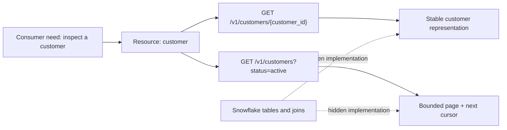

# Resource and Endpoint Design

> Design an API around stable business concepts and consumer tasks, not around tables or whatever the backend happens to expose today.

## Executive Summary

- **What it is:** Turning business capabilities into resources, URLs, methods, request models, and response models.
- **Why it matters:** A clear contract lets clients and the service evolve independently.
- **Mental model:** An endpoint is a governed doorway to a capability, not remote access to a database table.
- **Best used when:** Several consumers need predictable, validated access to data or an action.
- **Avoid or reconsider when:** A file transfer, managed connector, data share, or direct analytical access solves the need more simply.

## What It Can Do

- Give consumers a stable vocabulary such as customers, positions, or exports.
- Bound filtering, sorting, pagination, and returned fields.
- Apply authorization and business rules at a deliberate boundary.
- Hide storage layout and implementation changes from consumers.

## What It Cannot Do

- Repair unclear domain ownership or conflicting business definitions.
- Make an analytical warehouse behave like a low-latency transactional store.
- Prevent breaking changes without discipline, tests, and a deprecation policy.
- Replace bulk exchange patterns when clients need millions of rows.

## Core Concepts

| Concept | Meaning | Why it matters |
|---|---|---|
| Resource | A business entity or collection identified by a URI | Keeps the contract about the consumer's world |
| Representation | The JSON shape returned for a resource | Is a contract, not necessarily a database row |
| Method semantics | What `GET`, `POST`, `PUT`, `PATCH`, and `DELETE` promise | Affects retries, caches, and client expectations |
| Path parameter | Identifies a particular resource, for example `/customers/{id}` | Represents identity rather than optional filtering |
| Query parameter | Narrows or shapes a collection, for example `?status=active` | Keeps searches bounded and explicit |
| Idempotency | Repeating the same request has the same intended effect | Makes recovery from network uncertainty safer |
| Pagination | Returns a bounded page plus continuation information | Protects both service and client from unbounded results |

## How It Works (Simple Flow)

1. Identify the consumer and the decision or task they need to perform.
2. Name stable business resources rather than source tables.
3. Define operations using HTTP method semantics.
4. Specify request, response, error, pagination, and authorization behavior.
5. Write example interactions and an OpenAPI contract.
6. Review edge cases with consumers before committing implementation details.

## Visuals



## Readable Snippets

```http
GET /v1/customers?status=active&limit=50&cursor=eyJpZCI6IjEwMDAifQ
Accept: application/json

200 OK
{
  "items": [{"customer_id": "C-1042", "status": "active"}],
  "next_cursor": "eyJpZCI6IkMtMTA0MiJ9"
}
```

The cursor is opaque to the consumer. The service may encode a stable sort key, but clients should only store and return it.

## Consultant Talking Points

- **Client question this answers:** “Should we expose the customer table through an API?” Usually no; expose the consumer-safe customer contract.
- **Trade-offs to mention:** Convenience versus coupling, flexible filters versus query cost, and fine-grained calls versus bulk delivery.
- **Risk or governance angle:** Define field-level exposure and object-level authorization; a valid customer ID must not imply permission to see that customer.
- **Cost/performance angle:** Set maximum page sizes, allow only supported filters, and avoid arbitrary SQL-like query parameters.

## Common Pitfalls

- Mirroring table and column names directly, which leaks storage changes into every client.
- Using verbs everywhere (`/getCustomers`) instead of resources and method semantics, making the interface inconsistent.
- Returning unbounded collections, which creates latency, memory, and Snowflake cost risks.
- Treating `POST` retries as automatically safe without an idempotency key or deduplication rule.
- Designing only the happy path and leaving errors, empty results, authorization, and pagination ambiguous.

## When to Recommend What (Decision Table)

| Situation | Recommend | Why | Watch-outs |
|---|---|---|---|
| Read one known entity | `GET /resources/{id}` | Clear identity and cache semantics | Return `404` only after authorization rules are considered |
| Search a bounded collection | `GET /resources` with supported filters and cursor pagination | Familiar and easy to consume | Avoid arbitrary predicates and unstable ordering |
| Create a resource synchronously | `POST /resources` | Server can assign identity and validate input | Define duplicate and retry behavior |
| Replace a full known representation | `PUT /resources/{id}` | Idempotent replacement semantics are clear | Rarely suitable for partial business records |
| Update selected fields | `PATCH /resources/{id}` | Expresses partial change | Define omitted, null, and forbidden fields carefully |
| Deliver very large datasets | Export job, file, Snowflake share, or connector | Better throughput and resumability | API may still manage the job, not carry all rows |

## Related Topics

- [[05 APIs/03 Designing and Building APIs/Designing and Building APIs Overview]]
- [[05 APIs/03 Designing and Building APIs/15 Building a First API with FastAPI]]
- [[05 APIs/03 Designing and Building APIs/17 Errors Versioning and Compatibility]]
- [[05 APIs/02 Consuming APIs for Data Pipelines/10 Pagination Filtering and Incremental Extraction]]
- [[01 Snowflake/04 Data Engineering/29 Semi-structured Data, Schema Drift, and Data Contracts]]

## Related Decision Notes

- [[80 Comparisons and Decision Notes/Comparisons/Cross-Tool/Comparison - API vs File vs CDC|API vs File vs CDC]]
- [[80 Comparisons and Decision Notes/Decision Notes/Cross-Tool/Decisions - Serving Data from Snowflake Through an API|Serving Data from Snowflake Through an API]]

## Questions

- Which parts of a proposed endpoint describe a stable business concept, and which merely expose the current database design?
- What happens if the client retries each write request after losing the response?
- At what result size should the design switch from paged JSON to an export or sharing pattern?

## Sources To Revisit

- [RFC 9110 — HTTP Semantics](https://www.rfc-editor.org/rfc/rfc9110)
- [OpenAPI Specification](https://spec.openapis.org/oas/latest.html)
- [Microsoft REST API Guidelines](https://github.com/microsoft/api-guidelines)
- [Google AIP-121 — Resource-oriented design](https://google.aip.dev/121)
