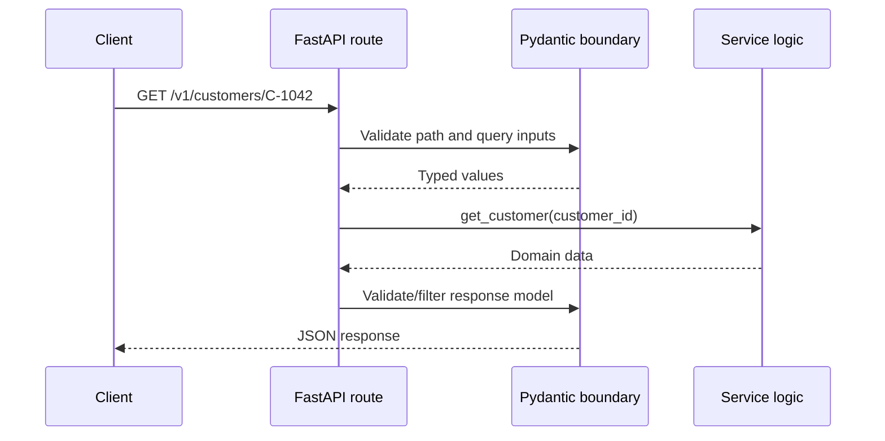

# Building a First API with FastAPI

> Use Python types to turn an endpoint design into a validated, documented service without burying the core API ideas under framework machinery.

## Executive Summary

- **What it is:** A small Python web API built with FastAPI and Pydantic models.
- **Why it matters:** Typed inputs and outputs make the contract visible in code and generate an OpenAPI description for consumers and tooling.
- **Mental model:** FastAPI is the HTTP adapter; Pydantic guards the data boundary; service functions contain the business behavior.
- **Best used when:** A Python team needs a documented API, strong validation, and a fast path from design to a maintainable service.
- **Avoid or reconsider when:** The organization already operates another standard stack well, or a managed integration removes the need for custom code.

## What It Can Do

- Map methods and paths to Python functions.
- Parse and validate path, query, header, and body inputs.
- Validate and filter output through response models.
- Generate OpenAPI plus interactive documentation.
- Inject shared dependencies such as authentication or a repository.

## What It Cannot Do

- Choose a good contract, authorization model, or service boundary for you.
- Make blocking database work non-blocking just because a route uses `async def`.
- Supply production deployment, monitoring, secrets, or capacity planning by itself.
- Turn every Python exception into a safe consumer-facing error automatically.

## Core Concepts

| Concept | Meaning | Why it matters |
|---|---|---|
| Path operation | A method-plus-path function such as `GET /customers/{id}` | Connects HTTP semantics to code |
| Pydantic model | Typed schema that validates and serializes data | Makes boundary assumptions executable |
| Response model | Declared outward shape | Prevents accidental field leakage and documents clients' contract |
| Dependency | Reusable value or check resolved per request | Useful for auth, repositories, configuration, and cleanup |
| OpenAPI document | Machine-readable description generated from route metadata | Powers docs, review, tests, and client generation |
| Sync versus async | Execution model of route and dependency functions | Must match the libraries doing the actual I/O |

## How It Works (Simple Flow)

1. The server matches the incoming method and path to a path operation.
2. FastAPI extracts inputs from the path, query string, headers, and body.
3. Pydantic validates and converts those inputs or FastAPI returns a validation error.
4. Dependencies resolve cross-cutting needs such as identity or a repository.
5. The path operation calls service logic and returns a Python value.
6. The response model validates, filters, and serializes the outward JSON.
7. The same declarations contribute to the generated OpenAPI document.

## Visuals



## Readable Snippets

```python
from fastapi import FastAPI, HTTPException, Query
from pydantic import BaseModel

app = FastAPI(title="Customer Data API", version="1.0.0")

class Customer(BaseModel):
    customer_id: str
    status: str

CUSTOMERS = {"C-1042": Customer(customer_id="C-1042", status="active")}

@app.get("/v1/customers/{customer_id}", response_model=Customer)
def get_customer(customer_id: str, include_inactive: bool = Query(False)):
    customer = CUSTOMERS.get(customer_id)
    if customer is None or (customer.status != "active" and not include_inactive):
        raise HTTPException(status_code=404, detail="Customer not found")
    return customer
```

Run with `fastapi dev main.py`, then inspect `/docs` and `/openapi.json`. The in-memory dictionary keeps the first example focused on the HTTP contract; Snowflake belongs behind a repository later.

## Consultant Talking Points

- **Client question this answers:** “How quickly can a Python team publish a validated, documented API?” Quickly—but the contract and operating model still need deliberate design.
- **Trade-offs to mention:** Fast development and strong typing versus adding a Python service the client must own and patch.
- **Risk or governance angle:** Use distinct input and output models so internal or sensitive fields cannot leak by accident.
- **Cost/performance angle:** Dependency injection makes repositories replaceable, but request-time calls still need timeouts, concurrency limits, and measurement.

## Common Pitfalls

- Putting SQL, authorization, serialization, and business rules directly in every route, making behavior hard to test and change.
- Returning raw database rows without a response model, which can expose new columns unintentionally.
- Believing `async def` accelerates a synchronous Snowflake connector; blocking I/O can still occupy the worker.
- Publishing generated docs as if generation guarantees a well-designed or stable contract.
- Accepting Pydantic's type coercion without deciding where strict validation is required for identifiers, money, or dates.

## When to Recommend What (Decision Table)

| Situation | Recommend | Why | Watch-outs |
|---|---|---|---|
| Small learning or internal API | One FastAPI app with route, model, and service modules | Easy to understand and iterate | Preserve separation before the app grows |
| Shared auth or repository creation | FastAPI dependency | Centralizes checks and lifecycle behavior | Avoid hidden dependency graphs |
| External consumer contract | Explicit request and response Pydantic models | Validation and OpenAPI remain aligned | Treat model changes as API changes |
| Existing Java/.NET platform standard | Follow the supported organizational stack | Operations and skills may outweigh framework preference | Apply the same HTTP design principles |
| Pure bulk data exchange | File, share, connector, or export job | API framework adds little value to the data movement | API may still coordinate access and status |

## Related Topics

- [[05 APIs/03 Designing and Building APIs/Designing and Building APIs Overview]]
- [[05 APIs/03 Designing and Building APIs/14 Resource and Endpoint Design]]
- [[05 APIs/03 Designing and Building APIs/16 Connecting an API to Snowflake]]
- [[05 APIs/03 Designing and Building APIs/18 Testing APIs]]
- [[04 Docker/03 Data Stack Integration Patterns/11 Containerizing Python Data Jobs]]

## Related Decision Notes

- [[80 Comparisons and Decision Notes/Decision Notes/Cross-Tool/Decisions - Serving Data from Snowflake Through an API|Serving Data from Snowflake Through an API]]

## Questions

- Which parts of the sample should remain HTTP-specific, and which should move into service or repository code?
- Why can a response model be a security control as well as a documentation feature?
- What evidence would justify choosing FastAPI over the client's existing service framework?

## Sources To Revisit

- [FastAPI tutorial](https://fastapi.tiangolo.com/tutorial/)
- [FastAPI request bodies](https://fastapi.tiangolo.com/tutorial/body/)
- [FastAPI response models](https://fastapi.tiangolo.com/tutorial/response-model/)
- [Pydantic models](https://docs.pydantic.dev/latest/concepts/models/)
- [OpenAPI Specification](https://spec.openapis.org/oas/latest.html)
