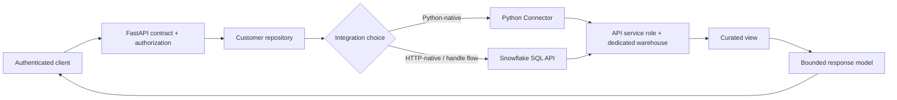

# Connecting an API to Snowflake

> Put a narrow repository boundary between HTTP and Snowflake, then design identity, queries, sessions, latency, and warehouse cost as production concerns.

## Executive Summary

- **What it is:** Using the Snowflake Python Connector or Snowflake SQL API behind an application endpoint.
- **Why it matters:** A working query is easy; a safe, predictable, supportable request path requires RBAC, parameter binding, session handling, and workload isolation.
- **Mental model:** The API is a governed consumer of Snowflake, not a public SQL console.
- **Best used when:** Consumers need a narrow, stable interface to curated data and analytical latency is acceptable.
- **Avoid or reconsider when:** The workload requires millisecond point lookups, huge result transfers, highly variable queries, or transactional writes.

## What It Can Do

- Query curated views or tables under a least-privilege service identity.
- Apply bounded filters and return consumer-oriented response models.
- Tag queries so API workload can be attributed in Snowflake history.
- Isolate API workload on a dedicated warehouse with explicit timeout and sizing policy.
- Submit and poll Snowflake work through the SQL API when an HTTP-native integration is useful.

## What It Cannot Do

- Guarantee low latency when a warehouse is suspended, queued, or scanning expensive data.
- Safely expose arbitrary SQL merely by placing it behind authentication.
- Convert Snowflake into an operational database for every access pattern.
- Eliminate warehouse credit consumption, concurrency limits, or result-size constraints.

## Core Concepts

| Concept | Meaning | Why it matters |
|---|---|---|
| Python Connector | Native Python DB-API driver using connections and cursors | Natural for a Python service and direct row handling |
| SQL API | REST endpoints for submitting, checking, and cancelling SQL | Useful when an HTTP-native client or async handle workflow fits better |
| Service identity | Non-human identity used by the API | Enables rotation, audit, and least privilege independent of developers |
| Repository boundary | Application interface hiding database access details | Keeps routes testable and makes connector choices replaceable |
| Parameter binding | Values sent separately from SQL text | Reduces injection risk and type/quoting mistakes |
| Connection reuse | Reusing or pooling established connections safely | Avoids authentication and setup cost on every request |
| Query tag | Session metadata attached to Snowflake queries | Supports cost attribution and incident tracing |
| Workload isolation | Dedicated warehouse and resource settings for the API | Protects API latency and other analytical workloads |

### Python Connector vs SQL API

| Dimension | Python Connector | SQL API |
|---|---|---|
| Best fit | Python service with direct query/result handling | HTTP-native integration, serverless client, or explicit statement-handle flow |
| Interface | DB-API connection and cursor | HTTPS requests and JSON responses |
| Authentication | Connector-supported service authentication | OAuth or key-pair authentication to the SQL API |
| Bind style | `%s`, named pyformat, `?`, or numeric depending on configuration | `?` placeholders plus typed JSON `bindings` |
| Long queries | `execute_async()` and query ID | Statement handle with status/result polling |
| Session handling | Stateful connection; set role, warehouse, and session parameters deliberately | Request supplies role, warehouse, database, schema, timeout |
| Operational burden | Manage connector lifecycle and safe connection reuse | Manage tokens, HTTP retries, partitions, handles, and API response states |
| Main caution | Blocking calls and unsafe sharing of session state | A request may become asynchronous even when `async=true` was not specified |

## How It Works (Simple Flow)

1. The API authenticates the caller and authorizes access to the requested business resource.
2. It validates filters and translates only supported inputs into a fixed query shape.
3. A repository obtains a safely configured connection or prepares a SQL API request.
4. The request uses a dedicated service role, warehouse, database, schema, timeout, and query tag.
5. SQL values are bound separately rather than concatenated into query text.
6. Snowflake executes against curated objects; the repository bounds and maps the result.
7. The API converts rows into a stable response model and records correlation metadata.

## Visuals



## Readable Snippets

```python
import os
import snowflake.connector

def fetch_customer(customer_id: str) -> dict | None:
    # In production, acquire this from an application-managed pool or safe reuse layer.
    with snowflake.connector.connect(
        account=os.environ["SNOWFLAKE_ACCOUNT"],
        user=os.environ["SNOWFLAKE_USER"],
        private_key_file=os.environ["SNOWFLAKE_PRIVATE_KEY_FILE"],
        role="API_CUSTOMER_READER",
        warehouse="API_SERVING_WH",
        database="CURATED",
        schema="CUSTOMER",
        session_parameters={
            "QUERY_TAG": '{"service":"customer-api","endpoint":"get-customer"}',
            "STATEMENT_TIMEOUT_IN_SECONDS": 10,
        },
    ) as connection:
        with connection.cursor() as cursor:
            cursor.execute(
                """select customer_id, status
                   from api_customer_v
                   where customer_id = %s
                   limit 1""",
                (customer_id,),
            )
            row = cursor.fetchone()
            return None if row is None else {"customer_id": row[0], "status": row[1]}
```

The query shape is fixed, the value is bound, and the service role can read only the curated view. Opening a connection per request is intentionally visible here as a learning example; production code should reuse connections carefully without leaking mutable session state between requests.

SQL API binding has the same principle but a different representation:

```json
{
  "statement": "select customer_id, status from api_customer_v where customer_id = ? limit 1",
  "bindings": {"1": {"type": "TEXT", "value": "C-1042"}},
  "role": "API_CUSTOMER_READER",
  "warehouse": "API_SERVING_WH",
  "database": "CURATED",
  "schema": "CUSTOMER",
  "timeout": 10
}
```

## Consultant Talking Points

- **Client question this answers:** “Can we put an API directly on Snowflake?” Yes for suitable analytical access patterns, after validating latency, concurrency, security, and cost.
- **Trade-offs to mention:** The connector is simpler inside Python; the SQL API avoids a language-specific database driver but adds HTTP token, polling, retry, and result-partition handling.
- **Risk or governance angle:** Use a non-human identity, least-privilege role, curated objects, bound values, allowed filters, secret rotation, and field-level response models.
- **Cost/performance angle:** A dedicated auto-suspending warehouse improves attribution and isolation, but cold starts and frequent tiny queries can produce poor latency-to-cost economics.

## Common Pitfalls

- Creating a new authenticated Snowflake connection for every request without measuring handshake and session setup cost.
- Reusing one mutable session carelessly across concurrent requests, allowing role, database, query tag, or transaction state to leak.
- Building SQL with string interpolation, which creates injection and correctness risks even for apparently simple filters.
- Granting the API role broad table access instead of access to narrow curated views.
- Returning unbounded query results or allowing arbitrary sorting and filtering.
- Sharing a transformation warehouse with API traffic, causing unpredictable queues and unclear cost ownership.
- Assuming every SQL API request completes synchronously; clients must handle statement handles and polling.

## When to Recommend What (Decision Table)

| Situation | Recommend | Why | Watch-outs |
|---|---|---|---|
| Python API with ordinary bounded queries | Snowflake Python Connector behind a repository | Native, familiar DB-API interface and direct result handling | Blocking I/O, connection lifecycle, mutable session state |
| Non-Python or HTTP-only environment | Snowflake SQL API | Standard HTTPS integration and explicit statement handles | Auth tokens, HTTP retries, partitions, async responses |
| Long analytical query | Asynchronous job and result retrieval | Keeps the client request bounded and recoverable | Retention, authorization, cancellation, warehouse cost |
| Large dataset distribution | Secure share, file export, or bulk pattern | Avoids expensive row-by-row JSON serving | Consumer capability and governance |
| Millisecond operational lookup at high concurrency | Operational serving store or cache fed from curated data | Better latency and concurrency fit | Freshness and duplicate data ownership |
| Narrow internal analytical lookup | Snowflake-backed endpoint with cache where justified | Minimal extra platform and governed source | Cold starts, stale cache, query attribution |

## Related Topics

- [[05 APIs/03 Designing and Building APIs/Designing and Building APIs Overview]]
- [[05 APIs/03 Designing and Building APIs/15 Building a First API with FastAPI]]
- [[05 APIs/03 Designing and Building APIs/19 Async Work and Long-running Requests]]
- [[01 Snowflake/03 Security and Governance/12 RBAC Roles and Privileges]]
- [[01 Snowflake/06 Cost Management and Operations/46 Warehouse Scheduling and Auto-suspend]]
- [[02 dbt/08 dbt on Snowflake and Finance Patterns/76 Database Schema and Warehouse Strategy]]

## Related Decision Notes

- [[80 Comparisons and Decision Notes/Decision Notes/Snowflake/Decisions - Choosing a Warehouse Strategy by Workload Type]]
- [[80 Comparisons and Decision Notes/Comparisons/Cross-Tool/Comparison - Snowflake Python Connector vs SQL API|Snowflake Python Connector vs SQL API]]
- [[80 Comparisons and Decision Notes/Decision Notes/Cross-Tool/Decisions - Serving Data from Snowflake Through an API|Serving Data from Snowflake Through an API]]

## Questions

- What latency and concurrency evidence would make Snowflake a poor request-time serving layer for this API?
- How will a request ID, API endpoint, service version, and Snowflake query ID be correlated during an incident?
- Which exact objects and rows should the service role see if the API process is compromised?

## Sources To Revisit

- [Snowflake Python Connector — connecting](https://docs.snowflake.com/en/developer-guide/python-connector/python-connector-connect)
- [Snowflake Python Connector — binding data](https://docs.snowflake.com/en/developer-guide/python-connector/python-connector-example#binding-data)
- [Snowflake SQL API](https://docs.snowflake.com/en/developer-guide/sql-api/index)
- [Snowflake SQL API — submitting requests](https://docs.snowflake.com/en/developer-guide/sql-api/submitting-requests)
- [Snowflake access control overview](https://docs.snowflake.com/en/user-guide/security-access-control-overview)
