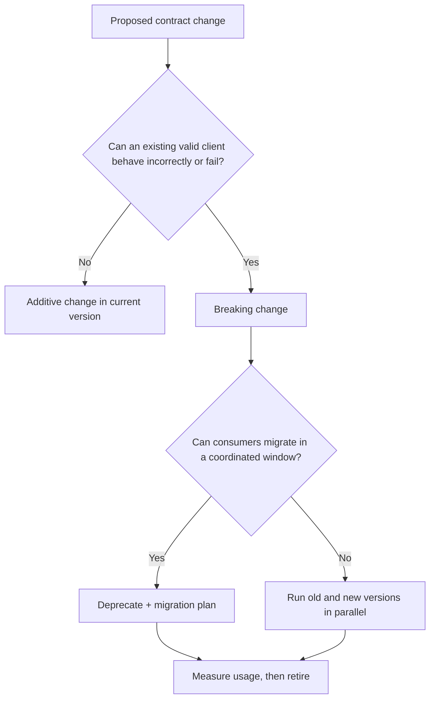

# Errors Versioning and Compatibility

> Make failure responses useful to machines and humans, then evolve the contract without surprising consumers.

## Executive Summary

- **What it is:** A consistent error model plus rules for compatible changes, versions, deprecation, and retirement.
- **Why it matters:** Consumers code against failure behavior and field meaning just as much as against successful examples.
- **Mental model:** The API contract includes status codes, error bodies, semantics, and change policy—not only successful JSON.
- **Best used when:** Any API has more than one consumer, an independent release cycle, or a production support obligation.
- **Avoid or reconsider when:** Never avoid it; only scale the ceremony to the API's reach and risk.

## What It Can Do

- Let clients distinguish invalid input, missing resources, conflicts, throttling, and server failure.
- Give support teams a safe correlation ID without leaking internal stack traces.
- Allow additive evolution inside a stable version when consumers tolerate unknown fields.
- Give consumers an explicit migration window for breaking changes.
- Make deprecation and ownership reviewable rather than informal.

## What It Cannot Do

- Make a semantic change compatible merely by keeping the same JSON shape.
- Guarantee clients ignore new fields unless that behavior is part of the consumer contract.
- Remove the cost of supporting old versions or coordinating migrations.
- Replace observability; a safe public error should link to richer internal evidence.

## Core Concepts

| Concept | Meaning | Why it matters |
|---|---|---|
| HTTP status | Standard high-level outcome such as `400`, `404`, `409`, `429`, or `503` | Gives generic clients and intermediaries useful semantics |
| Problem details | Standard error document with fields such as `type`, `title`, `status`, and `detail` | Creates a consistent machine-readable failure shape |
| Error code | Stable application-specific identifier | Lets clients branch without parsing prose |
| Correlation ID | Identifier linking client error to logs, traces, and Snowflake query evidence | Supports incident investigation safely |
| Compatible change | Change existing consumers can accept without modification | Usually additive, but depends on stated client rules |
| Breaking change | Change that can alter valid client behavior or interpretation | Requires migration, a new version, or coordinated release |
| Deprecation | Supported notice period before retirement | Turns surprise removal into managed change |

### Compatibility Is About Meaning

| Change | Usually compatible? | Important qualification |
|---|---|---|
| Add an optional response field | Yes | Only if clients are required to tolerate unknown fields |
| Add an optional request field | Yes | Its default behavior must preserve prior behavior |
| Add a new enum value | Risky | Exhaustive client code may fail even though the JSON schema expanded |
| Make an optional field required | No | Existing requests or responses may no longer validate |
| Rename or remove a field | No | Consumer parsing breaks |
| Change units, timezone, sign, or business meaning | No | Shape may be identical while decisions become wrong |
| Tighten validation | Often breaking | Previously accepted requests may be rejected |

## How It Works (Simple Flow)

1. Define a small error taxonomy and map it to HTTP status codes.
2. Return one stable problem-details shape with an application code and correlation ID.
3. Classify each proposed contract change by consumer impact, including semantics.
4. Make additive compatible changes in the current version and test old clients or schemas.
5. Introduce a new major API version when a breaking change is unavoidable.
6. Publish migration guidance, deprecation dates, and usage telemetry.
7. Retire an old version only after agreed criteria and consumer communication are met.

## Visuals



## Readable Snippets

```python
from uuid import uuid4
from fastapi import FastAPI, Request
from fastapi.responses import JSONResponse

app = FastAPI()

class CustomerNotFound(Exception):
    def __init__(self, customer_id: str):
        self.customer_id = customer_id

@app.exception_handler(CustomerNotFound)
async def customer_not_found(request: Request, exc: CustomerNotFound):
    request_id = request.headers.get("x-request-id", str(uuid4()))
    return JSONResponse(
        status_code=404,
        media_type="application/problem+json",
        content={
            "type": "https://api.example.com/problems/customer-not-found",
            "title": "Customer not found",
            "status": 404,
            "detail": f"No visible customer has ID {exc.customer_id}.",
            "code": "CUSTOMER_NOT_FOUND",
            "request_id": request_id,
        },
    )
```

The message is safe and useful to the consumer. Logs can retain exception details under the same `request_id`; stack traces should not be returned publicly.

## Consultant Talking Points

- **Client question this answers:** “Can we just change the endpoint and tell users?” Only if all consumers are controlled, identified, and released together; otherwise use a compatibility policy.
- **Trade-offs to mention:** Long support windows protect consumers but multiply code paths, testing, security fixes, and operational burden.
- **Risk or governance angle:** Treat changes to masking, row visibility, financial definitions, timestamps, and units as semantic contract changes even if the schema is unchanged.
- **Cost/performance angle:** Parallel versions consume engineering and runtime capacity; telemetry should identify actual usage before extending support indefinitely.

## Common Pitfalls

- Returning `200 OK` with an error flag, preventing generic tooling from understanding failure.
- Returning raw Snowflake errors or stack traces, exposing SQL, object names, and implementation details.
- Using human prose as the only machine-readable error signal.
- Assuming adding enum members or tightening validation is harmless.
- Creating `/v2` for every additive field, producing permanent version sprawl.
- Publishing a deprecation date without measuring consumers or assigning migration ownership.

## When to Recommend What (Decision Table)

| Situation | Recommend | Why | Watch-outs |
|---|---|---|---|
| Predictable client-correctable failure | Specific `4xx` plus problem details and stable code | Client can respond deliberately | Do not reveal whether hidden objects exist |
| Transient service or Snowflake dependency failure | `503` with retry guidance where safe | Signals temporary inability to serve | Retrying can amplify an outage; use backoff |
| Additive optional field | Same major version | Avoids unnecessary version churn | Contract must require unknown-field tolerance |
| Changed field meaning or required shape | New major version or coordinated breaking release | Protects existing consumers | Plan migration, telemetry, and retirement |
| Internal API with one jointly deployed consumer | Coordinated change may be enough | Lower ceremony and no parallel version | Verify there are truly no hidden consumers |
| Public or regulated data product | Explicit version and deprecation policy | Stronger predictability and evidence | Support cost and security patching |

## Related Topics

- [[05 APIs/03 Designing and Building APIs/Designing and Building APIs Overview]]
- [[05 APIs/03 Designing and Building APIs/14 Resource and Endpoint Design]]
- [[05 APIs/03 Designing and Building APIs/18 Testing APIs]]
- [[05 APIs/02 Consuming APIs for Data Pipelines/11 Rate Limits Timeouts Retries and Backoff]]
- [[02 dbt/06 Governance Semantic Layer and Mesh/53 Model Versions and Deprecation]]

## Related Decision Notes

- [[80 Comparisons and Decision Notes/Decision Notes/dbt/Decisions - Versioning and Deprecating a dbt Model]]

## Questions

- Which response changes could alter a financial decision without changing a field's name or type?
- How will a consumer correlate a safe public error with logs and a Snowflake query ID?
- What measurable conditions must be met before an old API version is retired?

## Sources To Revisit

- [RFC 9110 — HTTP Semantics](https://www.rfc-editor.org/rfc/rfc9110)
- [RFC 9457 — Problem Details for HTTP APIs](https://www.rfc-editor.org/rfc/rfc9457)
- [OpenAPI Specification](https://spec.openapis.org/oas/latest.html)
- [FastAPI handling errors](https://fastapi.tiangolo.com/tutorial/handling-errors/)
- [RFC 8594 — The Sunset HTTP Header Field](https://www.rfc-editor.org/rfc/rfc8594)
