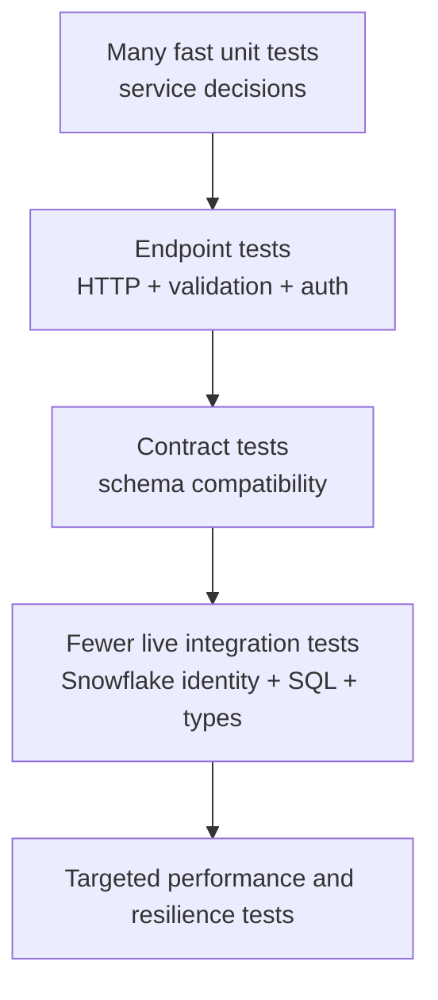

# Testing APIs

> Test the contract, authorization, failure modes, and dependency boundaries—not merely whether one happy-path request returns JSON.

## Executive Summary

- **What it is:** A layered testing approach using pytest, FastAPI's test client, dependency overrides, contract checks, and selected live integration tests.
- **Why it matters:** API failures often occur at boundaries: validation, authorization, retries, serialization, and upstream behavior.
- **Mental model:** Unit tests prove decisions, endpoint tests prove HTTP behavior, contract tests prove shape, and integration tests prove the real dependency path.
- **Best used when:** From the first endpoint onward, with depth increasing according to exposure and risk.
- **Avoid or reconsider when:** Do not avoid testing; reconsider only redundant tests that assert framework internals rather than your behavior.

## What It Can Do

- Prove status codes, headers, bodies, and validation behavior.
- Verify that callers cannot access forbidden resources or sensitive fields.
- Lock request and response schemas against accidental breaking changes.
- Exercise timeouts, dependency failures, empty results, and retry behavior.
- Validate real Snowflake grants, objects, types, and query assumptions in a controlled environment.

## What It Cannot Do

- Prove production capacity from small functional tests.
- Make mocks reveal differences in real Snowflake behavior they do not model.
- Replace monitoring, canaries, or incident exercises.
- Establish that the business meaning of returned data is correct without data-quality and reconciliation evidence.

## Core Concepts

| Concept | Meaning | Why it matters |
|---|---|---|
| Unit test | Tests service logic without HTTP or live dependencies | Fast feedback on decisions and edge cases |
| Endpoint test | Sends a request through the application using a test client | Verifies routing, validation, status, headers, and serialization |
| Contract test | Checks requests/responses against an agreed schema or consumer expectation | Detects accidental compatibility breaks |
| Integration test | Uses a real boundary such as Snowflake in a controlled environment | Finds auth, SQL, type, and configuration mismatches |
| Authorization test | Proves allowed and denied access across identities and objects | Security needs negative evidence, not just success |
| Performance test | Measures latency, throughput, concurrency, and saturation | Validates capacity and warehouse behavior |
| Fixture | Reusable pytest setup with controlled lifecycle | Keeps state explicit and tests readable |

## How It Works (Simple Flow)

1. State observable behavior from the contract and risk model.
2. Test business rules as fast unit tests.
3. Override repositories and identity dependencies for deterministic endpoint tests.
4. Test success, invalid input, absence, forbidden access, conflict, timeout, and dependency failure.
5. Compare OpenAPI or representative payloads with the approved contract.
6. Run selected tests against a dedicated Snowflake integration environment and least-privilege role.
7. Add performance and resilience tests for critical endpoints before production changes.

## Visuals



## Readable Snippets

```python
from fastapi.testclient import TestClient
import pytest

from app.main import app
from app.dependencies import get_customer_repository

class FakeCustomerRepository:
    def get(self, customer_id: str):
        if customer_id == "C-1042":
            return {"customer_id": customer_id, "status": "active"}
        return None

@pytest.fixture
def client():
    app.dependency_overrides[get_customer_repository] = FakeCustomerRepository
    with TestClient(app) as test_client:
        yield test_client
    app.dependency_overrides.clear()

@pytest.mark.parametrize("customer_id,expected", [
    ("C-1042", 200),
    ("missing", 404),
])
def test_get_customer(client, customer_id, expected):
    response = client.get(f"/v1/customers/{customer_id}")
    assert response.status_code == expected
    if expected == 200:
        assert response.json() == {"customer_id": "C-1042", "status": "active"}
        assert "national_id" not in response.json()
```

This test proves outward behavior and field exclusion while keeping Snowflake out of the fast test loop. A separate, smaller suite should prove the real repository against a dedicated environment.

## Consultant Talking Points

- **Client question this answers:** “We have unit tests—is the API covered?” Not unless HTTP, authorization, contracts, and real integrations are also tested at appropriate depth.
- **Trade-offs to mention:** Mocks are fast and deterministic; live tests are slower and costlier but expose real grants, types, sessions, and SQL behavior.
- **Risk or governance angle:** Include explicit cross-tenant, hidden-object, sensitive-field, expired-credential, and audit-correlation tests.
- **Cost/performance angle:** Keep routine Snowflake integration data small, tag test queries, auto-suspend the warehouse, and reserve load tests for controlled windows.

## Common Pitfalls

- Testing only `200` responses and ignoring invalid, absent, unauthorized, throttled, and upstream-failure paths.
- Mocking Snowflake everywhere, so role grants, timestamp conversion, SQL syntax, and schema changes never meet the tests.
- Using production data, credentials, or unrestricted roles in automated tests.
- Asserting implementation details so refactoring breaks tests even when the contract is unchanged.
- Treating a generated OpenAPI file as proof that runtime responses match the contract.
- Running uncontrolled load tests against a shared warehouse and causing cost or availability incidents.

## When to Recommend What (Decision Table)

| Situation | Recommend | Why | Watch-outs |
|---|---|---|---|
| Business rule with no I/O | Unit test | Fast, precise feedback | Avoid framework setup |
| Route validation and response behavior | FastAPI `TestClient` plus dependency override | Exercises the HTTP boundary deterministically | Clear overrides after each test |
| Shared external consumer | Contract/schema tests in CI | Detects breaking changes before release | Schema compatibility does not prove semantic compatibility |
| Snowflake repository | Small live integration suite | Proves identity, grants, SQL, types, and objects | Isolated environment, tagged queries, stable fixtures |
| Sensitive multi-tenant API | Authorization matrix and negative tests | Denials are core behavior | Avoid leaking object existence in assertions or errors |
| Critical high-volume endpoint | Controlled load and failure testing | Reveals saturation and recovery behavior | Representative data, warehouse, and concurrency are essential |

## Related Topics

- [[05 APIs/03 Designing and Building APIs/Designing and Building APIs Overview]]
- [[05 APIs/03 Designing and Building APIs/15 Building a First API with FastAPI]]
- [[05 APIs/03 Designing and Building APIs/17 Errors Versioning and Compatibility]]
- [[05 APIs/03 Designing and Building APIs/19 Async Work and Long-running Requests]]
- [[02 dbt/03 Testing Documentation and Data Quality/21 Generic Singular and Custom Data Tests]]

## Related Decision Notes

- [[80 Comparisons and Decision Notes/Decision Notes/Cross-Tool/Decisions - Serving Data from Snowflake Through an API|Serving Data from Snowflake Through an API]]

## Questions

- Which production risk is invisible if every Snowflake call is mocked?
- What negative authorization cases must pass before a customer endpoint can be released?
- Which tests belong on every commit, and which need a controlled integration or performance environment?

## Sources To Revisit

- [FastAPI testing](https://fastapi.tiangolo.com/tutorial/testing/)
- [FastAPI dependency overrides for testing](https://fastapi.tiangolo.com/advanced/testing-dependencies/)
- [pytest fixtures](https://docs.pytest.org/en/stable/how-to/fixtures.html)
- [pytest parametrization](https://docs.pytest.org/en/stable/how-to/parametrize.html)
- [OpenAPI Specification](https://spec.openapis.org/oas/latest.html)
