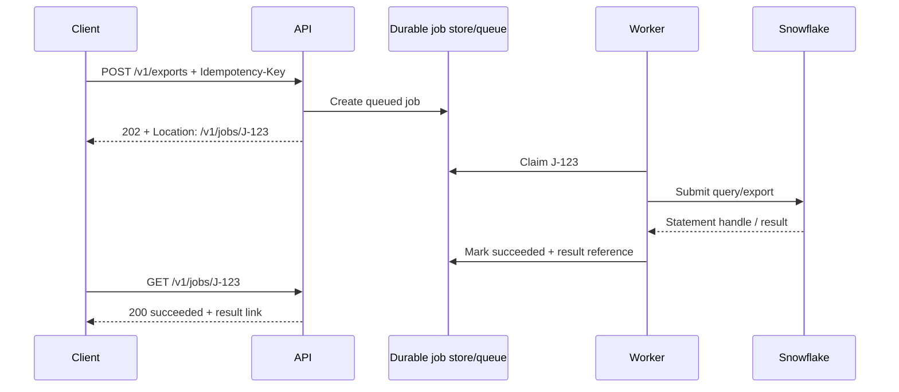

# Async Work and Long-running Requests

> Return control to the client quickly, represent long work as a durable job, and make status, retry, result, and cancellation behavior explicit.

## Executive Summary

- **What it is:** A job-oriented API pattern in which a request returns `202 Accepted` and a job identifier while work continues independently.
- **Why it matters:** Warehouse queries, exports, and data processing can outlive client, proxy, and server request timeouts.
- **Mental model:** Submission creates a resource called a job; workers progress it; clients observe it through status and result endpoints.
- **Best used when:** Work is slow, variable, resource-intensive, retryable, or valuable enough to survive an API process restart.
- **Avoid or reconsider when:** The work is reliably quick and the extra queue, state, and lifecycle would add needless complexity.

## What It Can Do

- Keep client connections short while work continues.
- Provide a durable status such as queued, running, succeeded, failed, or cancelled.
- Allow polling, webhook notification, cancellation, and delayed result retrieval.
- Separate API concurrency from Snowflake query concurrency.
- Give retries a stable idempotency and audit boundary.

## What It Cannot Do

- Make work faster; it changes coordination and resilience.
- Guarantee exactly-once execution without idempotent effects and durable state.
- Make in-process background tasks durable across restarts.
- Remove the need for quotas, timeouts, cleanup, access checks, and cost controls.

## Core Concepts

| Concept | Meaning | Why it matters |
|---|---|---|
| `202 Accepted` | Request was accepted but processing is not complete | Prevents clients from mistaking acceptance for success |
| Job resource | Durable record of state, ownership, timestamps, and result/error reference | Gives work an observable lifecycle |
| Worker | Process that claims and executes jobs | Decouples request handling from slow work |
| Idempotency key | Client-supplied key identifying the logical submission | Prevents duplicate jobs when a response is lost |
| Statement handle | Identifier returned by the Snowflake SQL API for status/results | Tracks Snowflake execution, but does not replace the application's job model |
| Polling | Client periodically retrieves job status | Simple but can create excess traffic without backoff |
| Callback/webhook | Service notifies the client when state changes | Reduces polling but introduces delivery security and retry concerns |
| Cancellation | Best-effort request to stop work | Needs clear race behavior and downstream cancellation support |

## How It Works (Simple Flow)

1. The client submits work with an idempotency key.
2. The API validates and authorizes the request, creates a durable job, and returns `202` with its location.
3. A worker claims the job and records that it is running.
4. The worker submits bounded Snowflake work, retaining the statement/query handle for correlation and cancellation.
5. The worker records success with a result reference or failure with a safe error.
6. The client polls with backoff or receives a signed, retryable webhook notification.
7. The service expires job metadata and results according to a documented retention policy.

## Visuals



## Readable Snippets

```python
from enum import StrEnum
from uuid import uuid4
from fastapi import FastAPI, Header, Response, status
from pydantic import BaseModel

app = FastAPI()

class JobState(StrEnum):
    queued = "queued"
    running = "running"
    succeeded = "succeeded"
    failed = "failed"

class ExportRequest(BaseModel):
    as_of_date: str

class Job(BaseModel):
    job_id: str
    state: JobState

jobs: dict[str, Job] = {}  # Learning-only; production state must be durable.
idempotency_index: dict[str, str] = {}

@app.post("/v1/exports", response_model=Job, status_code=status.HTTP_202_ACCEPTED)
def create_export(
    request: ExportRequest,
    response: Response,
    idempotency_key: str = Header(alias="Idempotency-Key"),
):
    job_id = idempotency_index.get(idempotency_key)
    if job_id is None:
        job_id = f"J-{uuid4()}"
        jobs[job_id] = Job(job_id=job_id, state=JobState.queued)
        idempotency_index[idempotency_key] = job_id
        # A durable queue would receive the job here.
    response.headers["Location"] = f"/v1/jobs/{job_id}"
    return jobs[job_id]
```

FastAPI `BackgroundTasks` is useful for small, non-critical work after a response. A durable export should normally use an external queue/job store and worker because in-process work can disappear when the API restarts or scales down.

## Consultant Talking Points

- **Client question this answers:** “Why not increase the HTTP timeout until the Snowflake query finishes?” Long connections are fragile and couple client capacity directly to warehouse variability.
- **Trade-offs to mention:** Job APIs improve resilience and capacity control but add state, queue operations, retention, and consumer lifecycle handling.
- **Risk or governance angle:** Job status and result endpoints must re-check ownership; unguessable IDs alone are not authorization.
- **Cost/performance angle:** Queue depth and worker concurrency can protect the warehouse; unchecked workers can simply move the overload downstream.

## Common Pitfalls

- Returning `202` without a job/status resource, leaving the client unable to determine the outcome.
- Treating in-memory state or in-process background tasks as durable production processing.
- Creating duplicate exports when the client retries after losing the submission response.
- Polling every second indefinitely without `Retry-After`, backoff, or terminal-state rules.
- Marking a job cancelled before confirming or attempting cancellation in Snowflake.
- Keeping sensitive result files forever or issuing result links that outlive authorization and retention policy.
- Equating a Snowflake statement handle with the full business job; one job may contain validation, multiple statements, export, and publication.

## When to Recommend What (Decision Table)

| Situation | Recommend | Why | Watch-outs |
|---|---|---|---|
| Reliably sub-second bounded lookup | Synchronous endpoint | Simpler consumer and operating model | Keep timeouts and limits anyway |
| Small best-effort follow-up in same process | FastAPI `BackgroundTasks` | Minimal machinery | Not durable; no heavy compute or critical work |
| Long query, export, or multi-step process | Durable job store/queue plus worker | Survives request and process lifecycle | Idempotency, retries, retention, operations |
| SQL API query that may exceed response window | Store statement handle and poll through a job | Aligns with Snowflake response workflow | SQL API may return a handle even without explicit async |
| Many jobs competing for Snowflake | Bounded workers and workload-specific warehouse | Applies backpressure and isolates cost | Queue latency and fairness |
| Client cannot poll efficiently | Signed webhook plus status endpoint | Timely notification with source of truth | Delivery retries, replay protection, secret rotation |

## Related Topics

- [[05 APIs/03 Designing and Building APIs/Designing and Building APIs Overview]]
- [[05 APIs/03 Designing and Building APIs/16 Connecting an API to Snowflake]]
- [[05 APIs/03 Designing and Building APIs/17 Errors Versioning and Compatibility]]
- [[05 APIs/03 Designing and Building APIs/18 Testing APIs]]
- [[05 APIs/02 Consuming APIs for Data Pipelines/12 Polling Webhooks Async Jobs and Bulk Exports]]
- [[01 Snowflake/04 Data Engineering/28 Pipeline Observability, Latency, and Recovery]]

## Related Decision Notes

- [[80 Comparisons and Decision Notes/Comparisons/Cross-Tool/Comparison - Snowflake Python Connector vs SQL API|Snowflake Python Connector vs SQL API]]
- [[80 Comparisons and Decision Notes/Decision Notes/Cross-Tool/Decisions - Serving Data from Snowflake Through an API|Serving Data from Snowflake Through an API]]

## Questions

- Which parts of the business job must survive an API deployment or worker crash?
- How will retries avoid duplicate Snowflake writes, exports, or notifications when the previous outcome is unknown?
- What limits on queue depth, per-client jobs, worker concurrency, result size, and retention protect cost and availability?

## Sources To Revisit

- [RFC 9110 — `202 Accepted`](https://www.rfc-editor.org/rfc/rfc9110#name-202-accepted)
- [FastAPI background tasks and durability caveat](https://fastapi.tiangolo.com/tutorial/background-tasks/)
- [Snowflake SQL API — submitting requests](https://docs.snowflake.com/en/developer-guide/sql-api/submitting-requests)
- [Snowflake SQL API — handling responses](https://docs.snowflake.com/en/developer-guide/sql-api/handling-responses)
- [Snowflake SQL API — cancelling statements](https://docs.snowflake.com/en/developer-guide/sql-api/cancelling-requests)
