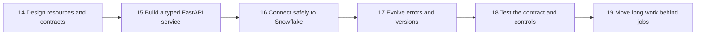
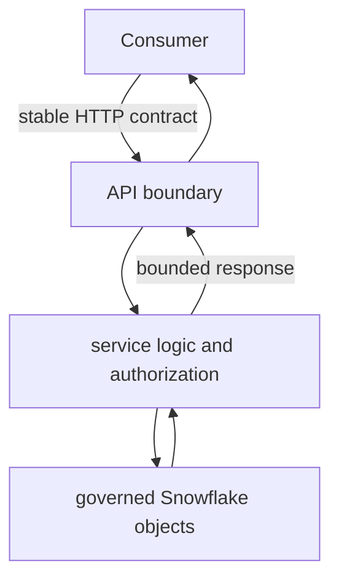

# Designing and Building APIs Overview

> Move from reading API documentation to designing, building, testing, and operating a small API that exposes governed data safely.

## Chapter Goal

After this chapter, you should be able to explain an API contract, build a small FastAPI service, connect it responsibly to Snowflake, and recognize when a request belongs in a background job rather than a synchronous endpoint.

The learning stack is intentionally small:

- **FastAPI** maps HTTP requests to Python functions and produces OpenAPI documentation.
- **Pydantic** validates request and response data at the boundary.
- **pytest** makes behavior repeatable and reviewable.
- **Snowflake** is the analytical data source, not automatically an operational serving database.

## Learning Sequence

| Topic | Central question | Practical outcome |
|---|---|---|
| [[05 APIs/03 Designing and Building APIs/14 Resource and Endpoint Design]] | What should the API expose? | A small, coherent resource model and endpoint contract |
| [[05 APIs/03 Designing and Building APIs/15 Building a First API with FastAPI]] | How does the contract become working code? | A runnable typed API with generated documentation |
| [[05 APIs/03 Designing and Building APIs/16 Connecting an API to Snowflake]] | How should an API reach governed analytical data? | A deliberate connector choice with RBAC, latency, and cost controls |
| [[05 APIs/03 Designing and Building APIs/17 Errors Versioning and Compatibility]] | How can clients depend on the API as it changes? | Stable errors and an explicit compatibility policy |
| [[05 APIs/03 Designing and Building APIs/18 Testing APIs]] | How do we prove behavior beyond the happy path? | A layered pytest suite covering contract, authorization, and dependencies |
| [[05 APIs/03 Designing and Building APIs/19 Async Work and Long-running Requests]] | What if work outlives an HTTP request? | A `202 Accepted` job pattern with status, retry, and cancellation semantics |

## Consultant Mental Model

An API is a product boundary, not a thin SQL wrapper. Its implementation can change, but consumers need its observable behavior to remain dependable.

## Completion Check

You can finish this chapter by building a read-only `/v1/customers` API backed by a curated Snowflake view. It should have bounded pagination, a least-privilege service role, bound SQL parameters, query tags, a stable error shape, contract tests, and an asynchronous export job for large results.

## Related Learning Areas

- [[05 APIs/02 Consuming APIs for Data Pipelines/Consuming APIs for Data Pipelines Overview]]
- [[05 APIs/04 Production Security and Data Stack Integration/Production Security and Data Stack Integration Overview]]
- [[01 Snowflake/03 Security and Governance/12 RBAC Roles and Privileges]]
- [[01 Snowflake/06 Cost Management and Operations/46 Warehouse Scheduling and Auto-suspend]]
- [[04 Docker/03 Data Stack Integration Patterns/11 Containerizing Python Data Jobs]]

## Sources To Revisit

- [FastAPI tutorial](https://fastapi.tiangolo.com/tutorial/)
- [OpenAPI Specification](https://spec.openapis.org/oas/latest.html)
- [Snowflake SQL API](https://docs.snowflake.com/en/developer-guide/sql-api/index)
- [pytest documentation](https://docs.pytest.org/en/stable/)
