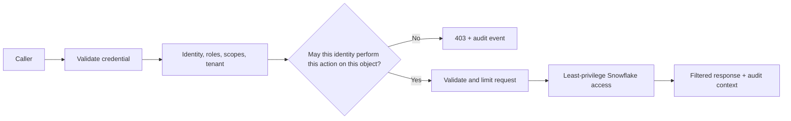

# API Security and Authorization

> [!abstract] Learning target
> Separate identity from permission and protect every API operation, object, and sensitive field with explicit controls.

> **Curriculum priority:** Essential

## Executive Summary

- **What it is:** API security combines transport protection, authentication, authorization, input validation, secret handling, abuse controls, and evidence.
- **Why it matters:** An API is a deliberate doorway into data and business operations. A valid login must not become permission to access every customer's records.
- **Mental model:** **Authenticate the caller, authorize the action and object, constrain the request, and record the decision.**
- **Best used when:** Designing any internal, partner, or public API, especially one exposing Snowflake data or triggering data-platform operations.
- **Avoid or reconsider when:** The team cannot define data ownership, consumer identities, access rules, credential lifecycle, or an incident response path.

## What It Can Do

- Verify human, workload, partner, or service identity.
- Enforce endpoint-, action-, object-, row-, and field-level permissions.
- Limit input size, request frequency, query complexity, and resource consumption.
- Keep credentials out of source code and rotate them independently of deployment.
- Produce evidence showing who requested which resource and whether access was allowed.

## What It Cannot Do

- Make broad Snowflake roles safe merely by hiding them behind an endpoint.
- Replace data classification, ownership, retention, or privacy decisions.
- Make a bearer token harmless after it is stolen.
- Prevent misuse if object-level authorization is missing inside the application logic.
- Guarantee safety from a one-time penetration test or an API gateway alone.

## Core Concepts

| Concept | Plain-language meaning | Why it matters |
|---|---|---|
| Authentication | Establish who or what is calling | Identity is the input to later access decisions |
| Authorization | Decide what that identity may do | Must be checked for the operation and the specific object requested |
| Scope or role | Named boundary on allowed behavior | Keeps service identities narrower than human administration roles |
| Object-level authorization | Check access to the exact customer, account, trade, or file | Prevents changing an identifier to read someone else's data |
| Field-level control | Exclude or mask sensitive attributes | A permitted row can still contain fields the caller must not see |
| Rate and resource limit | Bound request volume and cost | Protects availability and Snowflake consumption |
| Secret manager | Controlled store for credentials and keys | Supports restricted retrieval, rotation, and audit |

## How It Works (Simple Flow)

1. TLS protects the connection and the caller presents a supported credential.
2. The identity provider or API layer validates the token, signature, issuer, audience, and expiry.
3. The application maps the identity to roles, scopes, tenant, or policy attributes.
4. Each endpoint checks the requested action and the specific data object; it does not trust an object ID from the caller.
5. Input validation and resource limits reject malformed, excessive, or unexpectedly expensive requests.
6. The data layer uses a least-privilege Snowflake role and applies any masking or row-access controls required as defense in depth.
7. Security-relevant results are logged without recording credentials or sensitive payloads.

## Visuals



## Readable Snippets

The important security check is not just whether a token exists:

```python
def can_read_account(principal, account_id: str) -> bool:
    return account_id in principal.allowed_account_ids

@app.get("/v1/accounts/{account_id}")
def read_account(account_id: str, principal=Depends(current_principal)):
    if not can_read_account(principal, account_id):
        raise HTTPException(status_code=403, detail="Not permitted")
    return load_account(account_id)
```

The Snowflake query must still bind `account_id`; never splice it into SQL text.

## Consultant Talking Points

- **Client question this answers:** "If every caller logs in, why do we need more security logic?"
- **Trade-offs to mention:** Fine-grained authorization reduces exposure but needs reliable identity attributes, policy ownership, testing, and support.
- **Risk or governance angle:** Broken object authorization, over-broad service roles, leaked tokens, excessive data fields, and missing API inventories are recurring API risks.
- **Cost/performance angle:** Rate limits and query constraints are security controls because unrestricted requests can exhaust API, container, or Snowflake capacity.

## Common Pitfalls

- Checking that a token is valid but not checking whether the caller owns the requested object.
- Using one powerful Snowflake service role for unrelated endpoints and tenants.
- Logging authorization headers, JWTs, private data, or full response bodies.
- Treating API keys as permanent passwords without expiry, rotation, or scoped ownership.
- Returning every warehouse column because the caller is allowed to see the row.
- Adding rate limits only after a cost or availability incident.

## When to Recommend What (Decision Table)

| Situation | Recommend | Why | Watch-outs |
|---|---|---|---|
| Internal workload calls one API | Short-lived workload identity with narrow scopes | Removes shared human credentials | Token audience, rotation, and non-production separation |
| User-facing API has tenant-owned objects | Object- and tenant-level authorization on every operation | Login alone cannot enforce ownership | Test identifier substitution and indirect references |
| Sensitive fields are exposed from Snowflake | API response allowlist plus Snowflake policies where appropriate | Provides layered control | Keep policy semantics consistent across access paths |
| Anonymous or high-volume endpoint | Gateway limits plus application resource controls | Protects downstream capacity and cost | Rate limits are not a substitute for authorization |
| No team owns authorization policy | Delay exposure or reduce the use case | Undefined permissions cannot be implemented safely | Assign data owner and control owner first |

## Related Topics

- [[05 APIs/04 Production Security and Data Stack Integration/Production Security and Data Stack Integration Overview|Production, Security, and Data Stack Integration Overview]]
- [[05 APIs/02 Consuming APIs for Data Pipelines/09 Authentication and Service Identity|Authentication and Service Identity]]
- [[05 APIs/03 Designing and Building APIs/18 Testing APIs|Testing APIs]]
- [[01 Snowflake/08 Enterprise Snowflake in Production/56 Authentication and Service Identity Patterns|Snowflake Authentication and Service Identity Patterns]]
- [[04 Docker/04 Security Operations and Team Standards/15 Non-root Users Secrets and Least Privilege|Docker Non-root Users, Secrets, and Least Privilege]]

## Related Decision Notes

- [[80 Comparisons and Decision Notes/Decision Notes/Cross-Tool/Decisions - Serving Data from Snowflake Through an API|Serving Data from Snowflake Through an API]]

## Questions

- **Explain:** What is the difference between authenticating a caller and authorizing access to a particular account?
- **Apply:** Which API and Snowflake controls would you use for a partner allowed to read only its own trades?
- **Challenge:** Where could sensitive data escape even if endpoint authorization is correct?

## Sources To Revisit

- [OWASP: API Security Top 10](https://owasp.org/www-project-api-security/)
- [IETF RFC 9700: Best Current Practice for OAuth 2.0 Security](https://www.rfc-editor.org/rfc/rfc9700)
- [Snowflake Docs: Overview of Access Control](https://docs.snowflake.com/en/user-guide/security-access-control-overview)
- [Snowflake Docs: Securing the Python Connector](https://docs.snowflake.com/en/developer-guide/python-connector/python-connector-secure)
