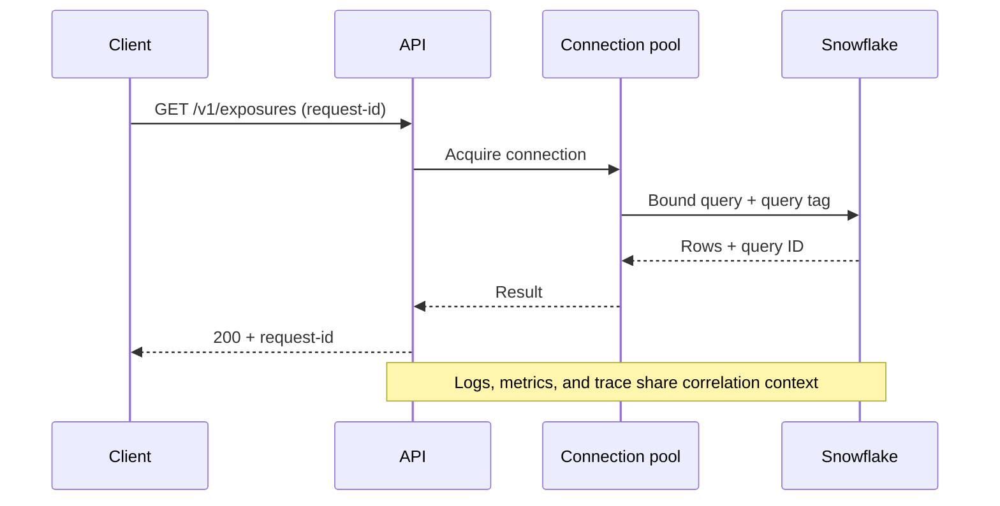

# Observability and Operations

> [!abstract] Learning target
> Trace one API request across the service and Snowflake, distinguish symptoms from causes, and define signals that operators can act on.

> **Curriculum priority:** Essential

## Executive Summary

- **What it is:** The logs, metrics, traces, identifiers, alerts, and runbooks used to understand an API's behavior in production.
- **Why it matters:** A `500` response is only a symptom. The cause may be bad input, an expired token, a connection-pool wait, a suspended warehouse, a slow query, or a downstream outage.
- **Mental model:** **Follow one request from edge to dependency using a correlation ID, then aggregate many requests into service-level signals.**
- **Best used when:** Operating any API with consumers, dependencies, cost, or availability expectations.
- **Avoid or reconsider when:** Telemetry records secrets or sensitive payloads, has no retention owner, or produces alerts nobody is expected to handle.

## What It Can Do

- Connect a client-visible failure to application, dependency, and Snowflake evidence.
- Measure traffic, errors, latency, saturation, retries, and downstream timings.
- Show whether an incident is isolated to one endpoint, tenant, version, or deployment.
- Support SLOs and alerts based on consumer impact rather than raw log volume.
- Link API requests to Snowflake query tags and query history.

## What It Cannot Do

- Explain business correctness unless domain validations and reconciliation signals exist.
- Recover a failed request or replay work automatically.
- Make unbounded high-cardinality labels affordable.
- Replace a runbook, an on-call owner, or a dependency support agreement.
- Safely record entire requests and responses by default.

## Core Concepts

| Concept | Plain-language meaning | Why it matters |
|---|---|---|
| Structured log | Event recorded as named fields rather than free text | Easier to search by request, endpoint, status, or dependency |
| Request or correlation ID | Identifier carried through one interaction | Connects client error, application log, and downstream work |
| Metric | Numeric measurement over time | Supports dashboards and alerts for rates, latency, and saturation |
| Trace | Timed path through components and dependencies | Shows where a distributed request waited or failed |
| SLI/SLO | Measured behavior and agreed objective | Defines acceptable availability or latency from the consumer view |
| Query tag | Snowflake session/query context recorded with queries | Attributes warehouse work to API endpoint, service, and deployment |
| Runbook | Tested diagnostic and recovery steps | Turns an alert into an owned operational response |

## How It Works (Simple Flow)

1. The edge accepts or creates a request ID and returns it to the caller.
2. The application logs one structured start/end record with endpoint, version, status, duration, and safe identity context.
3. Tracing records time spent in validation, application logic, queues, Snowflake, and other dependencies.
4. Snowflake queries receive query tags containing stable service and endpoint identifiers, not personal data.
5. Metrics aggregate request rate, error rate, latency percentiles, pool waits, query duration, and retry activity.
6. Alerts fire on sustained consumer impact or exhausted capacity and link to a runbook.
7. Operators correlate evidence, mitigate the incident, and improve controls after review.

## Visuals



## Readable Snippets

Use stable query tags that help operations without exposing customer data:

```sql
alter session set query_tag = '{
  "service":"positions-api",
  "endpoint":"GET /v1/positions",
  "release":"2026.08.1"
}';
```

Record the Snowflake query ID separately when available so an operator can inspect query history.

## Consultant Talking Points

- **Client question this answers:** "How will we tell whether the API or Snowflake caused the slowdown?"
- **Trade-offs to mention:** Rich telemetry accelerates diagnosis but costs storage and can create privacy risk or operational noise.
- **Risk or governance angle:** Treat logs and traces as governed data; redact secrets and sensitive identifiers and set access and retention rules.
- **Cost/performance angle:** Observe API latency and warehouse behavior together. Optimizing application code will not fix queueing or warehouse startup.

## Common Pitfalls

- Logging stack traces without request IDs, endpoint context, or downstream query identifiers.
- Alerting on every `500` instead of sustained error rate or SLO impact.
- Putting customer IDs, tokens, request bodies, or SQL literals into metric labels.
- Measuring average latency only and hiding slow tail behavior.
- Retrying downstream failures without measuring retry amplification.
- Creating dashboards without a named operator or recovery runbook.

## When to Recommend What (Decision Table)

| Situation | Recommend | Why | Watch-outs |
|---|---|---|---|
| Small internal API | Structured logs, request IDs, core request metrics, health checks | Minimum useful operating evidence | Keep the format stable and assign ownership |
| Several services and dependencies | Distributed traces plus common context propagation | Shows where time and failures accumulate | Sampling and sensitive attributes need governance |
| Snowflake-backed endpoint | Query tags, query IDs, warehouse/query dashboards | Links consumer experience to database work | Do not place personal data in tags |
| Regulated API | Controlled audit events separate from debug telemetry | Evidence and retention requirements differ | Define immutability, access, and reconciliation |
| No support team or SLO | Limit production exposure first | Telemetry cannot replace ownership | Agree service hours and escalation path |

## Related Topics

- [[05 APIs/04 Production Security and Data Stack Integration/Production Security and Data Stack Integration Overview|Production, Security, and Data Stack Integration Overview]]
- [[05 APIs/02 Consuming APIs for Data Pipelines/11 Rate Limits Timeouts Retries and Backoff|Rate Limits, Timeouts, Retries, and Backoff]]
- [[05 APIs/04 Production Security and Data Stack Integration/23 Performance and Cost Boundaries|Performance and Cost Boundaries]]
- [[01 Snowflake/06 Cost Management and Operations/45 Account Usage Views|Snowflake Account Usage Views]]
- [[02 dbt/05 Deployment CI CD and Operations/49 Observability with dbt and Snowflake Metadata|Observability with dbt and Snowflake Metadata]]

## Related Decision Notes

- [[80 Comparisons and Decision Notes/Decision Notes/Cross-Tool/Decisions - Serving Data from Snowflake Through an API|Serving Data from Snowflake Through an API]]

## Questions

- **Explain:** How do logs, metrics, and traces answer different operational questions?
- **Apply:** Which fields would you use to connect an API `500` to a Snowflake query without logging sensitive data?
- **Challenge:** Which apparently healthy metric could hide poor experience for a small but important client?

## Sources To Revisit

- [OpenTelemetry Docs: Signals](https://opentelemetry.io/docs/concepts/signals/)
- [Google SRE Workbook: Implementing SLOs](https://sre.google/workbook/implementing-slos/)
- [Snowflake Docs: QUERY_HISTORY](https://docs.snowflake.com/en/sql-reference/functions/query_history)
- [Snowflake Docs: QUERY_TAG](https://docs.snowflake.com/en/sql-reference/parameters#query-tag)
