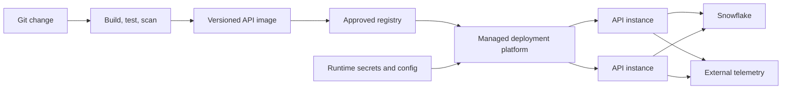

# Dockerizing and Deploying APIs

> [!abstract] Learning target
> Package an API as a replaceable container and explain the configuration, health, promotion, and platform responsibilities that remain outside the image.

> **Curriculum priority:** Essential

## Executive Summary

- **What it is:** Building the API and its pinned runtime into a container image, then deploying that immutable artifact with environment-specific configuration and credentials.
- **Why it matters:** The same tested FastAPI runtime can move from development through CI into a managed service without rebuilding it by hand.
- **Mental model:** **Image contains what runs; deployment supplies where it runs, what it may access, and how it stays healthy.**
- **Best used when:** The API has repeatable dependencies and will run on a container-capable platform such as a managed container service or Snowpark Container Services.
- **Avoid or reconsider when:** A simpler managed function fits the workload or no team owns images, runtime configuration, networking, scaling, and incident response.

## What It Can Do

- Pin Python, FastAPI, Snowflake connector, and operating-system dependencies.
- Run the same application image in local tests and deployment environments.
- Expose health and readiness endpoints for platform lifecycle decisions.
- Run as a non-root user with a small, reviewed dependency set.
- Promote a versioned image through an approved registry and CI pipeline.

## What It Cannot Do

- Store production credentials safely inside the image.
- Make local Docker Compose a production architecture.
- Configure identity, ingress, TLS, scaling, observability, or Snowflake privileges by itself.
- Guarantee environment parity when configuration, network, and downstream services differ.
- Preserve in-container state reliably across replacement or scaling.

## Core Concepts

| Concept | Plain-language meaning | Why it matters |
|---|---|---|
| Immutable image | Versioned package not edited after build | Makes promotion and rollback explainable |
| Application server | Process serving the Python application | Production process settings differ from development reload mode |
| Liveness | Whether the process should be restarted | Must not fail merely because a downstream dependency is briefly unavailable |
| Readiness | Whether the instance should receive traffic | Can reflect initialization and essential dependency availability |
| Runtime configuration | Environment-specific settings supplied at start | Keeps one image reusable without baking credentials or account names into it |
| Registry | Controlled store for versioned images | Supports provenance, access control, scanning, and promotion |
| Horizontal scaling | Run several stateless application instances | Requires shared external state and bounded Snowflake concurrency |

## How It Works (Simple Flow)

1. CI builds an image from pinned source and dependencies.
2. Automated tests and security checks run against that image.
3. The image receives an immutable version or digest and is pushed to an approved registry.
4. The deployment platform starts it as a non-root process with configuration and secrets injected at runtime.
5. Readiness succeeds only after the application can safely receive traffic; liveness detects a stuck process.
6. Logs, metrics, traces, and exit status leave the container for durable storage.
7. The exact artifact is promoted or rolled back while environment-specific identity and network policy remain external.

## Visuals



## Readable Snippets

```dockerfile
FROM python:3.12-slim

WORKDIR /app
COPY requirements.txt .
RUN pip install --no-cache-dir -r requirements.txt
COPY app ./app

RUN useradd --system apiuser
USER apiuser

CMD ["fastapi", "run", "app/main.py", "--port", "8000"]
```

This is a recognition example, not a complete production image. Pin the base image and packages, add build checks, and configure health behavior in the target platform.

## Consultant Talking Points

- **Client question this answers:** "If the API works in Docker, is it ready for production?"
- **Trade-offs to mention:** Containers improve runtime repeatability but introduce image, registry, platform, scaling, and security ownership.
- **Risk or governance angle:** Review base-image provenance, packages, non-root execution, secrets, ingress, egress, and deployment permissions.
- **Cost/performance angle:** Minimum instances reduce cold starts but cost money while idle; scaling instances can multiply Snowflake connections and queries.

## Common Pitfalls

- Baking a private key, OAuth secret, account identifier, or production configuration into the image.
- Running development reload mode or an unsuitable process configuration in production.
- Making liveness depend on Snowflake and causing restart storms during a downstream incident.
- Writing important files inside the container filesystem and losing them on replacement.
- Scaling the API without bounding database connections and query concurrency.
- Deploying mutable `latest` tags without a traceable artifact or rollback target.

## When to Recommend What (Decision Table)

| Situation | Recommend | Why | Watch-outs |
|---|---|---|---|
| Local learning and integration tests | Docker plus Compose where useful | Repeatable runtime and supporting services | Compose alone is not production readiness |
| Stateless API with normal platform needs | Managed container service | Offloads much infrastructure operation | Identity, networking, scaling, and observability still need design |
| Very small event-triggered endpoint | Managed function/serverless runtime | Lower operational footprint | Runtime limits, cold starts, and connector behavior |
| Service must remain close to Snowflake governance | Evaluate Snowpark Container Services | Snowflake-native container and endpoint surface | Snowflake-specific skills, compute pools, service roles, and limits |
| Stateful low-latency application | Dedicated application platform and operational store | Better state and transaction fit | Keep analytical publication into Snowflake separate |

## Related Topics

- [[05 APIs/04 Production Security and Data Stack Integration/Production Security and Data Stack Integration Overview|Production, Security, and Data Stack Integration Overview]]
- [[05 APIs/03 Designing and Building APIs/15 Building a First API with FastAPI|Building a First API with FastAPI]]
- [[05 APIs/04 Production Security and Data Stack Integration/24 Snowflake API and Integration Surfaces|Snowflake API and Integration Surfaces]]
- [[04 Docker/03 Data Stack Integration Patterns/11 Containerizing Python Data Jobs|Containerizing Python Data Jobs]]
- [[04 Docker/04 Security Operations and Team Standards/17 CI Build Test Publish and Promotion|Docker CI Build, Test, Publish, and Promotion]]

## Related Decision Notes

- [[80 Comparisons and Decision Notes/Decision Notes/Cross-Tool/Decisions - Serving Data from Snowflake Through an API|Serving Data from Snowflake Through an API]]

## Questions

- **Explain:** Which API concerns belong inside the image, and which belong to the deployment environment?
- **Apply:** How would you make a Snowflake-backed FastAPI image safe to promote from test to production?
- **Challenge:** Why can adding more API instances make Snowflake latency or cost worse?

## Sources To Revisit

- [FastAPI Docs: FastAPI in Containers](https://fastapi.tiangolo.com/deployment/docker/)
- [Docker Docs: Build best practices](https://docs.docker.com/build/building/best-practices/)
- [Docker Docs: Building best practices for secrets](https://docs.docker.com/build/building/secrets/)
- [Snowflake Docs: Snowpark Container Services Overview](https://docs.snowflake.com/en/developer-guide/snowpark-container-services/overview)
