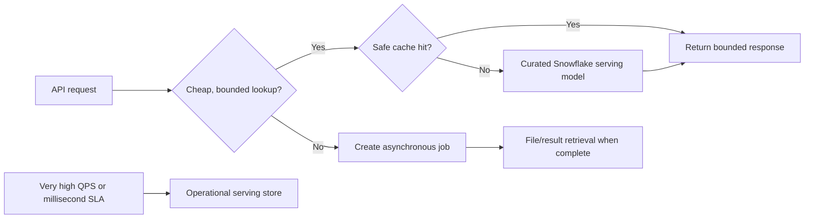

# Performance and Cost Boundaries

> [!abstract] Learning target
> Design API latency, concurrency, result size, and caching around Snowflake's analytical strengths instead of treating the warehouse as a per-request operational database.

> **Curriculum priority:** Essential

## Executive Summary

- **What it is:** The controls and architecture choices that keep response times predictable and prevent request volume from multiplying compute cost.
- **Why it matters:** A valid endpoint can still be a poor service if each call starts a warehouse, scans a large table, returns thousands of rows, or triggers the same query repeatedly.
- **Mental model:** **Every request consumes a latency and cost budget across the API, connection wait, Snowflake queue, query, serialization, and network.**
- **Best used when:** Serving Snowflake data to interactive clients or operating an API with variable query shapes and traffic.
- **Avoid or reconsider when:** The requirement is millisecond point access, very high write volume, or unbounded ad hoc querying better handled by another serving store or product.

## What It Can Do

- Bound result sizes, concurrency, execution time, and client request complexity.
- Precompute stable business logic into curated dbt models or Snowflake tables.
- Cache safe, reused results for a controlled period.
- Isolate API workloads with a dedicated warehouse and query tagging.
- Move slow work behind asynchronous job boundaries.

## What It Cannot Do

- Promise operational-database latency for arbitrary analytical queries.
- Make stale cached results acceptable without a freshness contract.
- Prevent cost growth if consumers can request unbounded dimensions, filters, or time ranges.
- Fix a poor data model solely by adding application instances.
- Make query-result caching a guaranteed application cache under every query and data-change pattern.

## Core Concepts

| Concept | Plain-language meaning | Why it matters |
|---|---|---|
| Latency budget | Maximum acceptable time divided among processing stages | Makes trade-offs and timeouts explicit |
| Concurrency | Requests or queries active at the same time | API scaling can shift the bottleneck into Snowflake |
| Backpressure | Slow or reject work when capacity is exhausted | Prevents overload from turning into total failure |
| Pagination and limit | Bound rows returned per request | Protects memory, network, serialization, and query cost |
| Cache | Reuse a result for a defined key and period | Reduces repeat work but introduces freshness and access concerns |
| Precomputation | Prepare a serving-shaped table before requests arrive | Moves expensive logic into governed batch or incremental pipelines |
| Serving store | Database or cache optimized for operational access | Useful when Snowflake is not the right latency or concurrency engine |

## How It Works (Simple Flow)

1. Define consumer latency, freshness, result-size, and availability expectations.
2. Restrict the API to known filters, columns, page sizes, and time ranges.
3. Materialize expensive transformations before serving rather than rebuilding them per request.
4. Reuse bounded connections and isolate queries on an attributed warehouse.
5. Apply application concurrency limits, Snowflake statement timeouts, and backpressure.
6. Cache only when the key includes authorization context and the freshness policy is explicit.
7. Measure tail latency and cost per endpoint; move unsuitable workloads to asynchronous delivery or another store.

## Visuals



## Readable Snippets

Bound both the API page and the Snowflake statement:

```sql
alter session set statement_timeout_in_seconds = 20;

select trade_id, book_id, as_of_date, exposure_amount
from serving.trade_exposure
where book_id = ? and as_of_date = ?
order by trade_id
limit ?;
```

The API should enforce a maximum `limit`; a bound parameter does not make an unlimited result cheap.

## Consultant Talking Points

- **Client question this answers:** "Can we simply put an API in front of our Snowflake views?"
- **Trade-offs to mention:** Direct warehouse access simplifies freshness and governance, while precomputation, caching, or a serving store improves latency at the cost of more state and ownership.
- **Risk or governance angle:** Cache keys must include tenant and authorization context, and cached sensitive data needs the same protection as the source.
- **Cost/performance angle:** Model API cost as requests multiplied by cache misses, query work, warehouse uptime, data transfer, and container capacity.

## Common Pitfalls

- Exposing arbitrary SQL-like filters and allowing consumers to determine query cost.
- Returning huge JSON arrays instead of paginating or delivering a file asynchronously.
- Letting every API instance create excessive Snowflake connections.
- Caching a response without tenant or permission context and leaking it across callers.
- Upsizing a warehouse before measuring query shape, queueing, startup, and cache behavior.
- Advertising a latency SLA without testing cold warehouse and tail-latency behavior.

## When to Recommend What (Decision Table)

| Situation | Recommend | Why | Watch-outs |
|---|---|---|---|
| Low-volume internal analytical lookup | Direct curated Snowflake query | Simple and governed | Bound query shape and account for warehouse startup |
| Repeated identical reads with acceptable staleness | Application cache | Reduces repeated warehouse work | Authorization-aware keys and invalidation policy |
| Expensive stable transformation | dbt/Snowflake precomputed serving table | Predictable request-time query | Refresh and data-quality ownership |
| Long-running export | Async job plus file/result retrieval | Avoids holding an HTTP connection | Job state, authorization, expiry, and cleanup |
| Millisecond, high-QPS point reads | Operational serving store fed from governed pipeline | Fits the access pattern | Additional platform, synchronization, and controls |

## Related Topics

- [[05 APIs/04 Production Security and Data Stack Integration/Production Security and Data Stack Integration Overview|Production, Security, and Data Stack Integration Overview]]
- [[05 APIs/03 Designing and Building APIs/19 Async Work and Long-running Requests|Async Work and Long-running Requests]]
- [[05 APIs/04 Production Security and Data Stack Integration/21 Observability and Operations|Observability and Operations]]
- [[01 Snowflake/02 Performance and Optimization/06 Query Profile|Snowflake Query Profile]]
- [[01 Snowflake/06 Cost Management and Operations/46 Warehouse Scheduling and Auto-suspend|Warehouse Scheduling and Auto-suspend]]

## Related Decision Notes

- [[80 Comparisons and Decision Notes/Decision Notes/Cross-Tool/Decisions - Serving Data from Snowflake Through an API|Serving Data from Snowflake Through an API]]

## Questions

- **Explain:** Why does adding an API in front of Snowflake not turn it into an operational database?
- **Apply:** How would you serve daily positions to 20 internal consumers with predictable cost?
- **Challenge:** At what latency, concurrency, freshness, or write requirement would you introduce another serving store?

## Sources To Revisit

- [Snowflake Docs: Warehouses Overview](https://docs.snowflake.com/en/user-guide/warehouses-overview)
- [Snowflake Docs: Persisted Query Results](https://docs.snowflake.com/en/user-guide/querying-persisted-results)
- [Snowflake Docs: STATEMENT_TIMEOUT_IN_SECONDS](https://docs.snowflake.com/en/sql-reference/parameters#statement-timeout-in-seconds)
- [Snowflake Docs: Performance Optimization](https://docs.snowflake.com/en/user-guide/performance-query-options)
