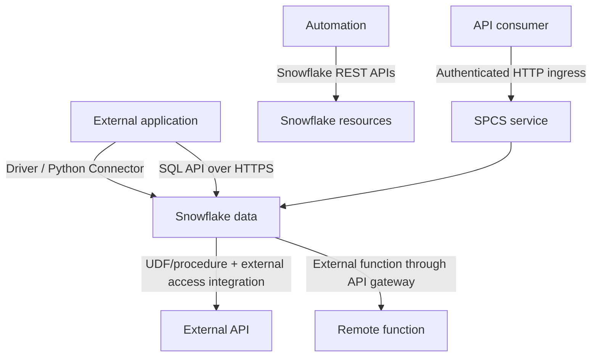

# Snowflake API and Integration Surfaces

> [!abstract] Learning target
> Distinguish connecting to Snowflake, managing Snowflake, calling external services from Snowflake, and hosting an API near Snowflake data.

> **Curriculum priority:** Essential

## Executive Summary

- **What it is:** A map of Snowflake's different programmatic integration surfaces rather than one single "Snowflake API."
- **Why it matters:** The SQL API, resource REST APIs, language connectors, external access integrations, external functions, and Snowpark Container Services solve different direction and runtime problems.
- **Mental model:** Ask **who initiates the call, where code runs, whether the goal is data or control, and who operates the runtime.**
- **Best used when:** Designing applications, automation, outbound enrichment, custom functions, or APIs backed by Snowflake.
- **Avoid or reconsider when:** A standard connector, managed ingestion product, file transfer, data share, or ordinary external application is simpler.

## What It Can Do

- Execute SQL through a language connector/driver or the HTTP-based SQL API.
- Manage supported Snowflake resources through developer REST APIs.
- Let approved UDF or procedure handlers call allowlisted external services through external access integrations.
- Invoke externally hosted code from SQL through external functions and a cloud HTTPS proxy.
- Run containerized services in Snowpark Container Services and expose authenticated HTTP endpoints.

## What It Cannot Do

- Provide one API surface with complete coverage of every Snowflake operation.
- Remove the need to choose roles, warehouses, network paths, secrets, retries, and cost attribution.
- Make an external HTTP call row-by-row without latency, batching, availability, and data-egress consequences.
- Turn Snowpark Container Services into the default home for every enterprise API.
- Guarantee that all features and networking patterns are available in every region or edition.

## Core Concepts

| Surface | Direction and purpose | Recognition rule |
|---|---|---|
| Python Connector / driver | Application calls Snowflake using a language-native database interface | First choice for many Python services and jobs |
| SQL API | Application submits SQL over HTTPS, checks status, and retrieves results | Useful when a REST boundary is preferable to a driver |
| Snowflake REST APIs | Automation manages supported Snowflake resources | Control-plane resource operations; coverage varies by resource |
| External access integration | UDF/procedure/SPCS code calls allowlisted external endpoints with approved secrets | Governed outbound network access from Snowflake runtime |
| External function | SQL invokes remotely hosted code through a cloud HTTPS proxy | External runtime appears as a SQL function |
| SPCS service endpoint | Containerized service runs in Snowflake and accepts HTTP ingress | API runtime near Snowflake data with Snowflake service operations |

## How It Works (Simple Flow)

1. State the goal: query data, manage a resource, call an outside service, or host a service.
2. Identify where the initiating code and execution runtime live.
3. Choose a connector/driver, SQL API, REST resource API, external access integration, external function, or SPCS service.
4. Design service identity, Snowflake role, secrets, allowed network path, and endpoint permissions.
5. Handle asynchronous execution, pagination/partitions, retries, timeouts, and idempotency where the chosen surface requires them.
6. Attribute warehouse, compute-pool, serverless, external-service, and network cost.
7. Monitor query history, access history, external access history, service events, and client telemetry.

## Visuals



## Readable Snippets

Recognition shape for the SQL API:

```http
POST /api/v2/statements?async=true HTTP/1.1
Authorization: Bearer <short-lived-token>
Content-Type: application/json

{
  "statement": "select trade_id from serving.trades where book_id = ? limit ?",
  "bindings": {
    "1": {"type": "TEXT", "value": "RATES"},
    "2": {"type": "FIXED", "value": "100"}
  },
  "warehouse": "API_WH",
  "role": "API_READER"
}
```

Long-running requests can return a statement handle that the client checks later. Treat HTTP status and SQL execution status as separate layers.

## Consultant Talking Points

- **Client question this answers:** "Which Snowflake API should our application use?"
- **Trade-offs to mention:** A language connector offers familiar database semantics; the SQL API offers an HTTP boundary; SPCS offers proximity but adds Snowflake container operations.
- **Risk or governance angle:** Direction matters: inbound application access and outbound data egress require different trust, network, and secret controls.
- **Cost/performance angle:** SQL API queries still consume Snowflake compute, while SPCS uses compute pools and external calls may add vendor and network cost.

## Common Pitfalls

- Calling every Snowflake programmatic surface "the REST API" and choosing the wrong one.
- Treating a successful HTTP submission as proof that asynchronous SQL completed successfully.
- Resubmitting non-idempotent SQL after a timeout without a stable request ID or reconciliation.
- Using external access without narrow network rules, approved secrets, and egress monitoring.
- Choosing SPCS solely because the data is in Snowflake without assessing platform skills, latency, and portability.
- Assuming developer REST APIs cover every equivalent SQL operation.

## When to Recommend What (Decision Table)

| Situation | Recommend | Why | Watch-outs |
|---|---|---|---|
| Python service queries Snowflake | Python Connector first | Mature native database interface | Connection reuse, blocking calls, role and warehouse design |
| Platform-neutral client needs HTTPS SQL execution | SQL API | No language-specific database driver required | Async status, result partitions, tokens, retries |
| Automation creates warehouses, roles, or supported resources | Snowflake REST API or Terraform | Resource-oriented control plane | Confirm current API/provider coverage |
| Stored procedure or UDF calls approved SaaS API | External access integration | Governed endpoint and secret allowlist | External availability, batching, egress, and cost |
| SQL must invoke remote code behind cloud gateway | External function | Presents remote operation as a function | Proxy, payload format, latency, and remote operations |
| Governed container API should run near Snowflake | Evaluate SPCS service | Snowflake-hosted container and authenticated ingress | Compute pool, service roles, region support, operations |

## Related Topics

- [[05 APIs/04 Production Security and Data Stack Integration/Production Security and Data Stack Integration Overview|Production, Security, and Data Stack Integration Overview]]
- [[05 APIs/03 Designing and Building APIs/16 Connecting an API to Snowflake|Connecting an API to Snowflake]]
- [[05 APIs/04 Production Security and Data Stack Integration/25 Consultant API Decision Framework|Consultant API Decision Framework]]
- [[01 Snowflake/08 Enterprise Snowflake in Production/57 Platform Extensions and Operational Workloads|Platform Extensions and Operational Workloads]]
- [[03 Fivetran/05 Security Governance and Production Operations/28 REST API Terraform and Configuration Automation|Fivetran REST API, Terraform, and Configuration Automation]]

## Related Decision Notes

- [[80 Comparisons and Decision Notes/Comparisons/Cross-Tool/Comparison - Snowflake Python Connector vs SQL API|Snowflake Python Connector vs SQL API]]
- [[80 Comparisons and Decision Notes/Decision Notes/Cross-Tool/Decisions - Serving Data from Snowflake Through an API|Serving Data from Snowflake Through an API]]

## Questions

- **Explain:** How do the SQL API and Snowflake REST APIs differ?
- **Apply:** Which surface would you use for a Python service, Terraform-style provisioning, and a UDF calling an external scoring API?
- **Challenge:** When would hosting an API in SPCS create more operational coupling than value?

## Sources To Revisit

- [Snowflake Docs: API Reference](https://docs.snowflake.com/en/api-reference)
- [Snowflake Docs: Snowflake SQL API](https://docs.snowflake.com/en/developer-guide/sql-api/index)
- [Snowflake Docs: Snowflake REST APIs Reference](https://docs.snowflake.com/en/developer-guide/snowflake-rest-api/reference)
- [Snowflake Docs: External Network Access Overview](https://docs.snowflake.com/en/developer-guide/external-network-access/external-network-access-overview)
- [Snowflake Docs: Working with Snowpark Container Services Services](https://docs.snowflake.com/en/developer-guide/snowpark-container-services/working-with-services)
