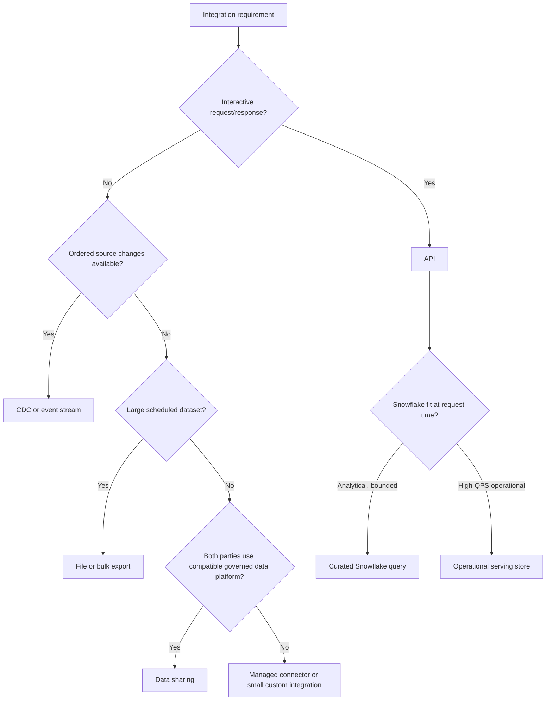

# Consultant API Decision Framework

> [!abstract] Learning target
> Decide whether a client problem needs an API at all, then recommend the smallest integration pattern with defensible correctness, security, ownership, and cost.

> **Curriculum priority:** Essential

## Executive Summary

- **What it is:** A structured way to compare APIs with files, CDC, events, data sharing, direct database access, and managed connectors.
- **Why it matters:** "Build an API" is often a proposed solution before freshness, volume, direction, failure recovery, and consumer behavior are understood.
- **Mental model:** **Start with the interaction contract, not the technology label.**
- **Best used when:** Framing ingestion, data-product delivery, partner integration, automation, or operational access for a client.
- **Avoid or reconsider when:** The decision is driven mainly by tool preference, platform fashion, or an assumption that APIs are always real time.

## What It Can Do

- Separate control-plane actions from business-data movement.
- Compare request/response, scheduled batch, event, CDC, and shared-data patterns.
- Expose hidden ownership for retries, schema change, replay, reconciliation, security, and support.
- Frame build-versus-buy using lifecycle cost rather than initial implementation effort.
- Identify when Snowflake is the analytical source but not the best request-time serving engine.

## What It Cannot Do

- Replace source-specific proof of data coverage, quotas, history, or delete behavior.
- Guarantee vendor connector quality or future API stability.
- Produce a latency or availability commitment without workload measurements.
- Resolve unclear data ownership, legal basis, or consumer entitlement.
- Make a custom integration free after the first successful run.

## Core Concepts

| Decision dimension | Question | Why it matters |
|---|---|---|
| Direction | Who calls whom, and where does data move? | Clarifies trust and network boundaries |
| Interaction | Request/response, event, stream, or scheduled transfer? | Determines coupling and failure behavior |
| Data shape | Small objects, large extracts, ordered changes, or shared tables? | Different transports fit different volumes |
| Freshness | Seconds, minutes, hours, or on demand? | "API" alone does not imply real time |
| Recovery | Can work be replayed after outage or expired history? | Determines checkpoint and retention needs |
| Contract | Who owns fields, compatibility, deprecation, and quality? | Prevents silent consumer breakage |
| Operating model | Who supports credentials, quotas, drift, incidents, and cost? | The decisive difference between demo and service |

## How It Works (Simple Flow)

1. Define the business outcome, consumers, direction, sensitivity, and required freshness.
2. Estimate volume, request pattern, history, deletes, schema change, and replay needs.
3. Check existing managed connectors, data sharing, file, CDC, event, and platform capabilities.
4. Compare options on correctness, latency, coupling, security, operability, portability, and total cost.
5. Choose the simplest pattern that meets requirements and assign source, transport, Snowflake, transformation, and consumer ownership.
6. Pilot the highest-risk behavior: quotas, incremental state, authorization, tail latency, recovery, and reconciliation.
7. Document exit conditions and review the pattern as consumers or volume change.

## Visuals



## Readable Snippets

A short discovery checklist is more useful than starting with framework code:

```text
Consumer and business action:
Direction and interaction pattern:
Freshness, volume, and peak concurrency:
History, deletes, and replay window:
Authentication and authorization owner:
Schema and compatibility owner:
Recovery and reconciliation evidence:
Expected platform and vendor cost:
```

## Consultant Talking Points

- **Client question this answers:** "Should we build an API for this integration?"
- **Trade-offs to mention:** APIs offer targeted interactive contracts but introduce consumer coupling, compatibility, quotas, availability, and service operations.
- **Risk or governance angle:** Confirm data entitlement, purpose, minimization, retention, audit, third-party risk, and credential lifecycle before exposing data.
- **Cost/performance angle:** Compare managed fees and platform consumption with years of custom maintenance, source changes, on-call, recovery, and consumer support.

## Common Pitfalls

- Assuming an API is real time while the underlying data refreshes once a day.
- Building a custom extractor before checking Fivetran or another supported managed connector.
- Moving large historical datasets through chatty paginated calls when a bulk export exists.
- Exposing Snowflake views directly without a stable consumer contract and workload controls.
- Ignoring deletes, replay, reconciliation, quotas, or schema deprecation during a happy-path pilot.
- Assigning build ownership but no production support or cost owner.

## When to Recommend What (Decision Table)

| Situation | Recommend | Why | Watch-outs |
|---|---|---|---|
| Standard SaaS source with mature managed connector | Fivetran or equivalent managed connector | Transfers API-change and recovery work to a supported product | Coverage, MAR, history, schema, security, and vendor fit |
| Database source needs ordered low-latency changes | CDC | Efficient change stream with transaction ordering | Log retention, source impact, deletes, and recovery |
| Large periodic snapshot or export | File/bulk delivery | Efficient, replayable transfer | Manifest, encryption, completeness, duplicate loads |
| Consumer needs small interactive business objects | API | Clear request/response contract | Auth, latency, rate limits, compatibility, operations |
| Snowflake-to-Snowflake governed analytics | Secure data sharing | Avoids copying and custom transport | Consumer platform fit and object-change governance |
| Unsupported source with stable API and strategic value | Custom extractor | Meets a real gap | Long-term ownership, tests, replay, and source change |
| Very high-QPS application reads | Operational serving store fed from Snowflake/data pipeline | Matches latency and concurrency requirements | Additional synchronization and platform ownership |

## Related Topics

- [[05 APIs/04 Production Security and Data Stack Integration/Production Security and Data Stack Integration Overview|Production, Security, and Data Stack Integration Overview]]
- [[05 APIs/02 Consuming APIs for Data Pipelines/13 API Ingestion Correctness|API Ingestion Correctness]]
- [[05 APIs/04 Production Security and Data Stack Integration/24 Snowflake API and Integration Surfaces|Snowflake API and Integration Surfaces]]
- [[03 Fivetran/01 Foundations and Platform Mental Model/05 When to Recommend Fivetran|When to Recommend Fivetran]]
- [[01 Snowflake/04 Data Engineering/20 Streams and Tasks|Snowflake Streams and Tasks]]

## Related Decision Notes

- [[80 Comparisons and Decision Notes/Comparisons/Cross-Tool/Comparison - API vs File vs CDC|API vs File vs CDC]]
- [[80 Comparisons and Decision Notes/Decision Notes/Cross-Tool/Decisions - Build vs Buy API Ingestion|Build vs Buy API Ingestion]]
- [[80 Comparisons and Decision Notes/Decision Notes/Cross-Tool/Decisions - Serving Data from Snowflake Through an API|Serving Data from Snowflake Through an API]]

## Questions

- **Explain:** Which requirement makes an API materially better than a file or CDC feed?
- **Apply:** How would you choose between Fivetran and custom Python for a paginated SaaS source?
- **Challenge:** Which requirement would make Snowflake the source of truth but not the correct request-time serving store?

## Sources To Revisit

- [Fivetran Docs: Core Concepts](https://fivetran.com/docs/core-concepts)
- [Snowflake Docs: Introduction to Secure Data Sharing](https://docs.snowflake.com/en/user-guide/data-sharing-intro)
- [Snowflake Docs: Snowpipe Streaming](https://docs.snowflake.com/en/user-guide/data-load-snowpipe-streaming-overview)
- [OWASP: API Security Top 10](https://owasp.org/www-project-api-security/)
