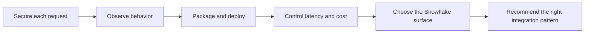

# Production, Security, and Data Stack Integration Overview

> [!abstract] Chapter outcome
> Evaluate whether an API is secure, operable, affordable, and correctly placed in a Snowflake-centered data platform.

## Topics

- [[05 APIs/04 Production Security and Data Stack Integration/20 API Security and Authorization|20 - API Security and Authorization]]
- [[05 APIs/04 Production Security and Data Stack Integration/21 Observability and Operations|21 - Observability and Operations]]
- [[05 APIs/04 Production Security and Data Stack Integration/22 Dockerizing and Deploying APIs|22 - Dockerizing and Deploying APIs]]
- [[05 APIs/04 Production Security and Data Stack Integration/23 Performance and Cost Boundaries|23 - Performance and Cost Boundaries]]
- [[05 APIs/04 Production Security and Data Stack Integration/24 Snowflake API and Integration Surfaces|24 - Snowflake API and Integration Surfaces]]
- [[05 APIs/04 Production Security and Data Stack Integration/25 Consultant API Decision Framework|25 - Consultant API Decision Framework]]

## Chapter Map

## How To Use This Area

Use this chapter after you can consume and build a small API. The emphasis shifts from making an endpoint work to deciding whether a client should trust and operate it.

## Related Areas

- [[05 APIs/API Learning Map|API Learning Map]]
- [[05 APIs/03 Designing and Building APIs/Designing and Building APIs Overview|Previous: Designing and Building APIs]]
- [[01 Snowflake/08 Enterprise Snowflake in Production/Enterprise Snowflake in Production Overview|Enterprise Snowflake in Production]]
- [[04 Docker/04 Security Operations and Team Standards/Security Operations and Team Standards Overview|Docker Security, Operations, and Team Standards]]
