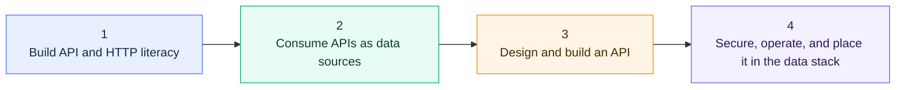

# API Learning Map

> [!abstract] Learning outcome
> Speak confidently about API architecture, build reliable API ingestion into Snowflake, and design a small production-shaped API that serves governed Snowflake data.

This curriculum assumes strong data-engineering experience but no prior API background. It teaches the vocabulary first, then consuming, building, and production judgment. The graph follows the existing vault pattern:

`API Learning Map -> chapter overview -> individual topic notes`

## Learning Path

## Suggested Path

1. **Conversation-ready:** Learn the request/response model, REST vocabulary, JSON, OpenAPI, authentication, rate limits, and main Snowflake API surfaces.
2. **Consumer-ready:** Build an incremental Python extractor with pagination, retries, checkpointing, and Snowflake raw landing.
3. **Builder-ready:** Build a typed FastAPI service over a curated Snowflake model with clear contracts and tests.
4. **Production-ready judgment:** Add authorization, telemetry, deployment, capacity controls, and an explicit operating model.

## Chapter Hubs

- [[05 APIs/01 Foundations and API Literacy/Foundations and API Literacy Overview|01 - Foundations and API Literacy]]
- [[05 APIs/02 Consuming APIs for Data Pipelines/Consuming APIs for Data Pipelines Overview|02 - Consuming APIs for Data Pipelines]]
- [[05 APIs/03 Designing and Building APIs/Designing and Building APIs Overview|03 - Designing and Building APIs]]
- [[05 APIs/04 Production Security and Data Stack Integration/Production Security and Data Stack Integration Overview|04 - Production, Security, and Data Stack Integration]]

## 01 Foundations and API Literacy

| Topic | Priority | Why it matters |
|---|---|---|
| [[05 APIs/01 Foundations and API Literacy/01 What APIs Are and Where They Fit|01 - What APIs Are and Where They Fit]] | Essential | Establishes APIs as software contracts and separates data-plane, control-plane, consumer, and producer concerns. |
| [[05 APIs/01 Foundations and API Literacy/02 HTTP Request and Response Anatomy|02 - HTTP Request and Response Anatomy]] | Essential | Makes methods, URLs, headers, bodies, status codes, and TLS readable in conversation and tooling. |
| [[05 APIs/01 Foundations and API Literacy/03 REST Resources Methods and Semantics|03 - REST Resources, Methods, and Semantics]] | Essential | Explains resource-oriented design, safety, idempotency, and common HTTP method expectations. |
| [[05 APIs/01 Foundations and API Literacy/04 JSON Serialization and Data Types|04 - JSON, Serialization, and Data Types]] | Essential | Connects nested API payloads and ambiguous types to relational landing and schema decisions. |
| [[05 APIs/01 Foundations and API Literacy/05 API Contracts OpenAPI and Documentation|05 - API Contracts, OpenAPI, and Documentation]] | Essential | Shows how producers and consumers agree on paths, schemas, errors, and compatibility. |
| [[05 APIs/01 Foundations and API Literacy/06 API Styles at Recognition Depth|06 - API Styles at Recognition Depth]] | Working depth | Gives enough context to recognize REST, RPC, SOAP, GraphQL, gRPC, webhooks, and streaming without deep-diving. |

## 02 Consuming APIs for Data Pipelines

| Topic | Priority | Why it matters |
|---|---|---|
| [[05 APIs/02 Consuming APIs for Data Pipelines/07 Exploring APIs with curl and an API Client|07 - Exploring APIs with curl and an API Client]] | Essential | Builds the fastest diagnostic habit: reproduce and inspect one complete request and response. |
| [[05 APIs/02 Consuming APIs for Data Pipelines/08 Calling APIs from Python|08 - Calling APIs from Python]] | Essential | Separates HTTP transport, parsing, configuration, and pipeline logic in a maintainable client. |
| [[05 APIs/02 Consuming APIs for Data Pipelines/09 Authentication and Service Identity|09 - Authentication and Service Identity]] | Essential | Covers API keys, bearer tokens, OAuth, JWTs, workload identity, expiry, and secret boundaries. |
| [[05 APIs/02 Consuming APIs for Data Pipelines/10 Pagination Filtering and Incremental Extraction|10 - Pagination, Filtering, and Incremental Extraction]] | Essential | Translates pages, cursors, filters, and watermarks into complete and restartable extraction. |
| [[05 APIs/02 Consuming APIs for Data Pipelines/11 Rate Limits Timeouts Retries and Backoff|11 - Rate Limits, Timeouts, Retries, and Backoff]] | Essential | Prevents transient failures and quotas from becoming duplicates, outages, or retry storms. |
| [[05 APIs/02 Consuming APIs for Data Pipelines/12 Polling Webhooks Async Jobs and Bulk Exports|12 - Polling, Webhooks, Async Jobs, and Bulk Exports]] | Essential | Matches delivery mechanics to freshness, volume, coupling, and recovery requirements. |
| [[05 APIs/02 Consuming APIs for Data Pipelines/13 API Ingestion Correctness|13 - API Ingestion Correctness]] | Essential | Brings checkpoints, deduplication, deletes, schema drift, replay, and reconciliation into one ingestion model. |

## 03 Designing and Building APIs

| Topic | Priority | Why it matters |
|---|---|---|
| [[05 APIs/03 Designing and Building APIs/14 Resource and Endpoint Design|14 - Resource and Endpoint Design]] | Essential | Turns business capabilities into stable resources, operations, parameters, and bounded responses. |
| [[05 APIs/03 Designing and Building APIs/15 Building a First API with FastAPI|15 - Building a First API with FastAPI]] | Essential | Creates typed endpoints, validation, and generated documentation using a compact Python stack. |
| [[05 APIs/03 Designing and Building APIs/16 Connecting an API to Snowflake|16 - Connecting an API to Snowflake]] | Essential | Connects API behavior to Snowflake roles, warehouses, parameter binding, connections, latency, and cost. |
| [[05 APIs/03 Designing and Building APIs/17 Errors Versioning and Compatibility|17 - Errors, Versioning, and Compatibility]] | Essential | Makes failure behavior predictable and protects consumers from unmanaged breaking changes. |
| [[05 APIs/03 Designing and Building APIs/18 Testing APIs|18 - Testing APIs]] | Essential | Covers logic, contract, dependency, authorization, integration, and negative-path evidence. |
| [[05 APIs/03 Designing and Building APIs/19 Async Work and Long-running Requests|19 - Async Work and Long-running Requests]] | Essential | Prevents long Snowflake work from being forced into one fragile synchronous HTTP request. |

## 04 Production, Security, and Data Stack Integration

| Topic | Priority | Why it matters |
|---|---|---|
| [[05 APIs/04 Production Security and Data Stack Integration/20 API Security and Authorization|20 - API Security and Authorization]] | Essential | Separates identity from endpoint-, object-, row-, and field-level permission. |
| [[05 APIs/04 Production Security and Data Stack Integration/21 Observability and Operations|21 - Observability and Operations]] | Essential | Connects request IDs, logs, metrics, traces, query tags, SLOs, and runbooks. |
| [[05 APIs/04 Production Security and Data Stack Integration/22 Dockerizing and Deploying APIs|22 - Dockerizing and Deploying APIs]] | Essential | Packages a repeatable runtime while preserving deployment, identity, network, and platform boundaries. |
| [[05 APIs/04 Production Security and Data Stack Integration/23 Performance and Cost Boundaries|23 - Performance and Cost Boundaries]] | Essential | Prevents interactive traffic from becoming unbounded latency, concurrency, and Snowflake cost. |
| [[05 APIs/04 Production Security and Data Stack Integration/24 Snowflake API and Integration Surfaces|24 - Snowflake API and Integration Surfaces]] | Essential | Distinguishes drivers, SQL API, REST resource APIs, external access, external functions, and SPCS. |
| [[05 APIs/04 Production Security and Data Stack Integration/25 Consultant API Decision Framework|25 - Consultant API Decision Framework]] | Essential | Compares API, file, CDC, events, data sharing, managed connectors, and operational serving stores. |

## Fast Conversation Pass

If a client conversation is imminent, start with topics **01, 02, 03, 05, 06, 09, 10, 11, 12, 17, 20, 23, 24, and 25**. That gives you the language and principal trade-offs before you build anything.

## Hands-on Milestones

1. Call a public API with `curl` and explain the method, URL, parameters, headers, body, status, and response.
2. Use Python to retrieve paginated JSON and preserve raw payload plus request metadata.
3. Build a restartable incremental extractor with authentication, timeouts, backoff, checkpointing, deduplication, and reconciliation into a Snowflake development area.
4. Build `/health` and `/v1/exposures` in FastAPI with typed models, bounded pagination, stable errors, and generated OpenAPI documentation.
5. Connect the API to a curated Snowflake model through a least-privilege service identity, bound queries, query tags, and a dedicated workload strategy.
6. Add authorization tests, structured telemetry, a Docker image, CI checks, capacity limits, and a recovery runbook.
7. Present the capstone as a consultant recommendation, including when not to use Snowflake at request time.

## Capstone

Build a small read-only **finance exposure API** over a curated Snowflake mart:

- `GET /v1/books/{book_id}/exposures?as_of_date=...`
- object-level authorization by permitted book;
- cursor or keyset pagination and a maximum page size;
- request ID, stable error body, query tag, and safe audit context;
- unit, contract, authorization, and Snowflake integration tests;
- Dockerized runtime with external secrets and health/readiness behavior;
- an architecture note comparing an external managed container platform with Snowpark Container Services;
- a boundary statement for when a cache or operational serving store becomes necessary.

## Deliberately Out of Scope

- Front-end web development beyond recognizing browser-specific CORS behavior.
- Deep GraphQL schema design, gRPC internals, SOAP implementation, or message-broker administration.
- Building an OAuth authorization server; use a managed identity provider in realistic designs.
- Kubernetes, service meshes, or advanced API-gateway product administration.
- Turning arbitrary SQL into a public endpoint.

## Cross-Tool Context

- [[00 Home/Snowflake Learning Map|Snowflake Learning Map]]
- [[02 dbt/dbt Learning Map|dbt Learning Map]]
- [[03 Fivetran/Fivetran Learning Map|Fivetran Learning Map]]
- [[04 Docker/Docker Learning Map|Docker Learning Map]]
- [[01 Snowflake/08 Enterprise Snowflake in Production/56 Authentication and Service Identity Patterns|Snowflake Authentication and Service Identity Patterns]]
- [[01 Snowflake/08 Enterprise Snowflake in Production/57 Platform Extensions and Operational Workloads|Snowflake Platform Extensions and Operational Workloads]]
- [[03 Fivetran/02 Connectors and Sync Behavior/07 Application and API Connectors|Fivetran Application and API Connectors]]
- [[04 Docker/03 Data Stack Integration Patterns/11 Containerizing Python Data Jobs|Containerizing Python Data Jobs]]
- [[80 Comparisons and Decision Notes/Comparisons and Decision Notes Overview|Comparisons and Decision Notes]]

## Sources To Revisit

- [MDN: Overview of HTTP](https://developer.mozilla.org/en-US/docs/Web/HTTP/Guides/Overview)
- [OpenAPI Specification](https://spec.openapis.org/oas/latest.html)
- [FastAPI Tutorial](https://fastapi.tiangolo.com/tutorial/)
- [IETF RFC 9700: Best Current Practice for OAuth 2.0 Security](https://www.rfc-editor.org/rfc/rfc9700)
- [OWASP: API Security Top 10](https://owasp.org/www-project-api-security/)
- [Snowflake Docs: API Reference](https://docs.snowflake.com/en/api-reference)
