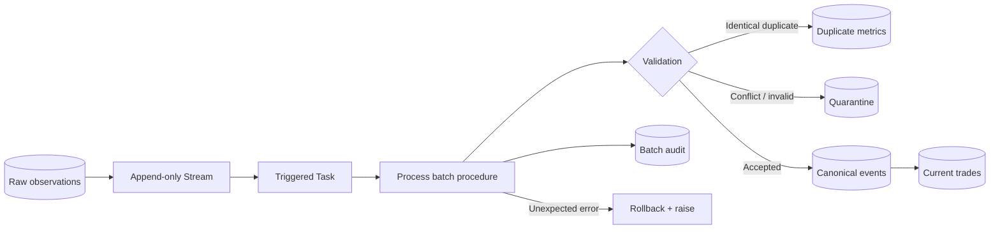

---
tags:
  - note-scenario
---

# Scenario - Trade Batch Must Be Validated Before Publication

> Client says: “A trade batch can contain duplicate deliveries, conflicting event payloads, or unknown instruments. Valid data must never be partially published, operations needs quarantine evidence, and a failed run must be safe to retry.”

## Likely Reasoning Path

1. **Define the business outcomes:** Separate accepted records, known business-invalid records, batch rejection, technical failure, and successful publication. Do not encode all of them as a generic success/failure flag.
2. **Preserve raw evidence:** Keep every delivered observation immutable with event ID, payload hash, source file, source row, and load timestamp. The procedure should not “clean” raw history.
3. **Separate trigger from work:** An append-only Stream exposes new raw observations; a gated Task decides when to call the batch-processing procedure.
4. **Make one batch stable:** Identify the batch/run and ensure processing sees a deterministic input set. Collapse identical delivery duplicates before merging by event ID.
5. **Apply explicit rules:** Same event ID and payload hash is a delivery duplicate; same event ID with a different hash is a conflict; missing reference data follows the agreed reject/quarantine policy.
6. **Choose the atomic boundary:** Accepted canonical changes, current-state changes, and success audit must commit together. Decide separately whether quarantine rows commit with accepted data or whether any conflict rejects the whole batch.
7. **Propagate technical failure:** On an unexpected SQL/runtime error, roll back and re-raise. Returning `'FAILED'` can leave the Task falsely green.
8. **Make retry idempotent:** Merge on stable keys, record the batch/run ID, prevent unsafe overlap, and ensure a second call cannot create another financial effect.
9. **Reconcile before consumption:** Compare delivered observations, duplicate/conflict counts, accepted canonical events, current trades, and position impact before declaring the batch complete.

## Recommended Snowflake Shape

## Consultant Recommendation Shape

Use a Stream and Task to trigger a narrowly scoped Snowflake Scripting procedure. Keep the procedure set-based and transactional, preserve raw evidence, and define expected data-quality outcomes separately from technical failure. Use owner’s rights only if the Task/caller needs a controlled publishing capability without direct DML privileges, and let a narrowly privileged operations role own it.

For strict all-or-nothing publication, do not expose a new consumer state until validation and reconciliation pass. If valid rows may proceed while invalid rows are quarantined, document that as an explicit partial-acceptance business rule rather than an implementation accident.

## Failure and Retry Contract

| Outcome | Data action | Procedure behavior | Task status |
|---|---|---|---|
| Identical delivery duplicate | Preserve raw; no second financial effect; update metrics | Continue | Success or warning |
| Conflicting reuse of event ID | Quarantine or reject batch according to policy | Return explicit business status or raise a controlled exception | Policy-dependent and monitored |
| Missing reference data | Quarantine, defer, or reject according to policy | Record deterministic reason | Policy-dependent and monitored |
| Unexpected SQL/runtime error | Roll back atomic work | Re-raise | Failed |
| Retry of completed batch | No duplicate effect | Return already-completed or safely re-merge | Success with evidence |

## Security and Governance Checks

- The Task-owner role and procedure-owner role must be explicit and narrowly privileged.
- Callers receive `USAGE` on the procedure, not broad direct DML, when owner’s-rights delegation is intended.
- Dynamic object names are allow-listed; data values use binds rather than string concatenation.
- Audit and error logging must not expose sensitive payloads or portfolio data.
- Procedure source, grants, and deployment are managed through Git and controlled promotion.
- Raw, quarantine, canonical, and published layers have separate retention and access policies.

## Related Learning Topics

- [[01 Snowflake/04 Data Engineering/26 Stored Procedures]]
- [[01 Snowflake/04 Data Engineering/20 Streams and Tasks]]
- [[01 Snowflake/04 Data Engineering/24.5 Bonus chapter Data from A-Z]]
- [[01 Snowflake/03 Security and Governance/12 RBAC Roles and Privileges]]
- [[01 Snowflake/07 Ecosystem and Integration/50 Notification Integrations and Alerts]]

## Related Decision Notes

- [[80 Comparisons and Decision Notes/Comparisons/Comparison - Stored Procedures vs Declarative Transformations]]
- [[80 Comparisons and Decision Notes/Comparisons/Comparison - Streams and Tasks vs Dynamic Tables]]
- [[80 Comparisons and Decision Notes/Decision Notes/Decisions - Choosing a Snowflake Ingestion Method]]

## Questions To Ask

- Does one invalid event reject the entire batch, or may valid events proceed while invalid ones are quarantined?
- Which validations must occur before canonical merge, current-state update, and position publication?
- What stable event and batch identifiers make every retry idempotent?
- Who owns the procedure, who may call it, and which underlying privileges are intentionally delegated?
- How are overlapping runs prevented for the same batch or business date?
- Which reconciliation thresholds should fail the Task rather than create a warning?
- How will operators replay a quarantined event after source/reference data is corrected?
