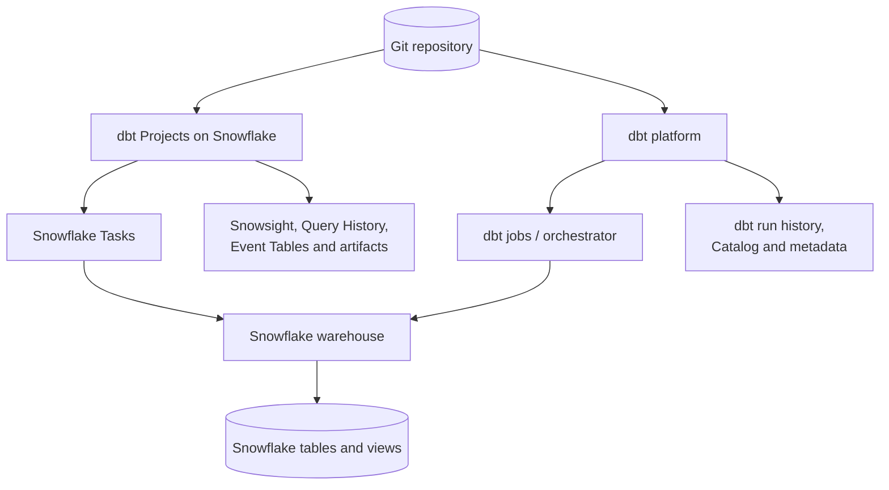

---
tags:
  - note-comparison
---

# Comparison - dbt Projects on Snowflake vs dbt Platform

## Short Answer

Choose **dbt Projects on Snowflake** when Snowflake is the strategic platform and the client wants development, versioned deployment, execution, scheduling, RBAC, and monitoring to fit the Snowflake operating model.

Choose the **dbt platform**—historically called dbt Cloud—when dbt is an enterprise platform in its own right, especially when the client needs a richer dbt-specific experience, broader hosted CI and orchestration, Semantic Layer or Catalog capabilities, or one control plane across multiple data platforms.

Both approaches send transformation SQL to Snowflake. Snowflake executes that SQL and stores the resulting models. The main decision is **who owns the dbt control plane**, not where the analytical data is processed.

## Architecture Difference

## Comparison Table

| Dimension | dbt Projects on Snowflake | dbt platform connected to Snowflake |
|---|---|---|
| Primary role | Snowflake-native dbt control plane | dbt-managed analytics-engineering platform |
| SQL execution | Snowflake warehouse | Snowflake warehouse |
| Model storage | Snowflake | Snowflake |
| Project code | Standard dbt project deployed as a versioned Snowflake object | Standard dbt project managed through the dbt platform and Git |
| Development | Snowflake Workspaces or local tooling | dbt Studio/IDE and supported local tooling |
| Production artifact | Immutable `DBT PROJECT` object version | Git commit plus dbt-platform environment/job configuration |
| Scheduling | User-managed Snowflake Tasks or an external orchestrator calling `EXECUTE DBT PROJECT` | dbt jobs and dbt orchestration features |
| CI/CD | Git plus Snowflake CLI or another CI runner | Git plus dbt-native CI capabilities |
| Monitoring | Snowsight, Task History, Query History, Event Tables, dbt artifacts | dbt run history, alerts, Catalog, artifacts, and platform metadata |
| Lineage | dbt DAG plus Snowflake Horizon lineage | dbt DAG, Catalog, and dbt-platform metadata |
| Runtime versions | Versions explicitly supported by Snowflake | dbt-supported platform release tracks |
| Concurrency | One `EXECUTE DBT PROJECT` call at a time per project object; internal dbt threads are supported | Governed by dbt-platform job and account capabilities |
| Environment variables | Not supported for deployed native project execution; use supported alternatives such as project variables | Supported platform configuration patterns are broader |
| Package access | Resolve packages before deployment or configure Snowflake external access | Managed through the dbt environment and its network configuration |
| Security boundary | Project, execution, logs, scheduling, and models remain in the Snowflake operating boundary | Model data and compute remain in Snowflake, while code-related metadata, credentials, logs, and artifacts involve the dbt SaaS boundary |
| Identity and RBAC | Snowflake project privileges, Task-owner role, profile role, warehouse and object grants | dbt-platform access plus the connected Snowflake user, role, warehouse, and object grants |
| Multi-platform reach | Snowflake-centric | Designed to span supported data platforms |
| Commercial model | Standard Snowflake compute; Snowflake states no additional per-user fee for native dbt Projects | dbt-platform subscription plus Snowflake compute |
| Operational owner | Often the Snowflake platform team | Often the analytics-engineering or enterprise dbt team |
| Vendor support boundary | Snowflake owns the native control plane; dbt project compatibility still matters | dbt Labs owns the dbt control plane; Snowflake owns data-plane execution |

## What Does Not Change

The following fundamentals apply to both options:

- Snowflake stores the source and modeled data.
- Snowflake warehouses execute the transformation SQL.
- Snowflake compute charges still apply.
- The project still uses dbt concepts such as models, sources, tests, `ref()`, Jinja, and materializations.
- Snowflake RBAC still controls access to data and target objects.
- Git should remain the durable code source of truth.
- Poor SQL, weak business rules, stale sources, and missing reconciliation remain problems regardless of control plane.

## Decision Rules

### Prefer dbt Projects on Snowflake when

- Snowflake is the client's only or dominant analytical platform.
- Reducing external platform sprawl is an explicit architectural goal.
- The Snowflake platform team will own production transformations.
- Snowflake Tasks, Query History, Event Tables, RBAC, and Snowsight are already the standard operational surfaces.
- Keeping project execution and operational metadata primarily inside Snowflake simplifies security approval.
- Snowflake's supported dbt versions, commands, flags, package model, and concurrency limits meet the requirement.
- The client wants native dbt capability without a separate per-user dbt-platform subscription.

### Prefer the dbt platform when

- dbt is a strategic enterprise capability rather than merely a Snowflake transformation framework.
- The client operates Snowflake alongside other supported analytical platforms.
- Analytics engineers need a stronger dbt-specific development, CI, orchestration, documentation, Catalog, or Semantic Layer experience.
- The analytics-engineering team, rather than the Snowflake platform team, owns deployment and production operations.
- Snowflake-native runtime, environment-variable, package, or concurrent-execution constraints are material.
- The client prefers dbt Labs to own and support the dbt control plane.

### Prefer self-operated dbt Core or Fusion when

- The client deliberately wants to operate dbt through Airflow, containers, CI runners, or another established orchestrator.
- The engineering team can own runtime upgrades, availability, secrets, logs, artifacts, scheduling, and incident response.
- Avoiding both a dbt SaaS subscription and Snowflake-native constraints is worth the additional operational burden.

## Security and Governance Questions

- Is project metadata, compiled SQL, lineage, and run-log information allowed to leave the Snowflake boundary?
- Which team owns the production identity and Snowflake role used to build models?
- Can development, approval, deployment, scheduling, and execution powers be separated?
- Where are credentials and package-repository access controlled?
- Which platform provides the audit evidence required after a failed or disputed production run?
- Does the client require private connectivity to the dbt SaaS control plane?
- Are third-party dbt packages reviewed, pinned, and resolved through an approved network path?

## Cost and Operating Model

Do not compare only license prices. Compare total operating cost:

| Cost area | Questions to ask |
|---|---|
| Snowflake compute | Are model selection, schedules, tests, threads, and warehouses equally optimized? |
| Platform license | What dbt-platform capabilities would the client actually use? |
| Engineering operations | Who maintains CI/CD, orchestration, runtime versions, secrets, logs, and alerts? |
| Security and compliance | What is the effort to approve and govern an external SaaS boundary? |
| Incident response | Which team and tool own retries, failed tests, stale data, and consumer communication? |
| Migration and lock-in | How much operational configuration exists outside the portable dbt project files? |

Native Snowflake may reduce software spend but increase responsibility for the Snowflake platform team. The dbt platform may cost more directly while reducing the amount of dbt-specific tooling the client builds and operates itself.

## Hybrid Warning

The same Git repository can support evaluation or migration between the two approaches, but production should have one clear control plane.

Avoid scheduling the same project from both Snowflake Tasks and dbt-platform jobs. Dual schedulers create:

- Duplicate executions
- Conflicting retries
- Unclear deployment ownership
- Overlapping writes
- Split monitoring and alerting
- Difficult incident reconstruction

## Consultant Recommendation Shape

> "Both options use Snowflake for data storage and SQL execution. The decision is whether Snowflake or dbt Labs should provide the development, scheduling, CI, monitoring, and governance control plane. We should choose based on platform strategy and operating ownership, then verify the required runtime, package, concurrency, security, and metadata capabilities before committing."

## Related Learning Topics

- [[01 Snowflake/04 Data Engineering/25 dbt on Snowflake]]
- [[01 Snowflake/04 Data Engineering/20 Streams and Tasks]]
- [[01 Snowflake/04 Data Engineering/21 Dynamic Tables]]
- [[01 Snowflake/03 Security and Governance/12 RBAC Roles and Privileges]]
- [[01 Snowflake/06 Cost Management and Operations/33 Warehouse Scheduling and Auto-suspend]]
- [[02 dbt/dbt Learning Map]]

## Related Scenarios

- No separate scenario yet. Add one when a real client constraint creates a distinct reasoning path beyond this reusable comparison.

## Sources To Revisit

- [Snowflake Docs: dbt Projects on Snowflake](https://docs.snowflake.com/en/user-guide/data-engineering/dbt-projects-on-snowflake)
- [Snowflake Docs: Access Control for dbt Projects](https://docs.snowflake.com/en/user-guide/data-engineering/dbt-projects-on-snowflake-access-control)
- [Snowflake Docs: Schedule dbt Project Executions](https://docs.snowflake.com/en/user-guide/data-engineering/dbt-projects-on-snowflake-schedule-project-execution)
- [Snowflake Docs: Requirements and Limitations](https://docs.snowflake.com/en/user-guide/data-engineering/dbt-projects-on-snowflake-limitations)
- [Snowflake Docs: Understanding dbt Project Costs](https://docs.snowflake.com/en/user-guide/data-engineering/dbt-projects-on-snowflake-cost)
- [dbt Docs: Connect Snowflake to the dbt Platform](https://docs.getdbt.com/docs/platform/connect-data-platform/connect-snowflake)
