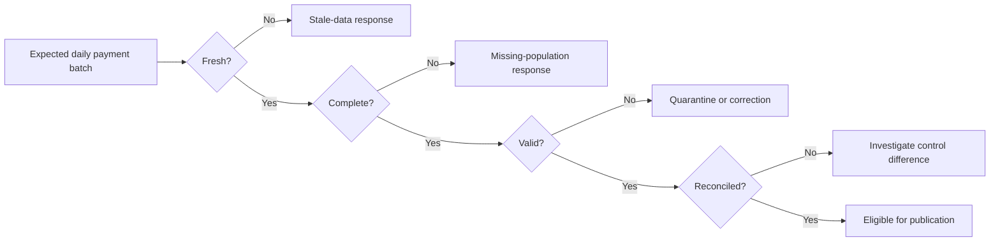

---
tags:
  - note-comparison
---

# Comparison - Freshness vs Completeness vs Validity vs Reconciliation

> Freshness proves recency, completeness proves expected population, validity proves acceptability, and reconciliation proves agreement; one green signal does not imply the others.

## Short Answer

- **Freshness:** Did something arrive recently enough?
- **Completeness:** Did everything expected arrive?
- **Validity:** Is the received data acceptable according to its rules?
- **Reconciliation:** Does the result agree with an authoritative source or control total?

These controls answer independent questions and often belong together for a material batch.

## Comparison Table

| Dimension | Freshness | Completeness | Validity | Reconciliation |
|---|---|---|---|---|
| Primary question | Did recent source activity occur? | Is the expected population present? | Do records conform to defined rules? | Do two populations or control figures agree? |
| Typical signal | Age of latest load or successful batch | Expected versus received files, partitions, keys, or rows | Invalid values, nulls, duplicates, ranges, or relationships | Difference in counts, amounts, balances, or key populations |
| Required reference | Time threshold and trustworthy timestamp | Expected manifest, schedule, population, or source count | Approved domain or business rule | Authoritative source, ledger, control table, or previous system |
| Typical dbt implementation | Source freshness or custom batch query | Singular test or batch-control model | Generic, singular, or custom data test | Singular test or reconciliation model |
| Example failure | A table has not loaded for six hours | Today’s file arrived but contains only 80% of expected accounts | A transaction uses an invalid currency code | Total exposure differs from the approved risk control total |
| Can pass while another fails? | Yes; one new row can be fresh but incomplete | Yes; all rows can arrive with invalid values | Yes; valid-looking records can omit a population | Yes; totals can match while individual keys differ |
| Common false confidence | “The timestamp is recent, so the batch is good” | “The count matches, so the records are correct” | “Every row is valid, so nothing is missing” | “The total matches, so every transaction matches” |
| Natural owner | Source or ingestion owner | Source, operations, or batch owner | Data or business-rule owner | Finance, risk, control, or authoritative-source owner |
| Cost pattern | Often a maximum timestamp or metadata query | Counts, manifests, or key comparisons | Row scans and aggregations | Aggregate comparison through full row/key diff |
| Typical response | Alert, delay, or block stale publication | Investigate missing population and replay | Reject, quarantine, correct, or approve exception | Block material output, investigate, correct, and sign off |

## Worked Pattern

For a daily payment batch:

| Control | Example rule | What a pass proves |
|---|---|---|
| Freshness | Latest successful batch completed before 06:00 | Recent delivery activity occurred |
| Completeness | Every expected file, legal entity, and payment key is present | The intended population arrived |
| Validity | IDs are non-null, currencies are approved, and amounts meet domain rules | Received records conform to defined rules |
| Reconciliation | Counts and monetary totals agree with the payment control table | The transformed output agrees with the approved control source |

The sequence is useful operationally, but the controls remain logically independent. A team may run them in parallel when faster diagnosis matters.

## Decision Rules

- Use freshness when recency itself has a meaningful service expectation and the timestamp represents warehouse arrival or successful batch completion.
- Add completeness whenever a recent timestamp could be produced by a partial file, partition, or micro-batch.
- Add validity for required fields, allowed domains, uniqueness, relationships, ranges, and business conditions.
- Add reconciliation when an authoritative source, control total, ledger, or legacy result exists.
- Reconcile both aggregates and key populations for material financial data; offsetting omissions can leave totals unchanged.
- Use business calendars and batch manifests when a continuous age threshold cannot represent holidays, cutoffs, or expected files.
- Define separate owners and responses where the source team, data team, and control owner have different responsibilities.
- For regulated output, define materiality, publication gate, retained evidence, impact assessment, remediation, rerun, and sign-off for every control class.
- Optimize large controls with partitions, metadata, or staged diagnostics only when the original control meaning is preserved.

## Consultant Recommendation Shape

> “A recent load is not proof of a complete or correct load. For a material batch, we should separately prove recency, expected population, record validity, and agreement with the authoritative control source, then define how each failure affects publication.”

## Watch-outs

- Using business-event time as freshness when quiet periods are legitimate.
- Treating a source-table row count as proof that every expected key is present.
- Applying validity rules without an approved owner for allowed values and exceptions.
- Reconciling only grand totals and missing offsetting errors or changed classifications.
- Running the checks against different source cutoffs or time zones.
- Combining every failure into one opaque test, making ownership and diagnosis difficult.
- Allowing warning thresholds to become permanent undocumented tolerances.
- Scanning full history on every run when the controlled population is a defined batch or partition.

## Related Learning Topics

- [[02 dbt/03 Testing Documentation and Data Quality/21 Generic Singular and Custom Data Tests]]
- [[02 dbt/03 Testing Documentation and Data Quality/23 Source Freshness and SLA Monitoring]]
- [[02 dbt/03 Testing Documentation and Data Quality/27 Test Severity and Failure Handling]]
- [[02 dbt/03 Testing Documentation and Data Quality/28 Audit and Migration Validation]]
- [[02 dbt/03 Testing Documentation and Data Quality/29 Data Quality Strategy in Regulated Environments]]

## Related Scenarios

- [[80 Comparisons and Decision Notes/Client Scenarios/dbt/Scenario - Dashboard Published From Stale Source Data]]
- [[80 Comparisons and Decision Notes/Client Scenarios/Snowflake/Scenario - Trade Batch Must Be Validated Before Publication]]

## Sources To Revisit

- [dbt Developer Hub - Source freshness](https://docs.getdbt.com/docs/deploy/source-freshness)
- [dbt Developer Hub - Data tests](https://docs.getdbt.com/docs/build/data-tests)
- [dbt Developer Hub - Test severity](https://docs.getdbt.com/reference/resource-configs/severity)
