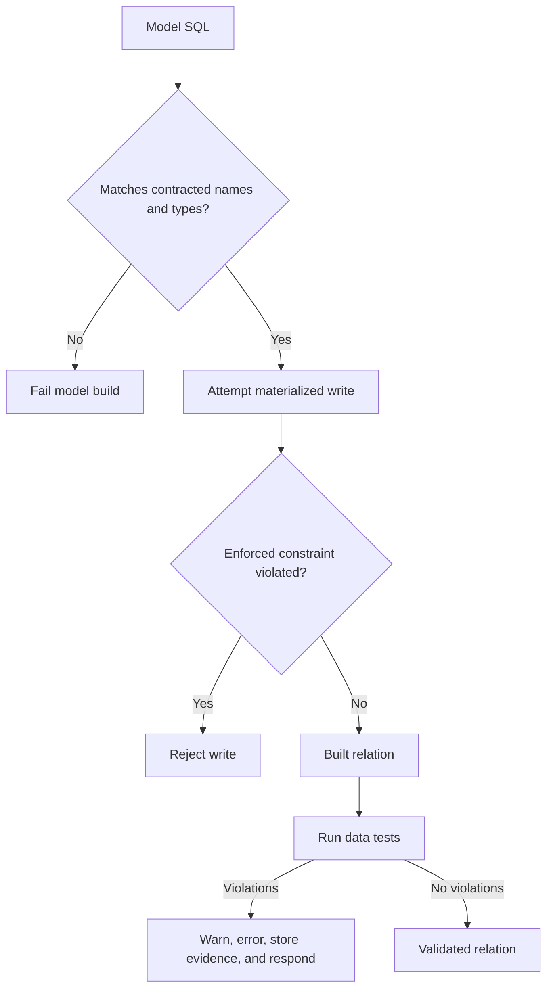

---
tags:
  - note-comparison
---

# Comparison - Model Contracts vs Data Tests vs Warehouse Constraints

> Model contracts protect a published structural interface, data tests detect violations in built data, and genuinely enforced warehouse constraints reject invalid writes.

## Short Answer

Use a **model contract** when consumers must receive an exact set of column names and compatible data types.

Use a **data test** when a SQL query can detect invalid records, including grain, uniqueness, relationships, reconciliation, and business-rule violations.

Use a **warehouse or ingestion constraint** when invalid data must be prevented from entering a relation and the platform genuinely enforces the rule.

For critical models, these mechanisms often complement one another rather than compete.

## Comparison Table

| Dimension | Model contract | Data test | Warehouse constraint |
|---|---|---|---|
| Primary purpose | Protect the model’s structural interface | Detect records or aggregates that violate a rule | Prevent a violating write when enforced |
| Checks | Declared column names and compatible data types | Any rule expressible as a failing-record SQL query | Platform-supported null, key, relationship, or check rule |
| Execution point | Before or during model materialization | Against actual built data | During insert, update, merge, or DDL-governed write |
| Failure effect | Model build fails on interface mismatch | Test warns or errors; descendants may skip in `dbt build` | Write fails if the database enforces the constraint |
| Protects against extra or missing columns | Yes | Only with a custom metadata test | Not usually the primary purpose |
| Proves uniqueness or relationships | No | Yes, by detection | Only if that constraint type is enforced |
| Proves business meaning is unchanged | No | Only when an explicit semantic test captures it | No |
| Flexibility | Structural declarations | Very high; generic or custom SQL | Limited to platform and adapter support |
| Diagnostic detail | Interface mismatch | Can return and store failing rows | Database error may identify the rule but provide less audit detail |
| Typical dbt object | `contract.enforced: true` plus column declarations | Generic, singular, or custom data test | `constraints` metadata and generated DDL where supported |
| Snowflake standard-table caveat | Contract behavior is handled by dbt | Tests query the actual data | `NOT NULL` is enforced; primary, unique, and foreign keys are generally informational |
| Best fit | Stable public model or cross-team interface | Actual data quality, reconciliation, and business rules | Required write-time rejection supported by the platform |

## Worked Example

For a daily account-balance model:

```text
Contract:
account_id, balance_date, and closing_balance must exist with declared types.

Constraint:
closing_balance must not be NULL during the write.

Data test:
account_id + balance_date must be unique in the completed relation.

Unit test:
a reversal transaction must reduce the calculated closing balance correctly.
```



## Decision Rules

- Use contracts at stable producer-consumer boundaries, not automatically on every experimental staging model.
- Declare every contracted output column explicitly and avoid `select *` on a managed interface.
- Use data tests for actual grain, uniqueness, relationships, ranges, reconciliations, and business rules.
- Use unit tests for calculation behavior under controlled edge-case inputs; neither contracts nor data tests replace that purpose.
- Treat an informational Snowflake primary or foreign key as metadata, not proof that the data satisfies the relationship.
- Use an enforced constraint where prevention is supported and valuable; retain a data test when diagnostic evidence or cross-platform consistency is also needed.
- Verify the current dbt adapter and warehouse behavior before promising enforcement to a client.
- Combine contracts, tests, documentation, ownership, versions, and change governance for public or regulatory models.
- Remember that a column can keep the same name and type while its business meaning changes; structural controls will not detect that alone.

## Consultant Recommendation Shape

> “Use the contract to define what consumers can depend on, use a genuinely enforced constraint to prevent supported invalid writes, and use data tests to verify the quality rules the warehouse does not enforce. We should state clearly which guarantees come from dbt and which come from Snowflake.”

## Watch-outs

- Describing every declared constraint as enforced.
- Treating a contract as proof of correct values, grain, or calculations.
- Replacing uniqueness tests with an informational Snowflake primary key.
- Contracting unstable internal models and creating unnecessary maintenance friction.
- Forgetting extra columns can break an enforced contract.
- Assuming all detailed type attributes are compared identically across platforms.
- Allowing a semantic change to pass because names and types remain stable.
- Ignoring the diagnostic and evidence differences between a failed write and a stored test failure.

## Related Learning Topics

- [[02 dbt/03 Testing Documentation and Data Quality/21 Generic Singular and Custom Data Tests]]
- [[02 dbt/03 Testing Documentation and Data Quality/22 Unit Tests for SQL Logic]]
- [[02 dbt/03 Testing Documentation and Data Quality/26 Model Contracts and Constraints]]
- [[02 dbt/03 Testing Documentation and Data Quality/29 Data Quality Strategy in Regulated Environments]]
- [[02 dbt/06 Governance Semantic Layer and Mesh/52 Model Contracts]]

## Related Scenarios

- No directly related client scenario yet.

## Sources To Revisit

- [dbt Developer Hub - Model contracts](https://docs.getdbt.com/docs/mesh/govern/model-contracts)
- [dbt Developer Hub - Constraints](https://docs.getdbt.com/reference/resource-properties/constraints)
- [dbt Developer Hub - Data tests](https://docs.getdbt.com/docs/build/data-tests)
- [Snowflake Documentation - Constraints overview](https://docs.snowflake.com/en/sql-reference/constraints-overview)
