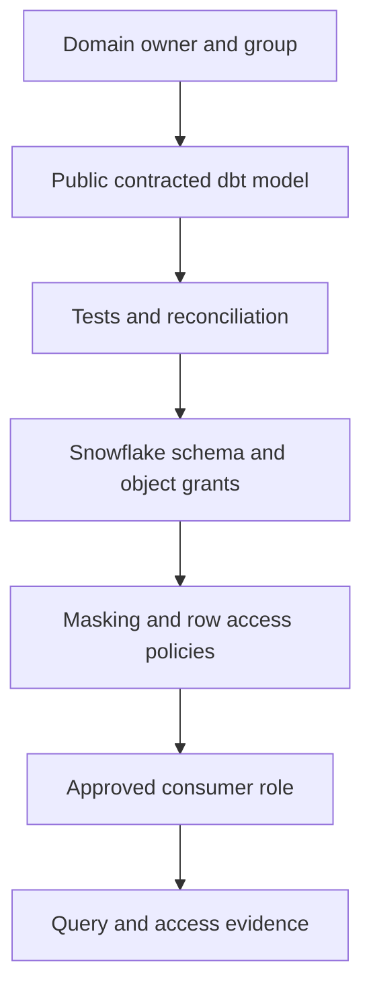

---
tags:
  - note-comparison
---

# Comparison - dbt Governance Controls vs Snowflake Security Controls

## Short Answer

Use **dbt governance controls** to define who owns a dbt resource, which models may depend on it, what structural interface it promises, and how it evolves.

Use **Snowflake security controls** to enforce which identity may use a warehouse or object and which rows or columns it may see.

They are complementary. `access: public` is not a database grant, and a Snowflake grant does not create a stable dbt data-product contract.

## Comparison Table

| Dimension | dbt governance controls | Snowflake security controls |
|---|---|---|
| Primary purpose | Project ownership and interface governance | Runtime authorization and data protection |
| Examples | Groups, owners, model access, contracts, versions, tests | RBAC, grants, masking policies, row access policies, tags |
| Main boundary | dbt resources and declared dependencies | Snowflake identities, objects, rows, columns, and warehouses |
| Prevents | Unapproved dbt references and accidental interface drift | Unauthorized queries and prohibited data visibility |
| Does not prevent | Direct SQL access or sensitive row visibility | Semantic drift or dbt consumers coupling to internals |
| Evidence | Project YAML, manifest, test results, version metadata | Grants, policy references, query/access history, tag metadata |
| Owner | Analytics/data-product team | Platform/security owner with data owner participation |
| Consultant recommendation | Use for governed producer-consumer promises | Use for least privilege and regulatory enforcement |

## Decision Rules

- Treat groups and owners as accountability metadata, not identity management.
- Use model access to protect dbt implementation boundaries; use Snowflake grants to protect physical objects.
- Use model contracts for structural expectations; use tests and reconciliation for content; use Snowflake policies for runtime visibility.
- Publish sensitive data only when both the dbt interface and Snowflake enforcement path are approved.
- Test the effective role and policy outcome for CI, production jobs, BI services, and human users separately.
- Keep sensitive staging and intermediate models private in dbt and inaccessible to ordinary consumer roles in Snowflake.
- Record which system supplies each piece of audit evidence.

## Example Control Stack

A critical client-position model may need every layer. Removing any one produces a different risk: unclear accountability, accidental dependency, structural break, incorrect content, unauthorized access, or missing evidence.

## Related Learning Topics

- [[02 dbt/06 Governance Semantic Layer and Mesh/50 Groups and Ownership]]
- [[02 dbt/06 Governance Semantic Layer and Mesh/51 Model Access]]
- [[02 dbt/06 Governance Semantic Layer and Mesh/52 Model Contracts]]
- [[02 dbt/06 Governance Semantic Layer and Mesh/59 Sensitive Data and Regulatory Boundaries]]
- [[01 Snowflake/03 Security and Governance/12 RBAC Roles and Privileges]]
- [[01 Snowflake/03 Security and Governance/14 Column-level Masking Policies]]

## Related Scenarios

- [[80 Comparisons and Decision Notes/Client Scenarios/Snowflake/Scenario - New Regulatory Team Needs Cross-Domain Data]]

## Sources To Revisit

- [dbt Developer Hub - Model governance](https://docs.getdbt.com/docs/mesh/govern/about-model-governance)
- [dbt Developer Hub - Model access](https://docs.getdbt.com/docs/mesh/govern/model-access)
- [Snowflake Documentation - Overview of Access Control](https://docs.snowflake.com/en/user-guide/security-access-control-overview)
- [Snowflake Documentation - Understanding masking policies](https://docs.snowflake.com/en/user-guide/security-column-intro)
- [Snowflake Documentation - Understanding row access policies](https://docs.snowflake.com/en/user-guide/security-row-intro)
