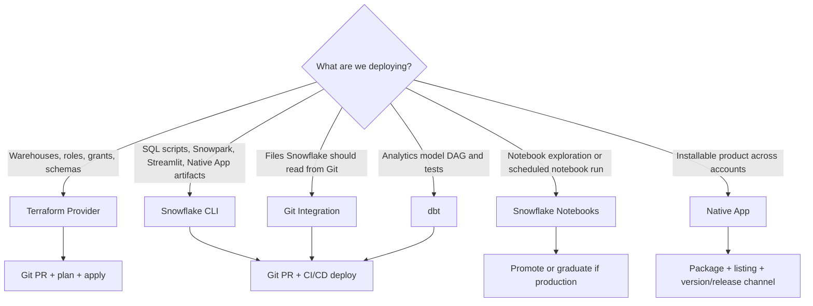

---
tags:
  - note-decision
---

# Decisions - Choosing a Snowflake DevOps and Deployment Pattern

> A framework for deciding when to use Git Integration, Snowflake CLI, Terraform, dbt, notebooks, or Native Apps in a Snowflake delivery workflow.

## Decision Frame

Clients do not usually ask for "Snowflake CLI" or "Git Integration" in isolation. They ask: **"How do we move Snowflake work safely from dev to prod?"**

The answer depends on what is being changed:

- **Platform baseline:** Terraform.
- **Deployable Snowflake project or SQL/app artifact:** Snowflake CLI.
- **Source-controlled files visible inside Snowflake:** Git Integration.
- **Analytics transformations:** dbt or dbt Projects on Snowflake.
- **Exploration and ML prototyping:** Snowflake Notebooks.
- **Packaged cross-account product:** Snowflake Native App.
- **Operational event routing:** notification integrations and alerts.

## Deciding Axes

- **Change type:** infrastructure object, SQL script, dbt model, app artifact, notebook, Native App package, or semantic/data product.
- **State model:** desired-state, migration-style, execution-style, or package/install-style.
- **Environment model:** one account, dev/test/prod accounts, branches, schemas, or separate consumers.
- **Approval model:** Git pull request, Terraform plan, CI job, Snowflake owner review, or listing approval.
- **Rollback model:** revert code, apply previous plan, rerun migration, use release channel, or restore data.
- **Security model:** service user, OIDC/workload identity, secrets, Terraform state, app privileges, and RBAC.

## Recommendation Table

| Situation | Recommend | Why | Watch-outs |
|---|---|---|---|
| Need repeatable warehouses, roles, grants, databases, schemas | Terraform Provider | Desired-state IaC fits stable platform objects | Protect state and manage drift/imports |
| Need to run/deploy SQL, Snowpark, Streamlit, Native App, or project artifacts | Snowflake CLI | Good CI/CD execution surface | CLI runs actions; it does not own long-term state |
| Snowflake should reference code directly from Git | Git Integration | Lets Snowflake fetch and use version-controlled files | Fetch cadence, secrets, and execution roles matter |
| Transformations need lineage, tests, documentation, environments | dbt | Purpose-built analytics engineering workflow | Not every platform object belongs in dbt |
| Data scientists need exploration close to Snowflake data | Snowflake Notebooks | Fast SQL/Python workbench | Promote carefully if it becomes production |
| Reusable product must be installed across accounts/customers | Native App | Package, version, distribute, and run locally in consumer accounts | App lifecycle, support, privileges, and costs |
| Manual changes keep breaking dev/test/prod | Git + CI/CD + Terraform/CLI/dbt split | Separates platform state, project deploys, and transformations | Requires change freeze and import/drift cleanup |
| Feature is too new for Terraform provider support | SQL/Snowflake CLI path temporarily | Direct Snowflake command may support it sooner | Revisit IaC support later |
| Security team rejects long-lived deployment secrets | Workload identity/OIDC where supported | Reduces stored credential risk | Requires CI platform and Snowflake setup |
| Regulated environment needs audit trail | PRs, plans, CI logs, query history, app release records | Evidence matters as much as tooling | Emergency changes need documented process |

## Questions To Ask

- What object or artifact is actually being promoted?
- Should the tool declare desired state, execute a migration, deploy files, or package an app?
- Which environments exist: schemas, accounts, branches, or consumers?
- Who approves production changes?
- Which identity runs deployments, and what privileges does it need?
- Where are secrets and Terraform state stored?
- How are manual production changes handled?
- What rollback is realistic for this change type?
- Which logs or records will satisfy audit?

## Related Learning Topics

- [[01 Snowflake/07 Ecosystem and Integration/48 Snowflake CLI and Terraform Provider]]
- [[01 Snowflake/07 Ecosystem and Integration/49 Git Integration]]
- [[01 Snowflake/07 Ecosystem and Integration/51 Native Apps Framework]]
- [[01 Snowflake/07 Ecosystem and Integration/50 Notification Integrations and Alerts]]
- [[01 Snowflake/04 Data Engineering/25 dbt on Snowflake]]
- [[01 Snowflake/05 Advanced Analytics and AI/36 Snowflake Notebooks]]
- [[01 Snowflake/03 Security and Governance/12 RBAC Roles and Privileges]]

## Related Comparisons and Scenarios

- [[80 Comparisons and Decision Notes/Comparisons/Snowflake/Comparison - Snowflake CLI vs Terraform Provider]]
- [[80 Comparisons and Decision Notes/Comparisons/Cross-Tool/Comparison - dbt Projects on Snowflake vs dbt Platform]]
- [[80 Comparisons and Decision Notes/Comparisons/Snowflake/Comparison - Native App vs Streamlit vs Direct Share]]
- [[80 Comparisons and Decision Notes/Client Scenarios/Cross-Tool/Scenario - Manual Snowflake Changes Keep Breaking Dev Test Prod Consistency]]

## Sources To Revisit

- [Snowflake Docs: Snowflake CLI](https://docs.snowflake.com/en/developer-guide/snowflake-cli/index)
- [Snowflake Docs: Integrating CI/CD with Snowflake CLI](https://docs.snowflake.com/en/developer-guide/snowflake-cli/cicd/integrate-ci-cd)
- [Snowflake Docs: Using a Git repository in Snowflake](https://docs.snowflake.com/en/developer-guide/git/git-overview)
- [Snowflake Docs: Snowflake Terraform Provider](https://docs.snowflake.com/en/user-guide/terraform)
- [Snowflake Docs: Snowflake Native App workflow](https://docs.snowflake.com/en/developer-guide/native-apps/native-apps-workflow)
- [Snowflake Docs: Snowflake Notebooks in Workspaces](https://docs.snowflake.com/en/user-guide/ui-snowsight/notebooks-in-workspaces/notebooks-in-workspaces-overview)
