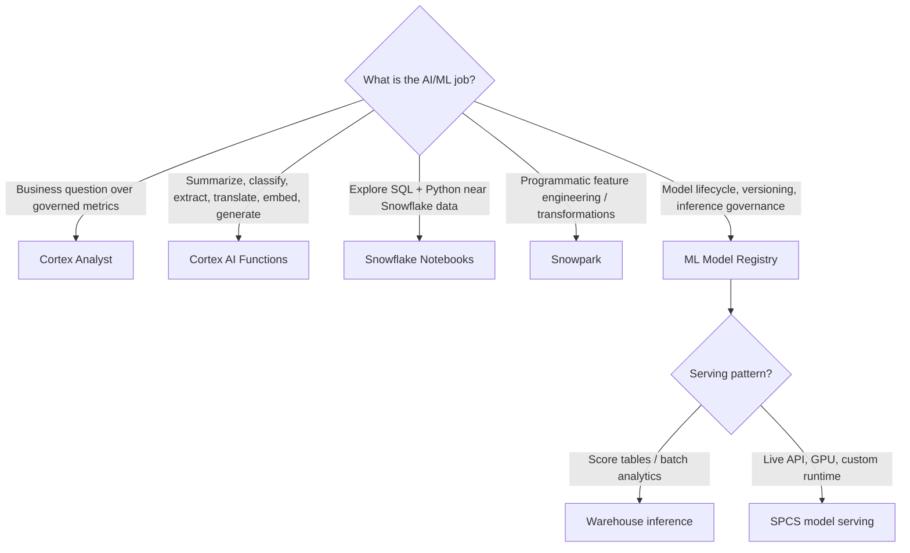

---
tags:
  - note-decision
---

# Decisions - Choosing a Snowflake AI and ML Pattern

> A framework for deciding whether a Snowflake AI/ML request belongs in Cortex, Snowpark, Notebooks, the Model Registry, warehouse inference, or Snowpark Container Services.

## Decision Frame

Clients rarely ask for a specific Snowflake AI feature by name. They ask things like "Can business users ask questions in plain English?", "Can we summarize these tickets?", "Can our data scientists build churn models?", or "Can this model score customers in production?"

Start with the business job, not the feature name:

- **Ask governed business questions:** Cortex Analyst.
- **Apply managed AI to text/files/media/rows:** Cortex AI Functions.
- **Explore and prototype with SQL/Python:** Snowflake Notebooks.
- **Transform large Snowflake data with Python/Java/Scala:** Snowpark.
- **Version, govern, and deploy models:** ML Model Registry.
- **Score many rows in batch:** warehouse inference.
- **Serve low-latency/custom runtime models:** Snowpark Container Services.

## Deciding Axes

- **User shape:** business user, analyst, data scientist, application, or pipeline.
- **Input shape:** structured tables, semantic metrics, text/files/media, features, or live API request.
- **Output shape:** answer, enriched column, registered model, prediction table, endpoint response, or app workflow.
- **Governance requirement:** semantic layer, RBAC, prompt controls, model versioning, data retention, and auditability.
- **Production maturity:** exploration, repeatable analysis, batch pipeline, service endpoint, or packaged product.
- **Cost surface:** SQL/warehouse credits, Cortex function usage, AI service usage, compute pools, storage, and repeated inference.

## Recommendation Table

| Situation | Recommend | Why | Watch-outs |
|---|---|---|---|
| Business users ask natural-language questions over governed metrics | Cortex Analyst | Turns semantic layer plus user question into SQL-backed answers | Requires tight semantic scope and metric governance |
| Text/documents/tickets need summarization or classification | Cortex AI Functions | Managed AI inference can run close to Snowflake data | Outputs are probabilistic; validate quality and cost |
| Analysts/data scientists need SQL and Python exploration | Snowflake Notebooks | Fast governed workbench near Snowflake data | Notebooks need promotion discipline before production |
| Python feature engineering should stay near Snowflake data | Snowpark | Pushes scalable transformations into Snowflake | Avoid local `collect()` and hidden monoliths |
| A trained model needs governance and reuse | ML Model Registry | Tracks versions, signatures, metrics, and inference options | Registry does not prove the model is good |
| Predictions feed tables, dashboards, campaigns, or scheduled analytics | Warehouse inference | Efficient batch pattern inside Snowflake workflows | Repeated rescoring can become expensive |
| Application needs prediction during user interaction | SPCS model serving | Request/response service model with custom runtime options | Needs endpoint security, scaling, monitoring, and cost ownership |
| Model needs GPU or unusual dependencies | SPCS / container runtime | Better fit for custom runtime and hardware needs | More operational complexity than warehouse inference |
| AI output drives regulated decisions | Add validation, human review, logging, and governance | The tool is not the control framework | Need evidence, tests, bias/error handling, and rollback |
| Client only needs deterministic business rules | SQL/dbt/rules engine first | Exact logic is safer and cheaper than probabilistic AI | Do not use AI just because it is fashionable |

## Questions To Ask

- Who is the user: business user, analyst, data scientist, pipeline, or application?
- Is the input structured data, unstructured content, a semantic metric, or a live request?
- Does the output need to be exact, probabilistic, explainable, or reviewable?
- Is this exploration, production batch, real-time serving, or a packaged product?
- What data leaves the table/query/prompt/model boundary?
- What cost surface applies: warehouse, Cortex, AI services, compute pool, or storage?
- How will quality be tested before users trust the output?
- Who owns monitoring, rollback, and model/prompt changes?

## Related Learning Topics

- [[01 Snowflake/05 Advanced Analytics and AI/26 Snowpark]]
- [[01 Snowflake/05 Advanced Analytics and AI/27 Cortex AI Functions]]
- [[01 Snowflake/05 Advanced Analytics and AI/28 Cortex Analyst]]
- [[01 Snowflake/05 Advanced Analytics and AI/29 ML Model Registry]]
- [[01 Snowflake/05 Advanced Analytics and AI/30 Snowflake Notebooks]]
- [[01 Snowflake/06 Cost Management and Operations/31 Credit Consumption Model]]

## Related Comparisons and Scenarios

- [[80 Comparisons and Decision Notes/Comparisons/Comparison - Cortex Analyst vs Cortex AI Functions]]
- [[80 Comparisons and Decision Notes/Comparisons/Comparison - Warehouse Inference vs SPCS Model Serving]]
- [[80 Comparisons and Decision Notes/Client Scenarios/Scenario - Business Users Want Self-Service Analytics but Metrics Are Inconsistent]]
- [[80 Comparisons and Decision Notes/Client Scenarios/Scenario - A Churn Model Is Stuck in a Notebook]]

## Sources To Revisit

- [Snowflake Docs: Snowflake AI and ML](https://docs.snowflake.com/en/guides-overview-ai-features)
- [Snowflake Docs: Cortex AI Functions](https://docs.snowflake.com/en/user-guide/snowflake-cortex/aisql)
- [Snowflake Docs: Cortex Analyst](https://docs.snowflake.com/en/user-guide/snowflake-cortex/cortex-analyst)
- [Snowflake Docs: Snowflake ML overview](https://docs.snowflake.com/en/developer-guide/snowflake-ml/overview)
- [Snowflake Docs: Model Registry overview](https://docs.snowflake.com/en/developer-guide/snowflake-ml/model-registry/overview)
- [Snowflake Docs: Snowflake Notebooks in Workspaces](https://docs.snowflake.com/en/user-guide/ui-snowsight/notebooks-in-workspaces/notebooks-in-workspaces-overview)
