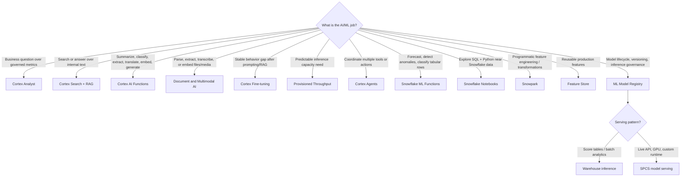

---
tags:
  - note-decision
---

# Decisions - Choosing a Snowflake AI and ML Pattern

> A framework for deciding whether a Snowflake AI/ML request belongs in Cortex, managed ML Functions, Feature Store, Snowpark, Notebooks, the Model Registry, warehouse inference, or Snowpark Container Services.

## Decision Frame

Clients rarely ask for a specific Snowflake AI feature by name. They ask things like "Can business users ask questions in plain English?", "Can we summarize these tickets?", "Can our data scientists build churn models?", or "Can this model score customers in production?"

Start with the business job, not the feature name:

- **Ask governed business questions:** Cortex Analyst.
- **Search and answer from internal text/documents:** Cortex Search + RAG.
- **Apply managed AI to text/files/media/rows:** Cortex AI Functions.
- **Turn files/media into parsed text, extracted fields, transcripts, or embeddings:** Document and Multimodal AI.
- **Improve stable repeated AI task behavior:** Cortex Fine-tuning.
- **Reserve capacity for predictable production inference:** Provisioned Throughput.
- **Coordinate multiple AI tools in one workflow:** Cortex Agents.
- **Forecast, detect anomalies, or classify rows with a packaged model:** Snowflake ML Functions.
- **Explore and prototype with SQL/Python:** Snowflake Notebooks.
- **Transform large Snowflake data with Python/Java/Scala:** Snowpark.
- **Standardize reusable model inputs:** Feature Store.
- **Version, govern, and deploy models:** ML Model Registry.
- **Score many rows in batch:** warehouse inference.
- **Serve low-latency/custom runtime models:** Snowpark Container Services.

## Deciding Axes

- **User shape:** business user, analyst, data scientist, application, or pipeline.
- **Input shape:** structured tables, semantic metrics, text chunks, documents, files/media, features, or live API request.
- **Output shape:** SQL-backed answer, retrieved context, enriched column, registered model, prediction table, endpoint response, or app workflow.
- **Governance requirement:** semantic layer, RBAC, prompt controls, model versioning, data retention, and auditability.
- **Production maturity:** exploration, repeatable analysis, batch pipeline, service endpoint, packaged product, or capacity-managed service.
- **Cost surface:** SQL/warehouse credits, Cortex function usage, fine-tuning tokens, PTUs, AI service usage, compute pools, storage, and repeated inference.

## Recommendation Table

| Situation | Recommend | Why | Watch-outs |
|---|---|---|---|
| Business users ask natural-language questions over governed metrics | Cortex Analyst | Turns semantic layer plus user question into SQL-backed answers | Requires tight semantic scope and metric governance |
| Users need search or Q&A over policies, contracts, runbooks, tickets, transcripts, or research | Cortex Search + RAG | Retrieves relevant enterprise text before generating an answer | Chunking, access filters, freshness, citations, and faithfulness |
| Text/documents/tickets need summarization or classification | Cortex AI Functions | Managed AI inference can run close to Snowflake data | Outputs are probabilistic; validate quality and cost |
| Documents, images, audio, or video need parsing, field extraction, transcription, or multimodal embeddings | Document and Multimodal AI | Turns non-tabular content into structured, searchable, reviewable outputs | File support, regional inference, source traceability, review thresholds, and cost |
| Stable repeated AI task still underperforms after prompting, structured outputs, or RAG | Cortex Fine-tuning | Adapts supported models to task examples | Needs high-quality examples, evaluation set, base-model lifecycle planning, and cost approval |
| Production AI app has predictable high-volume inference demand | Provisioned Throughput | Reserves managed model capacity | Pay for allocated PTUs; measure demand before reserving |
| A workflow needs to combine document search, metric questions, code, and tool calls | Cortex Agents | Coordinates specialized tools such as Analyst and Search | Larger governance, cost, and observability surface |
| Team needs forecasting, anomaly detection, or simple tabular classification quickly | Snowflake ML Functions | Packaged ML workflow directly in Snowflake | Validate data, leakage, metrics, drift, and business impact |
| Analysts/data scientists need SQL and Python exploration | Snowflake Notebooks | Fast governed workbench near Snowflake data | Notebooks need promotion discipline before production |
| Python feature engineering should stay near Snowflake data | Snowpark | Pushes scalable transformations into Snowflake | Avoid local `collect()` and hidden monoliths |
| Multiple models need consistent reusable inputs | Feature Store | Reduces training-serving skew and duplicated feature logic | Needs feature ownership, point-in-time correctness, and refresh governance |
| A trained model needs governance and reuse | ML Model Registry | Tracks versions, signatures, metrics, and inference options | Registry does not prove the model is good |
| Predictions feed tables, dashboards, campaigns, or scheduled analytics | Warehouse inference | Efficient batch pattern inside Snowflake workflows | Repeated rescoring can become expensive |
| Application needs prediction during user interaction | SPCS model serving | Request/response service model with custom runtime options | Needs endpoint security, scaling, monitoring, and cost ownership |
| Model needs GPU or unusual dependencies | SPCS / container runtime | Better fit for custom runtime and hardware needs | More operational complexity than warehouse inference |
| AI output drives regulated decisions | Add validation, human review, logging, and governance | The tool is not the control framework | Need evidence, tests, bias/error handling, and rollback |
| Client only needs deterministic business rules | SQL/dbt/rules engine first | Exact logic is safer and cheaper than probabilistic AI | Do not use AI just because it is fashionable |

## Questions To Ask

- Who is the user: business user, analyst, data scientist, pipeline, or application?
- Is the input structured data, unstructured content, a semantic metric, or a live request?
- Does the output need to be exact, probabilistic, explainable, or reviewable?
- Is this exploration, production batch, real-time serving, or a packaged product?
- What data leaves the table/query/prompt/model boundary?
- What cost surface applies: warehouse, Cortex, AI services, compute pool, or storage?
- Is the problem missing knowledge, model behavior, or capacity?
- How will quality be tested before users trust the output?
- Who owns monitoring, rollback, and model/prompt changes?

## Related Learning Topics

- [[01 Snowflake/05 Advanced Analytics and AI/32 Snowpark]]
- [[01 Snowflake/05 Advanced Analytics and AI/33 Cortex AI Functions]]
- [[01 Snowflake/05 Advanced Analytics and AI/34 Cortex Analyst]]
- [[01 Snowflake/05 Advanced Analytics and AI/37 Cortex Search and RAG]]
- [[01 Snowflake/05 Advanced Analytics and AI/38 Cortex Agents and CoWork]]
- [[01 Snowflake/05 Advanced Analytics and AI/40 ML Functions for Forecasting, Anomaly Detection, and Classification]]
- [[01 Snowflake/05 Advanced Analytics and AI/41 Feature Store and ML Operations]]
- [[01 Snowflake/05 Advanced Analytics and AI/42 Document and Multimodal AI]]
- [[01 Snowflake/05 Advanced Analytics and AI/43 Cortex Fine-tuning, Provisioned Throughput, and Model Lifecycle]]
- [[01 Snowflake/05 Advanced Analytics and AI/35 ML Model Registry]]
- [[01 Snowflake/05 Advanced Analytics and AI/36 Snowflake Notebooks]]
- [[01 Snowflake/06 Cost Management and Operations/44 Credit Consumption Model]]

## Related Comparisons and Scenarios

- [[80 Comparisons and Decision Notes/Comparisons/Comparison - Cortex Analyst vs Cortex AI Functions]]
- [[80 Comparisons and Decision Notes/Comparisons/Comparison - Warehouse Inference vs SPCS Model Serving]]
- [[80 Comparisons and Decision Notes/Client Scenarios/Scenario - Business Users Want Self-Service Analytics but Metrics Are Inconsistent]]
- [[80 Comparisons and Decision Notes/Client Scenarios/Scenario - A Churn Model Is Stuck in a Notebook]]

## Sources To Revisit

- [Snowflake Docs: Snowflake AI and ML](https://docs.snowflake.com/en/guides-overview-ai-features)
- [Snowflake Docs: Cortex AI Functions](https://docs.snowflake.com/en/user-guide/snowflake-cortex/aisql)
- [Snowflake Docs: Cortex Analyst](https://docs.snowflake.com/en/user-guide/snowflake-cortex/cortex-analyst)
- [Snowflake Docs: Cortex Search](https://docs.snowflake.com/en/user-guide/snowflake-cortex/cortex-search/cortex-search-overview)
- [Snowflake Docs: Cortex Agents](https://docs.snowflake.com/en/user-guide/snowflake-cortex/cortex-agents)
- [Snowflake Docs: Cortex AI Functions for documents](https://docs.snowflake.com/en/user-guide/snowflake-cortex/ai-documents)
- [Snowflake Docs: Cortex AI Functions for multimodal](https://docs.snowflake.com/en/user-guide/snowflake-cortex/ai-multimodal)
- [Snowflake Docs: Cortex Fine-tuning](https://docs.snowflake.com/en/user-guide/snowflake-cortex/cortex-finetuning)
- [Snowflake Docs: Provisioned Throughput](https://docs.snowflake.com/en/user-guide/snowflake-cortex/provisioned-throughput)
- [Snowflake Docs: ML Functions](https://docs.snowflake.com/en/guides-overview-ml-functions)
- [Snowflake Docs: Snowflake ML overview](https://docs.snowflake.com/en/developer-guide/snowflake-ml/overview)
- [Snowflake Docs: Feature Store](https://docs.snowflake.com/en/developer-guide/snowflake-ml/feature-store/overview)
- [Snowflake Docs: Model Registry overview](https://docs.snowflake.com/en/developer-guide/snowflake-ml/model-registry/overview)
- [Snowflake Docs: Snowflake Notebooks in Workspaces](https://docs.snowflake.com/en/user-guide/ui-snowsight/notebooks-in-workspaces/notebooks-in-workspaces-overview)
