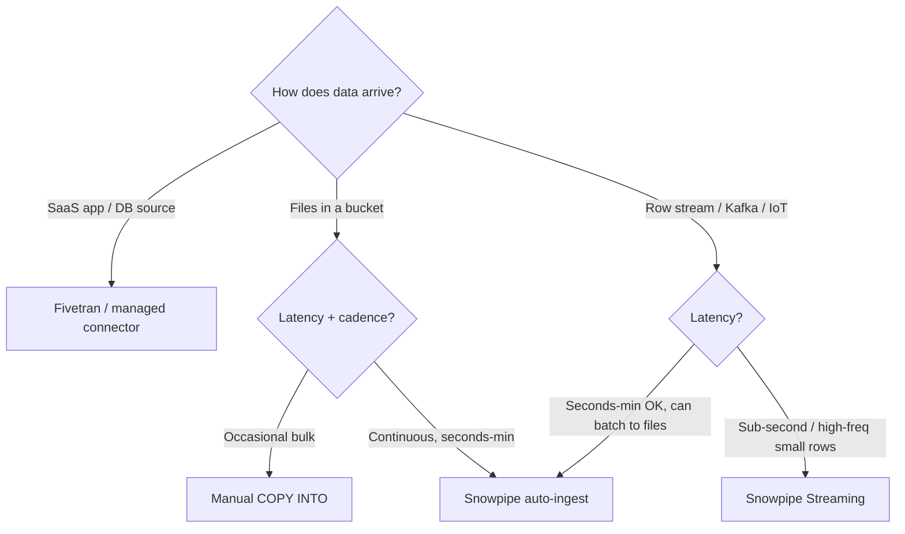

---
tags:
  - note-decision
---

# Decisions - Choosing a Snowflake Ingestion Method

> A framework for recommending how data should land in Snowflake — from manual bulk loads to true streaming.

## Decision Frame

Clients rarely ask "Snowpipe or Snowpipe Streaming?" — they ask **"how should we get this data in?"** The honest answer spans a spectrum: manual `COPY INTO`, classic Snowpipe, Snowpipe Streaming, and (for SaaS sources) a managed connector like Fivetran. The right choice is driven by a few clean axes, not by any single feature.

## Deciding Axes

- **Latency need:** batch (hours) → micro-batch (seconds–minute) → real-time (sub-second).
- **Arrival shape:** files already in a bucket vs a row-oriented stream (Kafka/IoT) vs a SaaS API/database source.
- **Frequency & payload size:** the small-files / per-file-cost tension — many tiny files punish classic Snowpipe.
- **Build vs buy:** declarative `PIPE` (least code) vs SDK/connector (code to operate) vs fully managed connector (least engineering, vendor cost).

## Recommendation Table

| Situation | Recommend | Why | Watch-outs |
|---|---|---|---|
| Occasional / scheduled bulk file loads | **Manual `COPY INTO`** (ch. 19) | Simplest, full control | You own scheduling |
| Files arrive continuously in a bucket | **Snowpipe auto-ingest** (ch. 22) | Hands-off, near-real-time, serverless | `ON_ERROR=SKIP_FILE` default; file sizing |
| Sub-second latency / real-time | **Snowpipe Streaming** (ch. 23) | No file-batching delay | Operate a client/connector |
| High-frequency tiny payloads | **Snowpipe Streaming** (ch. 23) | No per-file overhead; cheaper at scale | Throughput-based billing |
| Source is already Kafka | **Kafka Connector** (streaming mode) | Near drop-in topic → table | Connector config/ops |
| Can't wire cloud notifications | Snowpipe **REST API** trigger | App controls the file list | More client-side code |
| SaaS apps / operational DBs (Salesforce, Postgres…) | **Fivetran / managed connector** | Least engineering; pre-built schemas | Vendor cost; less control |
| Row-level dedup needed after landing | Any ingest **+ Streams + Tasks** | Pipe/stream lands raw; `MERGE` dedups downstream | Dedup is a separate step |

## Questions To Ask

- What latency does the business actually need — and what does it cost to hit it?
- How does the data arrive today: files, an event stream, or a SaaS/DB source?
- What's the file count and payload size profile (the small-files signal)?
- Do we want to operate ingestion code, or prefer declarative/managed?
- Where does deduplication and transformation happen after landing?

## Related Learning Topics

- [[01 Snowflake/04 Data Engineering/19 Stages and Data Loading]]
- [[01 Snowflake/04 Data Engineering/22 Snowpipe]]
- [[01 Snowflake/04 Data Engineering/23 Snowpipe Streaming]]
- [[01 Snowflake/04 Data Engineering/20 Streams and Tasks]]
- [[03 Fivetran/Fivetran Learning Map]]

## Related Comparisons and Scenarios

- [[80 Comparisons and Decision Notes/Comparisons/Comparison - Streams and Tasks vs Dynamic Tables]]

## Sources To Revisit

- [Snowflake Docs: Data Loading Overview](https://docs.snowflake.com/en/user-guide/data-load-overview)
- [Snowflake Docs: Introduction to Snowpipe](https://docs.snowflake.com/en/user-guide/data-load-snowpipe-intro)
- [Snowflake Docs: Snowpipe Streaming overview](https://docs.snowflake.com/en/user-guide/data-load-snowpipe-streaming-overview)
